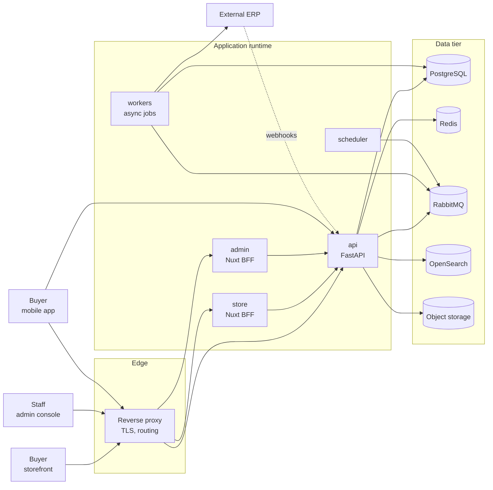

# Atlas B2B Platform — Reference Project Blueprint

A **standalone, fictional reference project** for onboarding engineers. It describes a multi-supplier B2B wholesale ordering platform end to end: product scope, system architecture, infrastructure, backend modules, API contract, data model, async processing, frontends, mobile app, and feature inventory.

**This is a teaching artifact.** Everything in it is invented. It contains no production systems, no customer data, no real hosts, no credentials, and no environment addresses.

---

## Why this project exists

An engineer joining the team should be able to build a realistic commerce platform **from an empty repository** and end up with the same architectural shape we use in production. This blueprint is the target shape.

It is deliberately **not** a copy of any real product. The business domain here is food-service wholesale, chosen because it exercises the same hard problems a regulated B2B marketplace hits:

| Problem class | How this domain exercises it |
|---|---|
| Multi-supplier cart and order split | One basket, many distributors, per-supplier fulfillment |
| Lot tracking and shelf life | Perishables need batch, expiry, and FEFO allocation |
| Storage constraints | Chilled / frozen / ambient handling rules gate what a buyer may order |
| Buyer verification | Trading licence + food-safety certificate must be verified before ordering restricted lines |
| Contract pricing | Per-buyer price lists, tiered quantity breaks, negotiated rates |
| Credit exposure | Credit terms, limits, statements, reconciliation alongside COD |
| External stock authority | An ERP system owns stock and dispatches orders |

The architecture is domain-agnostic. Swap the vocabulary and the same structure serves any multi-supplier B2B ordering product.

---

## How to read this

Read in order the first time. After that, use it as a reference.

| # | Document | What you get |
|---|---|---|
| — | [`docs/README.md`](docs/README.md) | Index and suggested reading paths |
| 01 | [`docs/01-product-brief.md`](docs/01-product-brief.md) | Domain, actors, capability scope, explicit non-goals |
| 02 | [`docs/02-system-architecture.md`](docs/02-system-architecture.md) | Topology, layering, boundaries, key decisions and their rationale |
| 03 | [`docs/03-infrastructure.md`](docs/03-infrastructure.md) | Local stack, service ports, deployment topology, CI/CD |
| 04 | [`docs/04-backend-architecture.md`](docs/04-backend-architecture.md) | Modular monolith conventions, module anatomy, enforcement rules |
| 05 | [`docs/05-api-contract.md`](docs/05-api-contract.md) | HTTP conventions, auth model, endpoint catalogue |
| 06 | [`docs/06-data-and-events.md`](docs/06-data-and-events.md) | Schema-per-module, entity relationships, domain events, job queues |
| 07 | [`docs/07-frontend-architecture.md`](docs/07-frontend-architecture.md) | Store and Admin apps, BFF pattern, routing, permission gating |
| 08 | [`docs/08-feature-inventory.md`](docs/08-feature-inventory.md) | **Complete feature list per surface:** Store, Admin, API, Mobile |
| 09 | [`docs/09-mobile-application.md`](docs/09-mobile-application.md) | Three independent buyer applications — Flutter, native Android, native iOS — and the twelve things all three must do |
| 10 | [`docs/10-delivery-plan.md`](docs/10-delivery-plan.md) | Phased build plan with milestones and acceptance criteria |
| 11 | [`docs/11-conventions-and-glossary.md`](docs/11-conventions-and-glossary.md) | Naming, code, git conventions, and domain vocabulary |
| 12 | [`docs/12-ai-features.md`](docs/12-ai-features.md) | Where AI belongs, what it may decide, and what it must never touch |
| 13 | [`docs/13-kickoff-plan.md`](docs/13-kickoff-plan.md) | The first ten days, split into intern tasks and owner tasks |
| 14 | [`docs/14-observability-and-analytics.md`](docs/14-observability-and-analytics.md) | Telemetry from OpenTelemetry through Alloy to Grafana, and Metabase over a read replica |

---

## Target system in one diagram

---

## Reference stack

| Layer | Choice |
|---|---|
| Backend | Go lang + FastAPI, modular monolith, one deployable |
| Data access | SQLAlchemy 2.x async, Alembic migrations |
| Validation | Pydantic v2 |
| Database | PostgreSQL — single source of truth |
| Cache | Redis-compatible |
| Broker | RabbitMQ (task queue + domain events) |
| Background work | Celery with priority queues plus a beat scheduler |
| Search | OpenSearch, with PostgreSQL full-text as fallback |
| Object storage | S3-compatible |
| Web frontend | Nuxt (SSR) + Vue + TypeScript, BFF pattern |
| Mobile | Three separate apps: Dart + Flutter, Kotlin + Jetpack Compose, Swift + SwiftUI — no shared client code |
| Telemetry instrumentation | OpenTelemetry, exporting OTLP. The application names no backend. |
| Telemetry collection | Grafana Alloy — one collector for metrics, logs, and traces |
| Metrics · logs · traces | Prometheus, Loki, Tempo, read in Grafana |
| Business analytics | Metabase over a read replica and curated models |
| AI | One `ai` module as the sole gateway to model providers: prompt registry, guardrails, cost accounting, evaluation. Output is always a proposal, never a decision. |

---

## What is intentionally absent

- Real hostnames, IP addresses, ports of live systems, or account identifiers
- Credentials, API keys, tokens, or connection strings
- Named customers, suppliers, partners, or staff
- Any regulated or jurisdiction-specific legal rule set
- Production data, fixtures derived from production, or dumps

If you need an environment detail while building, invent a placeholder (for example `store.atlas.internal`) rather than reaching for a real one.

---

## Neural Workflow

This repository operates under a controlled AI coding workflow called **Neural Workflow** featuring deterministic state progression and feedback loops:

- **Normal Progression:**
  `TODO` → `PLANNING` → `EXPLORING` → `IN_PROGRESS` → `IMPLEMENTED` → `TESTING` → `PASSED` → `REVIEW` → `SHIPPED`

- **Failure & Debugging Loop:**
  `TESTING` → `FAILED` → `BUG_FIX` → `TESTING` (up to a maximum of 3 debug cycles before transitioning to `BLOCKED`).

---

## Status

Blueprint only. No implementation, no deployment, no approval. Treat every statement here as a design intent to be verified as you build.
