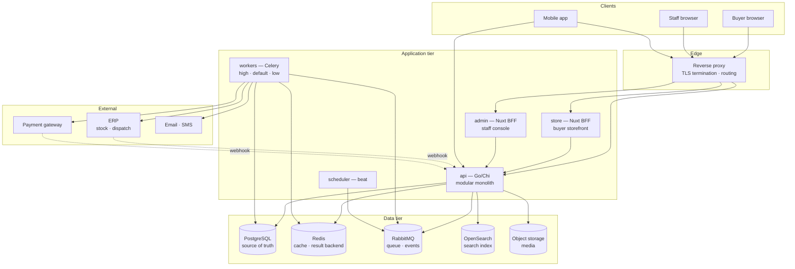
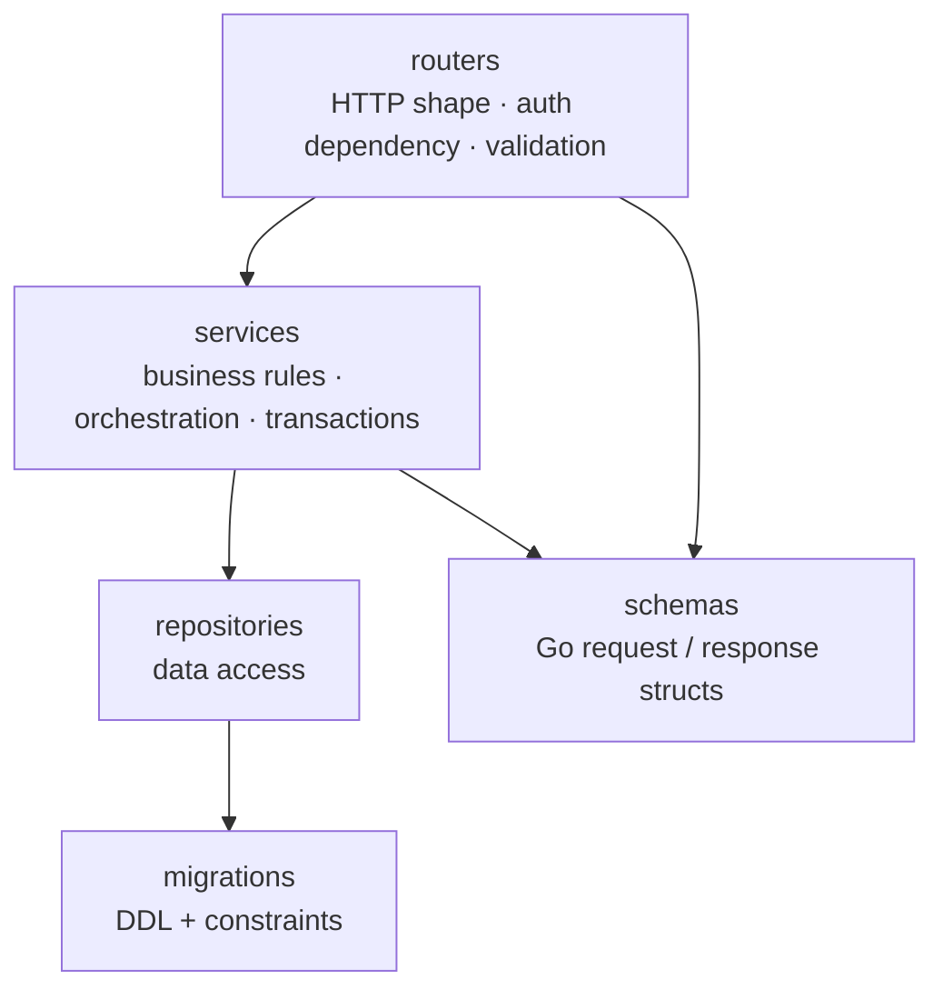
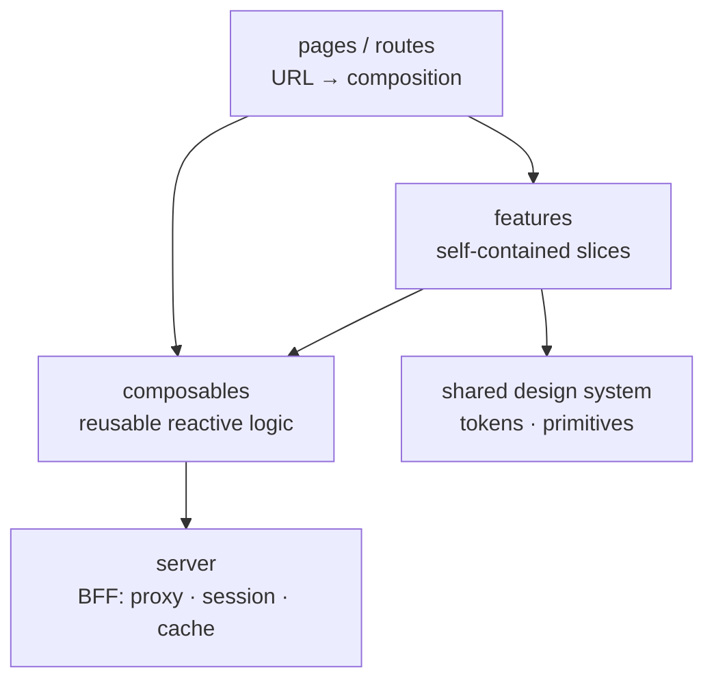
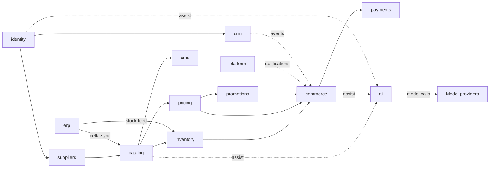
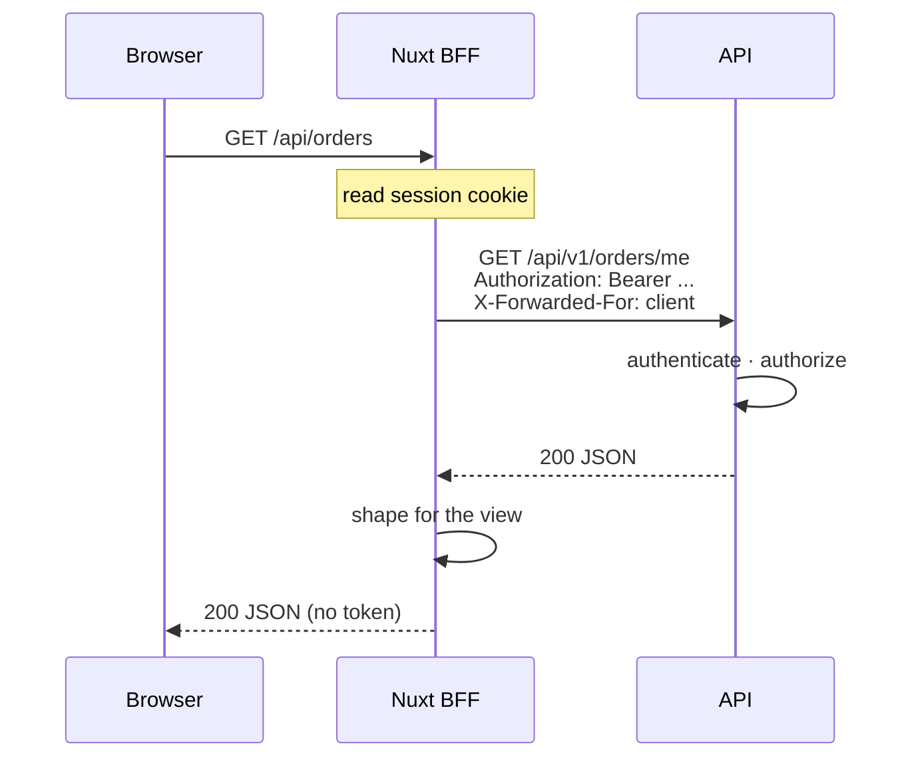

# 02 — System Architecture

**Status:** Blueprint
**Owner:** Architecture

## Purpose

Describe how Atlas is structured: the runtime topology, the layers, the boundaries between them, and the reasoning behind each significant structural decision. This is the document to read before arguing about where code belongs.

---

## Architectural shape

**A modular monolith with a BFF-tier frontend and an event-driven async tier.**

Four deliberate positions:

1. **One backend deployable, thirteen internal modules.** Module boundaries are enforced by convention and lint, not by the network. This gives clear ownership without distributed-system overhead.
2. **Frontends never talk to the API from the browser.** Each web app runs its own server tier (BFF) that owns session cookies, request shaping, and caching.
3. **Anything that can be asynchronous is asynchronous.** Order dispatch, ERP sync, notifications, and reporting do not block a request.
4. **PostgreSQL is the only source of truth.** Cache, search index, and object storage are all derived and rebuildable.
5. **AI proposes; deterministic code decides.** No model output sets a price, a stock level, an eligibility outcome, or a compliance decision. See [12 AI Features](12-ai-features.md).

---

## Runtime topology

### Trust boundaries

| Boundary | Crossing rule |
|---|---|
| Browser → reverse proxy | Only TLS. No service trusts a header it did not set itself. |
| Reverse proxy → BFF | Proxy sets client IP; the BFF forwards it explicitly. Never trust a client-supplied IP. |
| BFF → API | Bearer token attached server-side. The browser never holds an API token. |
| API → data tier | Credentials from environment. Data tier binds to a private network only. |
| API → external systems | Egress through explicit clients with timeouts, retries, and circuit breaking. |
| External → API | Webhooks authenticated by signature. Never trust the payload's claimed origin. |

---

## Layer model

### Backend layers

**Rules**

- A router **MUST NOT** contain business logic. It validates input, calls a service, shapes the response.
- A router **MUST NOT** import a model directly. It speaks in schemas.
- A service **MUST NOT** issue raw SQL. It goes through a repository.
- A repository **MUST NOT** decide business outcomes. It fetches and persists.
- A model **MUST NOT** import anything from services or routers.

Violations are the single most common cause of unmaintainable code. Enforce them in review.

### Frontend layers

**Rules**

- A page **MUST NOT** call the API directly. It goes through a composable or a feature.
- Cross-feature imports **MUST** go through a composable or the shared design system. Features are sealed.
- The `server/` tier owns cookies, CSRF, and upstream auth. Composables never handle tokens.

---

## Module boundaries

Thirteen modules. Each owns exactly one database schema and exposes exactly one public surface.

`ai` is a **leaf dependency**: many modules depend on it, it depends on none of them. It owns model routing, prompt versions, guardrails, cost accounting, and evaluation — never the business decision a feature makes with the result. See [12 AI Features](12-ai-features.md).

### The three rules

**1. Import only the public surface.**
A module may import another module's `__init__.py` exports. Nothing deeper. Not its models, not its services, not its repositories. CI lint rejects violations.

**2. Async coupling uses domain events.**
When something a module does matters to another module, publish an event. Do not reach across and call a peer synchronously for fire-and-forget work.

**3. One schema per module.**
Models declare their schema explicitly. Migrations are organised per module. A module never reads another module's tables — it asks the owner via the public surface or reacts to an event.

Full detail: [04 Backend Architecture](04-backend-architecture.md).

---

## Frontend BFF model

Why the BFF exists:

| Concern | Where it is handled | Why not in the browser |
|---|---|---|
| Session token | httpOnly cookie, set by BFF | Not readable by JS, not exfiltrable by XSS |
| Refresh | BFF, transparent to the app | Browser code never sees a refresh token |
| CSRF | Double-submit token at the BFF | Protects the cookie-authenticated edge |
| Caching | BFF, per route | Public reads cached without hitting the API |
| Payload shape | BFF | Adapts a stable API to view needs without versioning the API |

**Rule:** the browser calls same-origin `/api/*` on the Nuxt app. The API base URL never appears in client code.

---

## Key architectural decisions

Each decision below is recorded in short form: what, why, and what it costs. When you deviate, write down why.

### D1 — Modular monolith, not microservices

**Decision.** One Go deployable containing thirteen bounded modules.

**Why.** Thirteen modules do not justify thirteen pipelines, thirteen deploys, and a distributed tracing problem. Boundaries are a code-organisation problem first. Splitting before the seams are proven produces a distributed monolith — the worst of both.

**Cost.** A single deploy means one module's bug can affect all. Mitigated by strict layering and by keeping expensive work out of the request path.

**Revisit when.** One module's scaling profile genuinely diverges (for example, search indexing needs 10x the CPU of everything else), or a module's release cadence becomes an organisational blocker.

### D2 — Schema per module

**Decision.** Each module owns a PostgreSQL schema. Cross-schema reads are forbidden.

**Why.** Makes ownership legible in the database itself. Makes a future extraction mechanical rather than archaeological.

**Cost.** More migrations to manage, and any genuinely cross-cutting query must go through a module API rather than a join.

**Revisit when.** A proven, stable, read-only reporting need justifies a dedicated read model.

### D3 — BFF tier on both web frontends

**Decision.** Each Nuxt app runs a server tier that proxies to the API.

**Why.** httpOnly session cookies, transparent token refresh, CSRF protection, and per-route caching are all server concerns. Putting them in browser code means shipping tokens to the client.

**Cost.** An extra network hop and an extra tier to operate and observe.

### D4 — Two separate frontends, one shared design system

**Decision.** `store` and `admin` are separate apps sharing only design primitives.

**Why.** Different audiences, different rhythms. The storefront optimises for discovery and speed for anonymous and verified buyers. The console optimises for density, bulk actions, and data tables. Coupling them forces compromises on both.

**Cost.** Two builds, two deploys, and discipline required to keep the design system genuinely shared rather than forked.

### D5 — RabbitMQ for both queue and events

**Decision.** One broker serves Celery task queues and the domain event exchange.

**Why.** One operational dependency instead of two. Task dispatch and event publication have overlapping durability and routing needs.

**Cost.** Event and task traffic compete for the same broker. Mitigated by separate vhosts or clearly separated exchanges and queues, plus monitoring on both.

### D6 — FEFO allocation in the application layer

**Decision.** Allocation picks lots in expiry order inside a service, under a transaction with row-level locking.

**Why.** The rule interacts with reservations, quarantine, and order state. Expressing it in SQL alone hides it from tests and from readers.

**Cost.** Allocation is a contention point. Requires careful transaction scoping and a defined behaviour on lock timeout.

### D7 — Idempotency keys on all money and order mutations

**Decision.** Mutating endpoints that create orders, apply payments, or move stock accept an idempotency key and record it.

**Why.** Gateways retry. Networks drop responses after the server committed. Without this, retries duplicate revenue-affecting records.

**Cost.** An extra table, an extra store, and a retention policy.

### D8 — Search is derived, never authoritative

**Decision.** OpenSearch indexes are projections of PostgreSQL. Any index can be rebuilt from the database.

**Why.** Search clusters fail, schema changes happen, and analysers change. If search were authoritative, a reindex would be a data-loss event.

**Cost.** Index drift is possible and must be monitored, with a documented rebuild procedure.

### D9 — Verification gates catalogue visibility server-side

**Decision.** What a buyer may see and order is filtered in the API, not in the UI.

**Why.** Hiding a button is not access control. A verified-only product must be unreachable, not merely unlisted.

**Cost.** Every catalogue query needs buyer context, which complicates caching. Public and buyer-scoped reads use separate cache keys.

### D10 — AI is one module, and it proposes rather than decides

**Decision.** All model access goes through a single `ai` module. No other module calls a model provider directly. AI output is a proposal that deterministic code validates and a human confirms wherever money, stock, eligibility, or compliance is involved.

**Why.** Two independent problems. First, without a single gateway every module grows its own provider client, its own retry policy, and its own untracked bill. Second, probabilistic output in a correctness path is a defect class the platform cannot audit or reproduce. Concentrating model access makes cost, redaction, and prompt versions answerable in one place; restricting what AI may decide keeps the auditable parts auditable.

**Cost.** An extra hop and an extra module to own. Feature teams cannot tune a prompt without going through the registry. Some genuinely useful shortcuts — letting a model compute a total, letting retrieved content trigger an action — are off the table by design.

**Revisit when.** A capability demands sub-second, on-device inference, or a regulated requirement forces a fully isolated model deployment. Even then, the *decision* boundary stays where it is.

---

### D11 — Three mobile applications, one API contract, no shared client code

**Decision.** Atlas ships three buyer applications: a Flutter application covering both platforms, a native Android application, and a native iOS application. Each is an independent repository with its own release cycle and its own generated API client. They share no code. The API contract is the only coordination point.

**Why.** Independence is worth more than reuse here. Three applications that cannot break each other can be built in parallel, released on their own schedules, and owned by different people — and a change to one is never a risk to another. The cost of independence is that client-side presentation logic is written three times, which is bounded and visible. The cost of the alternative is a shared dependency that couples three release cycles to the slowest of them.

**Why the cost is acceptable.** The server is authoritative for price, stock, eligibility, and order state, so the clients stay thin. The rule surface that would be expensive to duplicate lives on the server, in one place, for all three apps and both web surfaces. What is left to duplicate is presentation, not correctness.

**Revisit when.** Reuse becomes worth the coupling it creates. The trigger is a client-side rule that is both complex and must agree exactly across apps, or a third platform that makes a fourth independent application unreasonable. Neither exists today.

Full description of the three applications and what they share: [09 Mobile Applications](09-mobile-application.md).

---

### D12 — Operational observability and business analytics are separate systems

**Decision.** Telemetry is instrumented with **OpenTelemetry**, collected by **Grafana Alloy**, stored in Prometheus, Loki, and Tempo, and read in Grafana. Business questions are answered in **Metabase**, over a read replica and curated models. The two do not share a data path, a configuration, or an audience.

**Why.** They answer different questions. "Is checkout failing right now?" is a question about the system, asked under time pressure, and answered from telemetry that must survive an outage of the thing it observes. "What is our margin by supplier this month?" is a question about the business, asked calmly, and answered from aggregates that may be minutes stale. A single tool doing both produces dashboards nobody reads and slows transactions down.

**Why the application only needs to know OTLP.** Instrumentation targets the OpenTelemetry interface, so the observability backend is replaceable through collector configuration rather than an application release. The application names no vendor and no storage service.

**Why analytics reads a replica.** An exploratory query against the primary database is the cheapest way to cause a production incident. A replica makes the isolation structural instead of a matter of discipline.

**Revisit when.** The replica becomes the bottleneck for analytics, or the volume of telemetry makes per-signal retention choices explicit rather than default. Both are cost questions, not architecture questions.

Full pipeline, cardinality rules, and the analytics boundary: [14 Observability and Analytics](14-observability-and-analytics.md).

---

## Non-functional budgets

Design targets. Nothing measured — this is a blueprint.

| Path | p50 | p95 | Notes |
|---|---|---|---|
| Catalogue list, cached | 80 ms | 250 ms | Cache hit, indexed |
| Catalogue list, uncached | 200 ms | 500 ms | First request after invalidation |
| Product detail | 60 ms | 200 ms | Single record plus relations |
| Search, OpenSearch | 80 ms | 250 ms | |
| Search, PostgreSQL fallback | 200 ms | 600 ms | Degraded mode |
| Authenticated read | 100 ms | 300 ms | User-scoped, indexed |
| Cart mutation | 150 ms | 400 ms | Single transaction |
| Checkout submit | 800 ms | 2000 ms | Order writes plus async dispatch |
| Admin list, 50 rows | 200 ms | 600 ms | |
| Admin bulk operation | 1500 ms | 4000 ms | Progress feedback required |
| Health and readiness | 30 ms | 100 ms | No business logic |
| AI proposal, small model | 900 ms | 2500 ms | Streaming required beyond 1 s |
| AI proposal, large model | 2500 ms | 6000 ms | Async with a status URL beyond the anti-target |
| AI cached proposal | 80 ms | 200 ms | Exact or semantic cache hit |
| AI admin assist (batch) | — | 30 s | Background job, never in a request |

**Anti-target.** Any request handler above 5 seconds. If work genuinely needs that long, dispatch it and return `202` with a status URL.

| Surface | Peak | Sustained |
|---|---|---|
| Storefront read | 500 rps | 100 rps |
| Storefront concurrent users | 1000 | 200 |
| Authenticated write | 100 rps | 30 rps |
| Admin | 50 rps | 10 rps |

---

## Failure behaviour

What Atlas should do when a dependency misbehaves. Decide this before it happens, not during.

| Failure | Expected behaviour |
|---|---|
| Redis unavailable | Serve uncached. Reads slow down. Writes still succeed. Never fail an order because cache is down. |
| OpenSearch unavailable | Fall back to PostgreSQL full-text search. Surface degraded mode in operations. |
| RabbitMQ unavailable | Writes still commit. Events buffer or park. Nothing is silently lost — log loudly. |
| ERP unreachable | Orders still accepted; dispatch queues. Stock shown as last-known with a staleness indicator. |
| Payment gateway timeout | Do not mark paid. Do not mark failed. Park as pending and reconcile. Never assume. |
| ERP reports stock below a confirmed reservation | Raise an exception for operations. Do not silently short-ship. |
| Object storage unavailable | Uploads fail loudly. Never accept a reference to a file that was not stored. |
| Model provider unavailable | Fall back to the non-AI path immediately. Log and alert. Never queue a request waiting on a model. |
| Model output fails validation | Treat as a failure. One bounded retry with a corrected prompt, then the fallback. Never best-effort parse. |
| AI budget exhausted for a tenant | Disable that tenant's AI features. Surface in the console. Core commerce is unaffected. |
| Guardrail rejection | Reject with an explanation. Do not retry the same input. Record the incident. |
| `ai` module disabled entirely | The platform stays fully usable. Every AI feature has a non-AI path — this is a release gate, not an aspiration. |
| Telemetry collector unreachable | The application keeps serving. Telemetry buffers briefly, then is dropped, loudly. Losing observability must never become an outage. |
| Metric volume spikes | The collector limits memory and drops rather than blocking. Sampling tightens before the application is affected. |
| Analytics replica lagging | Reports are stale. Operations are unaffected. Surface the lag; do not hide it. |
| Analytics tool unavailable | The platform is unaffected. Business questions wait; nobody can check out less because of it. |

**Principle:** degrade reads before writes. Never lose a committed business fact because a derived system is down.

---

## Related

- [01 Product Brief](01-product-brief.md) — the capabilities this structure serves
- [03 Infrastructure](03-infrastructure.md) — how these components are actually run
- [04 Backend Architecture](04-backend-architecture.md) — module rules in detail
- [06 Data & Events](06-data-and-events.md) — schemas, events, and job topology
- [09 Mobile Applications](09-mobile-application.md) — the client build strategies and their trade-offs
- [10 Delivery Plan](10-delivery-plan.md) — the order to build all of this in
- [12 AI Features](12-ai-features.md) — what AI may and may not do
