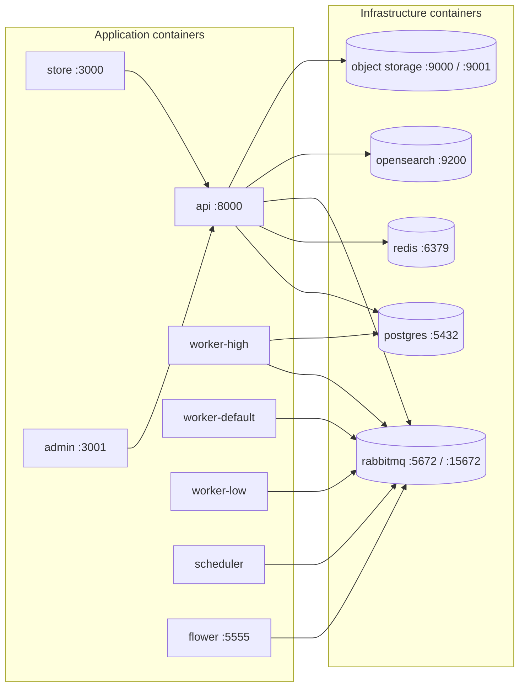
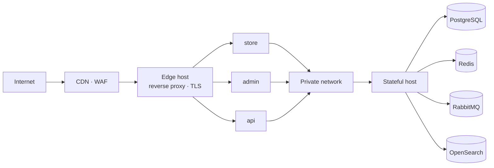

# 03 — Infrastructure

**Status:** Blueprint
**Owner:** Platform

## Purpose

How Atlas runs: the local development stack, the service topology, the deployment shape, and the delivery pipeline.

> **All addresses, hostnames, and ports below are conventions for this project.** None refer to a real system. Where a hostname is needed, placeholders under `atlas.internal` and `atlas.example` are used. Never substitute a real one.

---

## Repository layout

Six independent repositories. Ownership is separated so that application code, deployment mechanics, and monitoring do not become entangled — and so that the three mobile applications can be built and released independently of each other.

| Repository | Owns | Does not own |
|---|---|---|
| `atlas-platform` | Application source: backend, storefront, admin, shared design system | Deployment execution, dashboards, alerts |
| `atlas-deploy` | CI/CD pipelines, release automation, container manifests, deployment execution | Application code, monitoring |
| `atlas-observability` | Metrics, logs, traces, dashboards, alert rules, runbooks | Application code, deployment |
| `atlas-mobile-flutter` | The Flutter buyer application and its generated API client | Either native application |
| `atlas-mobile-android` | The native Android buyer application and its generated API client | The other two applications |
| `atlas-mobile-ios` | The native iOS buyer application and its generated API client | The other two applications |

The split is deliberate. An application change and a deployment change are different risk decisions and should be reviewable independently.

**Three mobile applications, three repositories, no shared code.** They coordinate only through the API contract in [05 API Contract](05-api-contract.md). See [09 Mobile Applications](09-mobile-application.md).

---

## Technology stack

| Layer | Technology | Rationale |
|---|---|---|
| Backend runtime | Python | Team familiarity, ecosystem, typing support |
| API framework | FastAPI | Async-native, dependency injection, OpenAPI generation |
| ORM | SQLAlchemy 2.x async | Mature, explicit, works with async drivers |
| Migrations | Alembic | One migration location per module |
| Validation | Pydantic v2 | Request and response schemas as the contract |
| Database | PostgreSQL | Single source of truth; strong consistency, JSON support, full-text search |
| Cache / result backend | Redis-compatible | Cache plus Celery result backend |
| Broker | RabbitMQ | Durable task queues plus topic-based event routing |
| Background work | Celery | Priority queues plus a beat scheduler |
| Search | OpenSearch | Faceted search; PostgreSQL full-text is the fallback |
| Object storage | S3-compatible | Media and documents; CDN in front |
| Admin/CMS runtime | Nuxt, Vue, TypeScript | SSR, file-based routing, strong TypeScript support |
| Web server tier | Nuxt Nitro | The BFF for both web apps |
| Mobile — Flutter | Dart + Flutter | One codebase produces both store artifacts — see [09 Mobile Applications](09-mobile-application.md) |
| Mobile — Android | Kotlin, Jetpack Compose | Platform-native, full access to Android capability |
| Mobile — iOS | Swift, SwiftUI | Platform-native, full access to iOS capability |
| Telemetry instrumentation | OpenTelemetry, exporting OTLP | One standard interface; the backend becomes replaceable without touching application code |
| Telemetry collection | Grafana Alloy | A single agent for metrics, logs, and traces, configured as code. The only component that names a backend. |
| Metrics store | Prometheus | Standard, self-hostable, well understood |
| Log store | Loki | Label-indexed, object storage for volume |
| Trace store | Tempo | Affordable trace retention; joins to logs on trace ID |
| Dashboards and alerting | Grafana | One pane over all three signals |
| Business analytics | Metabase | Self-service questions without shipping code, over a read replica |

Why the application only ever talks to OpenTelemetry is explained in [14 Observability and Analytics](14-observability-and-analytics.md).

---

## Local development stack

One manifest starts everything. **Do not run a second full-stack manifest at the same time** — services and ports overlap.



### Port allocation

Ports are the standard defaults for each technology unless noted, so most need no explaining.

| Port | Service | Notes |
|---:|---|---|
| 3000 | Store (buyer storefront) | BFF listens here. **Occupies Grafana's default port.** |
| 3001 | Admin (staff console) | BFF listens here |
| 3002 | Grafana | Moved off its default `3000`, which the storefront claims |
| 3003 | Metabase | |
| 3100 | Loki | |
| 3200 | Tempo | |
| 4317 / 4318 | OTLP receiver (Alloy) | gRPC / HTTP. The only address the application needs to know. |
| 5432 | PostgreSQL | Local database |
| 5555 | Flower | Worker monitoring |
| 5672 | RabbitMQ AMQP | }
| 6379 | Redis | Cache and Celery result backend |
| 8000 | API (FastAPI) | `/docs` and `/redoc` enabled locally only |
| 9000 / 9001 | Object storage | API / console |
| 9090 | Prometheus | |
| 9200 | OpenSearch | |
| 12345 | Alloy UI | Pipeline debugging |
| 15672 | RabbitMQ management | }}

**Port collision worth knowing about.** Grafana defaults to `3000`, which the storefront already uses. Pick one and record it; two services silently fighting over a port is a bad first day.

> Flower, the RabbitMQ management console, the API docs, and the observability and analytics interfaces are **local-only conveniences**. None are exposed outside a developer machine.

### First run

```
# start infrastructure and application containers
<task-runner> local:up

# apply database migrations
<task-runner> local:migrate

# load generated seed data
<task-runner> local:seed

# start only web apps and API against external infrastructure
<task-runner> local:up:apps
```

Replace `<task-runner>` with whichever runner the project standardises on. The commands above define the required capability; the tool is an implementation choice.

### Two supported local modes

| Mode | Manifest | When to use |
|---|---|---|
| Full stack | `compose.local.yml` | Default. Everything runs on one host. |
| Apps only | `compose.local-apps.yml` | Web, admin, and API only. Infrastructure is external (shared or remote). |

Do not add a third mode. Two is the limit of what stays correctly maintained.

### Optional overlay: telemetry and analytics

The observability and analytics services are **not in the default manifest**. A developer should not need seven extra containers to work on a feature, and most work does not.

```
<task-runner> local:up:observability
```

This is an **overlay, not a third mode** — it adds services to the running stack rather than describing a different way to run the platform. See [14 Observability and Analytics](14-observability-and-analytics.md).

**Rule:** the application and its test suite must both run with the overlay absent. If a feature only works when the collector is up, telemetry has become a dependency, and that is a defect.

### Seed data

Seed data is **generated**, never imported from a real system.

| Data | How it is produced |
|---|---|
| Buyers | Generated businesses with licence numbers that match the expected format but resolve to nothing |
| Suppliers | Generated companies with plausible names |
| Products | Generated items with realistic units, categories, and handling requirements |
| Lots | Generated with spread expiry dates so FEFO is observable |
| Orders | Generated across states to exercise the admin console |
| Users | A fixed set of development accounts across every role |

**Rule:** no fixture may be derived from a production extract, even with fields removed. Generate, do not sanitise.

---

## Deployment topology

Production is **split across two hosts by blast radius**. Application compute and stateful services are separate so that a compromised or overloaded application host cannot reach the data tier directly, and so stateful services can be backed up and resized independently.



### Host roles

| Host | Runs | Exposure |
|---|---|---|
| **Edge** | Reverse proxy, TLS termination | Only host with a public address |
| **Application** | API, workers, scheduler, store, admin | Reachable only from the edge host |
| **Stateful** | PostgreSQL, Redis, RabbitMQ, OpenSearch, object storage | Reachable only from the application host, over a private network, protected by host firewall rules |

**Rules**
1. The stateful host **MUST NOT** be reachable from the internet.
2. Data-tier credentials **MUST NOT** exist in the application host's environment beyond what that host needs.
3. Any change to stateful services is a separate, explicitly reviewed change — never a side effect of an application deploy.

### Single-host fallback

A single-host manifest exists for small deployments and for practising the full topology on one machine. Use it only when that topology is **explicitly chosen** and recorded. Do not let it become the silent default.

---

## Configuration and environments

### Three environments

| Environment | Purpose | Data |
|---|---|---|
| `local` | Development on a machine | Generated seed data |
| `staging` | Integration, QA, pre-release verification | Generated data, production-shaped |
| `production` | Live | Real |

### Configuration rules

1. **Every configuration value comes from the environment.** Nothing environment-specific is committed.
2. **`.env.example` lists keys with placeholder values.** It documents what exists. It never contains a real value.
3. **Secrets are never committed, logged, or printed** — not in stack traces, not in error responses, not in debug output.
4. **A missing required configuration value fails fast at startup.** Do not default to something silently wrong.
5. **Environment drift is a defect.** If staging and production differ in a way that changes behaviour, that is a bug, not an inconvenience.
6. **Model provider credentials live only in the `ai` module's configuration namespace.** No other module reads them, and they never reach a client.
7. **Every AI feature has an environment-level kill switch.** Disabling one takes effect without a deploy and without a restart.
8. **Model selection is configuration, not code.** Changing which model serves a feature is a config change in staging first, never a code change on a Friday.
9. **The telemetry endpoint is configuration, and its absence is valid.** An unset endpoint means no export, not a startup failure. Local development and the test suite both rely on this.
10. **The analytics database connection is read-only, and points at a replica.** No write credential for the primary exists anywhere in the analytics path.

### AI configuration

| Setting | Scope | Notes |
|---|---|---|
| Provider credential | `ai` only | Never read by another module; never logged |
| Model per feature | `ai`, per environment | Staging may deliberately use a smaller model |
| Token cap per call | Per feature | A hard ceiling, not an advisory |
| Timeout per call | Per feature | Exceeding it is a failure, not a partial answer |
| Feature kill switch | Per feature, per environment | Takes effect without a deploy |
| Cost ceiling | Per feature and per tenant | Exceeding it degrades the feature, never the platform |
| Redaction policy | Per feature | Which fields are stripped before a prompt is built |

**Local development.** The `ai` module runs with a stub provider that returns deterministic canned responses. A developer does not need a model credential to run the platform, and the test suite never calls a real provider.

### Placeholder hostnames

Use these in examples and local configuration:

| Purpose | Placeholder |
|---|---|
| Buyer storefront | `store.atlas.internal` |
| Staff console | `admin.atlas.internal` |
| API | `api.atlas.internal` |
| Public example domain | `*.atlas.example` |
| Mail sender | `no-reply@atlas.example` |
| Model provider (example only) | `https://models.atlas.example/v1` |

---

## Delivery pipeline

### Workflows

| Pipeline | Trigger | Produces |
|---|---|---|
| Backend CI | Pull request | Lint, typecheck, unit and integration tests |
| Frontend CI | Pull request | Lint, typecheck, unit tests, production build smoke |
| API image | Merge to main | Versioned container image |
| Worker image | Merge to main | Versioned container image |
| Store image | Merge to main | Versioned container image |
| Admin image | Merge to main | Versioned container image |
| Mobile CI (per app) | Pull request | Lint, unit tests, generated-client drift check, signed build for the target platform |
| Release | Tag | Image set tagged and published as one release |
| Housekeeping | Scheduled | Stale issue and branch cleanup |

**Mobile app builds are not container images.** They produce store artifacts and are released on the store's cadence, not the platform's. The mobile pipeline therefore gates merges and produces signed artifacts, but it is not part of the release artifact set promoted to production. A mobile regression cannot be rolled back by redeploying the backend, which is why remote feature flags are a hard requirement rather than a convenience.

**iOS builds require macOS.** The CI runner for `atlas-mobile-ios` must be a macOS host with Xcode; a Linux container cannot produce an iOS artifact.

### Gate rules

| Gate | Requirement |
|---|---|
| Merge to main | All CI green, at least one approval, no unresolved review threads |
| Release | Images built from a tagged commit; staging verified on the same tag |
| Production deploy | Release artifact promoted unchanged — no rebuild from a branch |
| Rollback | Previous release artifact remains pullable for at least one release cycle |

**Rule:** the artifact that was verified in staging is the artifact deployed to production. Rebuilding from a branch reintroduces unknown differences.

### Deployment sequence

```
build images (per commit)
      │
      ▼
run tests
      │
      ▼
publish versioned images  ──►  deploy to staging  ──►  verify
                                                          │
                                                          ▼
                                        promote the SAME images to production
                                                          │
                                                          ▼
                                            health checks · watch · rollback if needed
```

### Database migration policy

Migrations are the highest-risk part of any deploy. Rules:

1. **Migrations run before the new application version becomes live.**
2. **Every migration is backward-compatible with the previous application version.** Two-phase for destructive changes: deploy expansion, migrate data, then remove in a later release.
3. **Never drop a column in the same release that stops writing to it.**
4. **Every migration has a tested rollback path**, or an explicit written justification for why rollback is not possible.
5. **Data-changing migrations on large tables are executed in batches** with progress visibility, never as a single long transaction.
6. **A migration never runs automatically on application startup in production.** It is an explicit step.

---

## Observability

Owned by `atlas-observability`. Application repositories provide the instrumentation points only.

The pipeline is OpenTelemetry in the application, Alloy as the collector, Prometheus, Loki, and Tempo as stores, and Grafana as the single pane. The full shape — including the rules about cardinality, correlation, and secrets — is in [14 Observability and Analytics](14-observability-and-analytics.md).

| Signal | Source | Use |
|---|---|---|
| Metrics | Application and container exporters | Saturation, error rates, latency |
| Logs | Structured JSON from every service | Debugging, audit trail |
| Traces | Request and task instrumentation | Following one request across tiers |
| Alerts | Rules over the above | Paging on symptoms, not causes |
| Probes | `/health`, `/readyz` | Liveness and readiness only |

**What probes do not prove.** A green `/readyz` means the process is up and can reach PostgreSQL and Redis. It does **not** mean the catalogue synced, the queue drained, prices are correct, or orders can complete. Do not treat a green probe as system health.

**Alerting rule:** alert on user-visible symptoms (checkout failure rate, order dispatch backlog, ERP sync staleness) rather than on individual component metrics. Component alerts produce noise; symptom alerts produce action.

---

## Operational runbook requirements

Before launch, each of these must be written down with a tested procedure. A runbook written during an incident is not a runbook.

| Scenario | Must answer |
|---|---|
| Bad release deployed | How to roll back, how long it takes, what data risk exists |
| ERP sync stalled | How to detect, how to drain, what buyers see meanwhile |
| Queue backlog | How to identify the cause, how to prioritise, whether to scale |
| Database failover | Who decides, what the buyer sees, how long recovery takes |
| Payment webhook storm | How to rate-limit, how to deduplicate, how to reconcile afterwards |
| Suspected data leak | Containment steps, who is notified, what evidence is preserved |
| Certificate expiry | How it is detected ahead of time, renewal procedure |

---

## Related

- [02 System Architecture](02-system-architecture.md) — why the topology looks like this
- [04 Backend Architecture](04-backend-architecture.md) — module structure and conventions
- [06 Data & Events](06-data-and-events.md) — schemas, queues, and schedules
- [10 Delivery Plan](10-delivery-plan.md) — build order and milestones
