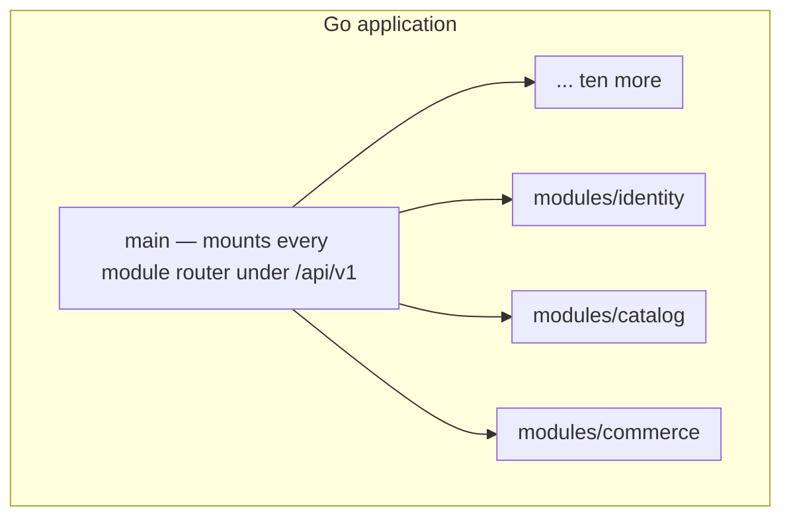
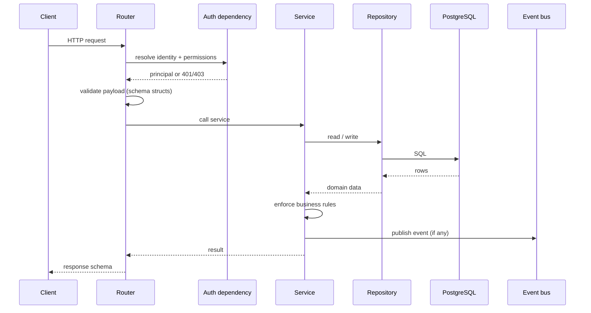

# 04 — Backend Architecture

**Status:** Blueprint
**Owner:** Backend

## Purpose

How the backend is organised, how a module is shaped, and which rules are enforced. Read this before creating a module or adding a cross-module call.

---

## The monolith

One Go application. Thirteen modules. Each module owns one PostgreSQL schema and exposes one public surface.



Modules never reach into each other's internals. They talk through a public surface or through events.

---

## Module anatomy

Every module has the same shape. Uniformity is the point — a new engineer should be able to open any module and know where things are.

```
internal/modules/<module>/
├── init.go             # wiring — constructors mounted in cmd/api/main.go
├── router/             # HTTP layer (Chi)
│   └── router.go       #   buyer routes + staff routes under admin middleware
├── service/            # business logic, one file per concern
│   ├── services.go     #   core service, constructor, shared errors
│   └── <concern>.go    #   e.g. checkout.go, lifecycle.go
├── repository/         # data access over pgx/SQLC
│   └── repository.go
├── schema/             # request/response structs (the contract)
│   └── schema.go
└── events/             # domain events this module publishes
    └── events.go
```

SQL lives in `migrations/NNNN_<name>.up.sql` / `.down.sql`; SQLC generates
typed queries under `internal/database/queries/` (never hand-edited). Tests
live beside the code as `*_test.go` (e.g. `router/router_test.go`) with a
shared advisory-lock `TestMain` per package.

### What each layer may do

| Layer | May | Must not |
|---|---|---|
| `router/` | Validate input, resolve auth dependencies, call one service, shape output | Contain business rules, import models, open transactions directly |
| `service/` | Enforce rules, orchestrate repositories, own transaction boundaries, publish events | Issue raw SQL, return persistence (SQLC) types to routers |
| `repository/` | Query and persist, build filters | Decide business outcomes, raise business errors |
| `migrations/` + generated queries | Declare tables, constraints, and typed queries | Hand-edit generated files, bypass the repository |
| `schema/` | Validate and serialise | Contain business logic |

### Constructors — the public surface

A module exposes constructors. `cmd/api/main.go` wires them; nothing else reaches into internals.

```go
// Mounting the catalogue module.
catalogServices := catalog_service.NewServices(db)
catalogRouter := catalog.New(catalogServices)
catalogRouter.RegisterRoutes()
srv.Router().Mount("/api/v1", catalogRouter.ChiRouter())
```

**Rule:** the constructor set is a contract, not a formality. Adding to it is a deliberate act. Removing from it is a breaking change for consumers.

---

## The boundary rules

CI enforces these. A pull request that breaks one does not merge.

### Rule 1 — No deep cross-module imports

```go
// ALLOWED — a sanctioned cross-module read through the owning service
order, err := commerceSvc.GetOrder(ctx, buyerID, orderCode)

// FORBIDDEN — reaching into another module's repository
import commerce_repo "github.com/atlas-platform/backend/internal/modules/commerce/repository"
```

**Why.** A deep import silently couples two modules at the implementation level. The owning module can no longer refactor without breaking a consumer it does not know about. Within months, the boundary is fiction.

**Enforcement.** A lint check greps for imports matching the forbidden pattern and fails on any match.

### Rule 2 — Async coupling uses domain events

When something your module does matters to another module, publish an event.

```go
// ALLOWED — notify, do not command
_ = publisher.Publish(ctx, events.EventOrderPlaced, envelope)

// FORBIDDEN — synchronous reach-across for background work
_, _ = inventorySvc.AllocateStockForOrder(ctx, orderID) // couples request latency to a peer
```

**Why.** Synchronous cross-module calls turn a modular monolith back into a tangle and couple one module's latency and availability to another's.

**Exception.** A read that must be consistent within the current request may call a peer's public read function. Document why in the code.

### Rule 3 — One schema per module

```sql
-- Owned by the catalogue schema; see migrations/000003_*.up.sql.
CREATE TABLE catalog.product (
    id BIGSERIAL PRIMARY KEY,
    code VARCHAR(26) NOT NULL UNIQUE
    -- ...
);
```

**Why.** Ownership becomes visible in the database. A future extraction is mechanical. Reporting reads can be granted schema by schema.

**Enforcement.** Migrations are numbered `NNNN_<name>.up.sql` / `.down.sql` pairs; every migration has a rollback path.

### Rule 4 — Public routes are IDOR-safe

| Route class | Identifier | Example |
|---|---|---|
| Public / buyer-facing | `slug` or opaque public code | `/api/v1/catalog/products/{slug}` |
| Staff-facing | Canonical string form of the primary key | `/api/v1/admin/catalog/products/{id}` |
| Internal module-to-module | Raw integer primary key | `get_product(product_id: int)` |

**Why.** Sequential integer IDs in public URLs invite enumeration and make every endpoint an access-control problem. Opaque identifiers make guessing useless.

**Enforcement.** A test asserts that no public router declares an `int` path parameter named `id`.

### Rule 5 — No cross-module joins

A module never queries another module's tables, not even for a read.

**Why.** A join is a hidden dependency that bypasses the boundary entirely and cannot be linted away.

**When you need it.** Either call the owner's public read, subscribe to the owner's event and maintain a local projection, or — if the need is genuinely analytical — build a read model.

### Rule 6 — No module calls a model provider directly

All inference goes through the `ai` module.

```go
// ALLOWED — through the gateway, with provenance and accounting
result := ai.Propose(ctx, ai.ProposalInput{...})

// FORBIDDEN — a private provider client, invisible to cost and guardrails
client := model.NewClient(apiKey) // outside modules/ai: invisible to all four
```

**Why.** One gateway means one place to redact, one place to bound cost, one place to version a prompt, and one place to answer "what did the model see?". A per-module client is invisible to all four.

**Enforcement.** A CI check rejects model-provider SDK imports outside `modules/ai/`. Provider API keys are present only in the `ai` module's configuration namespace.

**Also required.** The `ai` module is a leaf: it imports no other business module. If it needs catalogue data to build a prompt, the *caller* supplies it.

### Rule 7 — Model output is untrusted input

A completion is validated against a Go struct (decoded with `encoding/json` and range-checked) before any code uses it. It is never executed, never interpolated into SQL, and never allowed to select a tool or alter instructions.

**Why.** Every AI feature has two input surfaces: the one you control and the one an attacker does. Free text from a buyer, a supplier's spec sheet, and a scraped product description are all attacker-reachable. Treating output as trusted collapses the two.

**Enforcement.** Every `ai` response type is a Go struct. Retrieval surfaces are wrapped in a type that cannot be executed. Injection cases live in the evaluation set and fail the build.

---

### Rule 8 — Telemetry goes through the platform helper, not a backend client

Spans, metrics, and structured logs are emitted through the platform's instrumentation helper, which wraps the OpenTelemetry API. No module imports a telemetry backend client, and no module knows where telemetry is stored.

**Why.** The same reason the `ai` module owns model access: one place to change, one place to review, one place to disable. A module that imports a storage backend directly cannot be tested without it, and cannot be re-pointed without a release.

**Enforcement.** The dependency allow-list permits the OpenTelemetry API only. A backend client import fails review. The test suite runs with export disabled, which is only possible if nothing depends on a sink.

Detailed pipeline and cardinality rules: [14 Observability and Analytics](14-observability-and-analytics.md).

---

## Request lifecycle



The router owns HTTP. The service owns truth. Nothing else crosses.

---

## Transactions

1. **One transaction per service call**, opened in the service, not the router and not the repository.
2. **Explicit boundaries.** Never rely on implicit commit-on-request-end.
3. **No external I/O inside a transaction.** Call the payment gateway, the ERP, or the mailer *after* commit, or in a task. A held transaction plus a slow HTTP call is how connection pools die.
4. **Pessimistic locking for allocation.** Stock and lot allocation take row locks. Define the lock timeout and the behaviour on timeout.
5. **Idempotent writes.** Every mutation that affects money, stock, or order state accepts an idempotency key and records it.

### Locking order

When a service must lock several rows, it locks in a fixed order: **lot → reservation → order**. A consistent order prevents deadlocks between concurrent allocations. Write the order down; do not discover it in production.

---

## Error handling

A single error hierarchy, one response shape, correct status codes.

```go
// Sentinel domain errors; routers map them to status codes.
var (
    ErrProductNotFound   = errors.New("product not found")     // 404
    ErrInvalidQuantity   = errors.New("invalid quantity")       // 400
    ErrInsufficientStock = errors.New("insufficient stock")     // 422
    ErrOrderConflict     = errors.New("order state changed underneath") // 409
)
```

| Rule | Detail |
|---|---|
| One handler at the application level | Converts `ServiceError` to a response. Routers never build error responses. |
| Error messages are for developers | English, technical, no user-facing copy. The client localises. |
| Never leak internals | No stack traces, no SQL, no connection strings, no internal identifiers in a response body. |
| Errors are logged with a correlation ID | The same ID is returned to the client for support. |
| Business errors are not exceptions for control flow | Prefer returning a result type for expected outcomes; reserve exceptions for the unexpected. |

---

## Naming conventions

| Thing | Convention | Example |
|---|---|---|
| Module | singular noun | `catalog`, `commerce` |
| Schema | same as module | `catalog` |
| Table | singular snake_case | `product`, `order_line` |
| Primary key | `id` | `id` |
| Foreign key | `<referent>_id` | `supplier_id` |
| Timestamp | `<verb>_at` | `created_at`, `published_at` |
| Boolean | `is_` / `has_` prefix | `is_active`, `has_variants` |
| Enum | `<entity>_<attribute>` | `order_status`, `lot_state` |
| Router file | audience | `router.go` (buyer routes + staff group) |
| Service file | one file per concern | `services.go`, `checkout.go` |
| Repository file | one per aggregate | `repository.go` |
| Migration | numbered up/down pair | `000008_commerce_checkout_orders` |
| Domain event | `<entity>.<past_tense_verb>` | `order.placed`, `stock.reserved` |

---

## Testing expectations

| Level | Scope | Requirement |
|---|---|---|
| Unit | Service logic with repositories stubbed | Every business rule has a case |
| Integration | Service + repository + real database | Every repository function is exercised |
| API | Router + app, database included | Every endpoint has happy path, auth failure, validation failure |
| Contract | Response shape against the schema | Breaking a response fails the build |
| Boundary | Architecture lint | Deep imports, cross-schema joins, and public int IDs fail the build |

**Rules**
- A bug fix **MUST** add a test that fails before the fix.
- A business rule **MUST** have a test naming the rule, not the function.
- Tests **MUST NOT** depend on execution order or shared mutable state.
- Integration tests **MUST NOT** touch a real external system. Use a fake.

---

## Anti-patterns to reject in review

| Anti-pattern | Why it is rejected |
|---|---|
| Business logic in a router | Untestable, duplicated, and hidden from the service layer |
| A service returning a SQLC row type | Leaks persistence into the HTTP layer |
| A repository raising a business error | Data access layer should have no opinion on business rules |
| A cross-module join "just this once" | The boundary erodes one exception at a time |
| An external HTTP call inside a transaction | Holds a connection for the duration of a third party's latency |
| A `try/except` that swallows and continues | Turns a loud failure into silent data corruption |
| A repository importing from a service | Circular dependency and an untestable unit |
| A migration bundled with an unrelated feature | Unreviewable; if it fails, both must roll back |
| A module importing a model-provider SDK | Bypasses guardrails, cost accounting, and prompt versioning at once |
| Decoding a completion without struct validation | A malformed response becomes corrupt data instead of a failure |
| Letting retrieved text steer the prompt or a tool | This is the prompt-injection path |
| Passing contract prices to a third-party model by default | Commercial confidentiality breach |
| An AI call inside a database transaction | Holds a connection for the duration of a model's latency |
| Shipping an AI feature with no non-AI fallback | Hides a probabilistic dependency inside a correctness path |

---

## Related

- [02 System Architecture](02-system-architecture.md) — where these rules come from
- [05 API Contract](05-api-contract.md) — the HTTP surface modules expose
- [06 Data & Events](06-data-and-events.md) — schemas, events, and async tasks
- [11 Conventions & Glossary](11-conventions-and-glossary.md) — naming and vocabulary
- [12 AI Features](12-ai-features.md) — what the `ai` module owns and what it may decide
