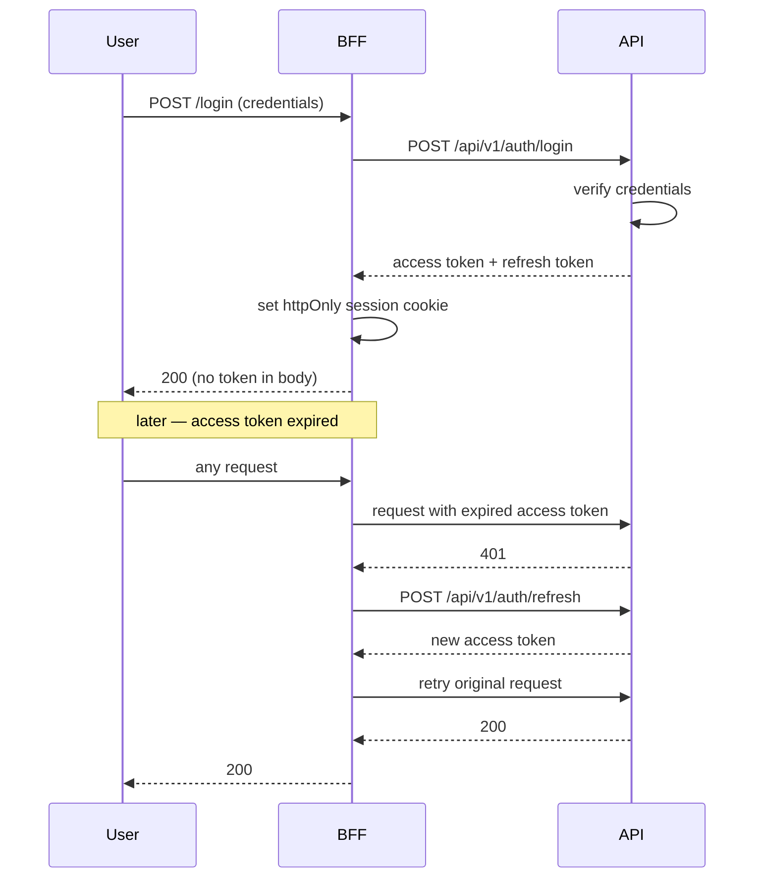

# 05 — API Contract

**Status:** Blueprint
**Owner:** Backend

## Purpose

The HTTP surface Atlas exposes to its frontends and mobile app: conventions, authentication, error shape, and the endpoint catalogue per module.

This document defines the **contract shape**. Per-endpoint request and response detail belongs in the module's router and schema files, and is published through the generated OpenAPI document.

---

## Base conventions

| Property | Value |
|---|---|
| Base path | `/api/v1` |
| Content type | `application/json` |
| Auth | Bearer JWT |
| Access token TTL | 1 hour |
| Refresh token TTL | 30 days |
| Signing | HMAC, secret from environment |
| Dates on the wire | ISO 8601, UTC |
| Timezone | A client display concern. The API never sends local time. |
| Money | Integer minor units plus an explicit currency code. Never a float. |
| IDs | Opaque public codes in public routes; string-form primary keys in staff routes |
| Tracing | `X-Request-ID` accepted from the client and always echoed |
| Versioning | Path-based. A breaking change means `/api/v2`. |

**Money rule.** `{"amount": 12550, "currency": "USD"}` means 125.50. Floats are forbidden in any monetary field — binary floating point cannot represent decimal money exactly, and the error compounds across a basket.

---

## Authentication



**Rules**

1. The access token **MUST NOT** be reachable from browser JavaScript. It lives in an httpOnly cookie set by the BFF.
2. Refresh is **transparent to the client**. The browser never handles a refresh token.
3. Refresh tokens rotate. A reused refresh token invalidates the whole family — that pattern indicates theft.
4. Logout revokes the refresh token server-side. Clearing a cookie is not logout.
5. The API never trusts a client-supplied identity. Identity comes from the verified token only.

### Authorisation model

Two layers, both server-side:

| Layer | Question | Enforcement |
|---|---|---|
| Role / permission | May this principal perform this operation at all? | Route dependency, checked before the handler runs |
| Scope | May this principal touch *this* record? | Service layer, using the principal's ownership facts |

Examples of scope:

| Principal | Scope fact |
|---|---|
| Buyer | Orders where `buyer_id` matches |
| Buyer staff | Same, further narrowed by the staff member's granted permissions |
| Supplier | Catalogue lines and orders where `supplier_id` matches |
| Staff | Governed by role, plus explicit permission for the specific operation |

**Rule:** hiding a control in the UI is not authorisation. Every restriction is enforced in the API.

---

## Error responses

One shape, everywhere.

```json
{
  "detail": "Insufficient stock for lot L-2291",
  "code": "insufficient_stock",
  "request_id": "01HQ8Z..."
}
```

| Field | Purpose |
|---|---|
| `detail` | Developer-facing message. English, technical, safe to log. |
| `code` | Stable machine-readable identifier. Clients branch on this, never on `detail`. |
| `request_id` | Correlates with server logs. Show it to the user for support. |
| `errors` | Optional. Field-level validation failures, keyed by field name. |

### Status code usage

| Code | When |
|---|---|
| 200 | Success with a body |
| 201 | Resource created; `Location` header set |
| 202 | Accepted for async processing; body contains a status URL |
| 204 | Success, no body |
| 400 | Malformed request |
| 401 | Missing or invalid credentials |
| 403 | Authenticated but not permitted |
| 404 | Not found, or not visible to this principal |
| 409 | State conflict: duplicate, already applied, stock contention |
| 422 | Semantically invalid payload |
| 429 | Rate limited; `Retry-After` set |
| 500 | Unhandled server error. Never exposes internals. |
| 503 | Dependency unavailable; `Retry-After` set |

**404 vs 403.** When a principal may not know a record exists, return 404. Returning 403 confirms existence, which is an information leak.

---

## Pagination, filtering, sorting

Offset pagination for admin surfaces; cursor pagination for anything a user scrolls.

```
GET /api/v1/admin/orders?page=1&page_size=50&status=awaiting_dispatch&sort=-placed_at
GET /api/v1/catalog/products?cursor=eyJpZCI6MTIzfQ&limit=24
```

| Parameter | Rule |
|---|---|
| `page` / `page_size` | 1-based page, default 20, maximum 200 |
| `cursor` / `limit` | Opaque cursor, default 24, maximum 100 |
| `sort` | Comma-separated; `-` prefix means descending |
| Filters | Explicitly named query parameters. No free-form filter expressions. |

Response envelope for offset pagination:

```json
{
  "items": [],
  "page": 1,
  "page_size": 50,
  "total": 1284,
  "has_next": true
}
```

**Rule:** a maximum page size exists so that no client can request an unbounded result and take down the database. Enforce it in the schema, not in the handler.

---

## Idempotency

Every mutation that affects **orders, payments, stock, or verification** accepts an idempotency key.

```
POST /api/v1/commerce/checkout
Idempotency-Key: 8f14e45f-ea0c-4f1e-9c0a-2b3d4e5f6a7b
```

| Behaviour | Result |
|---|---|
| First request with a key | Executed; response recorded against the key |
| Repeat with the same key, same payload | The recorded response is replayed. No side effect. |
| Repeat with the same key, different payload | `409` — the key was reused for a different intent |
| Key older than the retention window | Treated as new |

**AI proposal endpoints are also idempotent**, keyed on input hash plus prompt version. Re-submitting the same text returns the same `proposal_id` rather than a fresh, differently-worded proposal. Without this, a double-tap produces two proposals a buyer must reconcile.

**Confirming a proposal is the mutation.** `POST /ai/proposals/{id}/confirm` is where the money-affecting work happens, and it is idempotent on the proposal id. A confirmed proposal cannot be confirmed twice, and an expired proposal returns `409` rather than being silently re-priced.

**Why.** Gateways retry, networks drop responses after commit, and users double-tap. Without this, every one of those becomes a duplicated order or a double-charged account.

---

## Rate limiting

Per route, keyed by principal where authenticated and by client IP where not.

| Route class | Limit |
|---|---|
| Login, password reset | 5 / minute |
| Registration | 10 / minute |
| Token refresh | 20 / minute |
| Authenticated reads | 300 / minute |
| Authenticated writes | 60 / minute |
| Public catalogue reads | 600 / minute |
| Checkout submit | 10 / minute |
| Webhooks | 300 / minute, per source |
| AI proposals (buyer) | 20 / minute, per buyer |
| AI extraction (staff) | 60 / minute, per user |
| AI copilot queries | 30 / minute, per user |
| AI evaluation triggers | 5 / hour, per user |

Exceeding a limit returns `429` with `Retry-After`. Rate limit state lives in Redis so it is shared across API instances.

AI routes carry a second limit that is not per-route: a **cost budget** per tenant per period. A tenant at its ceiling gets `402` with the budget window in the body, not `429`. The two are different problems — one is too many requests, the other is too much spend — and the client should be able to tell them apart.

---

## Endpoint catalogue

Prefixes are shown relative to `/api/v1`. **A** = authenticated, **S** = staff permission required, **P** = public.

### `identity` — authentication, profile, verification

| Method | Path | Access | Purpose |
|---|---|---|---|
| POST | `/auth/register` | P | Begin buyer registration |
| POST | `/auth/register/verify` | P | Confirm registration with an OTP |
| POST | `/auth/login` | P | Obtain a token pair |
| POST | `/auth/refresh` | P | Exchange a refresh token |
| POST | `/auth/logout` | A | Revoke the refresh token family |
| POST | `/auth/password/forgot` | P | Begin password reset |
| POST | `/auth/password/reset` | P | Complete password reset |
| GET | `/buyer/me` | A | Current buyer profile |
| PATCH | `/buyer/me` | A | Update profile |
| GET | `/buyer/me/addresses` | A | List addresses |
| POST | `/buyer/me/addresses` | A | Add an address |
| PATCH | `/buyer/me/addresses/{code}` | A | Update an address |
| DELETE | `/buyer/me/addresses/{code}` | A | Remove an address |
| GET | `/buyer/me/verification` | A | Verification status and submitted evidence |
| POST | `/buyer/me/verification` | A | Submit or resubmit verification |
| GET | `/admin/users` | S | List platform users |
| PATCH | `/admin/users/{id}` | S | Update a user |
| POST | `/admin/users/{id}/suspend` | S | Suspend a user |
| GET | `/admin/verifications` | S | Verification review queue |
| POST | `/admin/verifications/{id}/decide` | S | Approve or reject, with reason |
| GET | `/admin/roles` | S | List roles and permissions |
| PUT | `/admin/roles/{role}/permissions` | S | Set a role's permissions |

### `catalog` — products and reference data

| Method | Path | Access | Purpose |
|---|---|---|---|
| GET | `/catalog/products` | P | Browse products |
| GET | `/catalog/products/{slug}` | P | Product detail |
| GET | `/catalog/categories` | P | Category tree |
| GET | `/catalog/brands` | P | Brand list |
| GET | `/catalog/suppliers` | P | Supplier list |
| GET | `/catalog/facets` | P | Facet values for the current filter set |
| GET | `/catalog/search` | P | Search with facets |
| GET | `/catalog/buyer-products` | A | Products visible to this buyer, with buyer pricing |
| GET | `/admin/catalog/products` | S | Staff product list |
| POST | `/admin/catalog/products` | S | Create a product |
| PATCH | `/admin/catalog/products/{id}` | S | Update a product |
| POST | `/admin/catalog/products/{id}/publish` | S | Publish a product |
| POST | `/admin/catalog/products/{id}/archive` | S | Archive a product |
| GET | `/admin/catalog/categories` | S | Staff category management |
| POST | `/admin/catalog/categories` | S | Create a category |
| GET | `/admin/catalog/suppliers` | S | Staff supplier list |
| POST | `/admin/catalog/reindex` | S | Trigger a search reindex |
| GET | `/admin/catalog/reindex/{job_id}` | S | Reindex progress |

### `pricing` — price lists and computation

| Method | Path | Access | Purpose |
|---|---|---|---|
| GET | `/admin/pricing/price-lists` | S | List price lists |
| POST | `/admin/pricing/price-lists` | S | Create a price list |
| GET | `/admin/pricing/price-lists/{id}` | S | Price list detail with entries |
| PUT | `/admin/pricing/price-lists/{id}/entries` | S | Replace entries |
| POST | `/admin/pricing/price-lists/{id}/assign` | S | Assign a price list to buyers |
| POST | `/pricing/quote` | A | Server-computed price for a set of lines |

**Note.** There is no endpoint for a client to submit a price. Price is computed from catalogue, price list, quantity, and promotions.

### `inventory` — stock, lots, allocation

| Method | Path | Access | Purpose |
|---|---|---|---|
| GET | `/inventory/availability` | A | Availability for a set of products |
| GET | `/admin/inventory/stock` | S | Stock list |
| GET | `/admin/inventory/lots` | S | Lot list with expiry and state |
| POST | `/admin/inventory/lots/{id}/quarantine` | S | Quarantine a lot |
| POST | `/admin/inventory/lots/{id}/release` | S | Release a lot from quarantine |
| GET | `/admin/inventory/low-stock` | S | Below-threshold items |
| GET | `/admin/inventory/expiring` | S | Lots nearing expiry |
| POST | `/admin/inventory/adjust` | S | Record a stock adjustment with a reason |

### `commerce` — cart, checkout, orders, fulfilment

| Method | Path | Access | Purpose |
|---|---|---|---|
| GET | `/commerce/cart` | A | Current cart, grouped by supplier |
| POST | `/commerce/cart/items` | A | Add a line |
| PATCH | `/commerce/cart/items/{code}` | A | Change quantity |
| DELETE | `/commerce/cart/items/{code}` | A | Remove a line |
| POST | `/commerce/cart/quote` | A | Totals, discounts, and availability for the cart |
| POST | `/commerce/checkout` | A | Submit the cart. Idempotent. Returns `202` when dispatch is deferred. |
| GET | `/commerce/orders/me` | A | Buyer order history |
| GET | `/commerce/orders/me/{code}` | A | Buyer order detail |
| POST | `/commerce/orders/me/{code}/cancel` | A | Request cancellation |
| GET | `/admin/orders` | S | Staff order list with SLA view |
| GET | `/admin/orders/{id}` | S | Staff order detail |
| POST | `/admin/orders/{id}/notes` | S | Add an internal note |
| POST | `/admin/orders/{id}/hold` | S | Put an order on hold |
| POST | `/admin/orders/{id}/release` | S | Release a hold |
| POST | `/admin/orders/{id}/split` | S | Split into supplier shipments |
| GET | `/admin/shipments` | S | Shipment list |
| PATCH | `/admin/shipments/{id}` | S | Update tracking or status |
| GET | `/admin/invoices` | S | Invoice list |
| POST | `/admin/invoices/{id}/issue` | S | Issue an invoice |

### `payments`

| Method | Path | Access | Purpose |
|---|---|---|---|
| GET | `/payments/methods` | A | Methods available to this buyer |
| POST | `/payments/intents` | A | Create a payment intent. Idempotent. |
| GET | `/payments/intents/{code}` | A | Intent status |
| GET | `/admin/payments` | S | Payment list |
| POST | `/admin/payments/{id}/refund` | S | Issue a refund, with reason |
| GET | `/admin/payments/reconciliation` | S | Reconciliation view |
| POST | `/webhooks/payments/{provider}` | P | Gateway callback. Signature-verified. |

### `promotions`

| Method | Path | Access | Purpose |
|---|---|---|---|
| GET | `/promotions/active` | A | Promotions applicable to this buyer |
| POST | `/commerce/cart/voucher` | A | Apply a voucher code |
| GET | `/admin/promotions` | S | Promotion list |
| POST | `/admin/promotions` | S | Create a promotion |
| PATCH | `/admin/promotions/{id}` | S | Update a promotion |
| POST | `/admin/promotions/{id}/publish` | S | Publish |
| GET | `/admin/promotions/reports` | S | Promotion performance |

### `crm` — leads, referrals, partners

| Method | Path | Access | Purpose |
|---|---|---|---|
| POST | `/leads` | P | Submit an enquiry |
| GET | `/admin/leads` | S | Lead queue |
| POST | `/admin/leads/{id}/assign` | S | Assign a lead |
| PATCH | `/admin/leads/{id}` | S | Update status or notes |
| GET | `/admin/referrals` | S | Referral codes and performance |
| POST | `/admin/referrals` | S | Create a referral code |
| GET | `/admin/partners` | S | Partner registry |
| POST | `/admin/partners` | S | Register a partner |
| GET | `/partners/track` | P | Resolve a partner reference from a campaign parameter |

### `cms`

| Method | Path | Access | Purpose |
|---|---|---|---|
| GET | `/cms/articles` | P | Published articles |
| GET | `/cms/articles/{slug}` | P | Article detail |
| GET | `/cms/pages/{slug}` | P | Static page |
| GET | `/cms/faqs` | P | FAQs |
| GET | `/cms/menus/{location}` | P | Navigation menu for a location |
| GET | `/admin/cms/articles` | S | Article management |
| POST | `/admin/cms/articles` | S | Create an article |
| POST | `/admin/cms/articles/{id}/publish` | S | Publish |
| GET | `/admin/cms/pages` | S | Page management |
| POST | `/admin/cms/pages` | S | Create a page |
| GET | `/admin/cms/banners` | S | Banner management |
| POST | `/admin/cms/menus` | S | Create a menu entry |
| GET | `/admin/cms/settings` | S | Site settings |
| PUT | `/admin/cms/settings` | S | Update site settings |

### `suppliers`

| Method | Path | Access | Purpose |
|---|---|---|---|
| POST | `/suppliers/apply` | P | Supplier application |
| GET | `/supplier/me` | A | Supplier's own profile |
| PATCH | `/supplier/me` | A | Update own profile |
| GET | `/supplier/me/orders` | A | Orders directed to this supplier |
| PATCH | `/supplier/me/orders/{code}` | A | Acknowledge or update fulfilment |
| PATCH | `/supplier/me/stock` | A | Push a stock update |
| GET | `/admin/suppliers` | S | Supplier list |
| POST | `/admin/suppliers/{id}/approve` | S | Approve a supplier |
| GET | `/admin/suppliers/{id}/contracts` | S | Contract terms |
| PUT | `/admin/suppliers/{id}/contracts` | S | Set contract terms |

### `platform` — cross-cutting

| Method | Path | Access | Purpose |
|---|---|---|---|
| GET | `/health` | P | Liveness |
| GET | `/readyz` | P | Readiness: database and cache reachable |
| GET | `/platform/notifications` | A | Notification list |
| POST | `/platform/notifications/{id}/read` | A | Mark read |
| POST | `/platform/media` | A | Request an upload target |
| GET | `/platform/reference/regions` | P | Reference data |
| GET | `/platform/feature-flags` | P | Flags relevant to this client |
| GET | `/admin/feature-flags` | S | Flag management |
| PUT | `/admin/feature-flags/{key}` | S | Set a flag |
| GET | `/admin/audit-log` | S | Audit trail |
| GET | `/admin/integration-traffic` | S | Inbound webhook and outbound request log, redacted |

### `ai` — model-backed assistance

Every route below returns a **proposal**, never a committed side effect. `A` = authenticated buyer, `S` = staff.

| Method | Path | Access | Purpose |
|---|---|---|---|
| POST | `/ai/proposals/cart` | A | Propose cart lines from text, an image reference, or a voice transcript |
| GET | `/ai/proposals/{id}` | A | Fetch a proposal and its current validity |
| POST | `/ai/proposals/{id}/confirm` | A | Confirm a proposal; this is the mutation |
| POST | `/ai/proposals/{id}/reject` | A | Discard a proposal |
| POST | `/ai/assist/search` | A | Intent search over the deterministic catalogue filter |
| POST | `/ai/assist/substitutes` | A | Ranked substitutes, with differences from the original surfaced |
| POST | `/ai/ask/product` | A | Grounded product question; abstains when ungrounded |
| GET | `/ai/conversations/{code}` | A | A conversation's proposals |
| POST | `/ai/extract/document` | S | Extract structured fields from an uploaded document |
| POST | `/ai/extract/order-list` | S | Extract line items from an uploaded order document |
| POST | `/ai/draft/content` | S | Draft content for a target surface |
| POST | `/ai/rank/leads` | S | Rank and suggest an owner for inbound leads |
| POST | `/ai/flag/scan` | S | Run a flagging pass over a supplied record set |
| POST | `/ai/copilot/query` | S | Resolve a natural-language question against the semantic layer |
| GET | `/admin/ai/prompts` | S | Prompt registry |
| POST | `/admin/ai/prompts` | S | Create a prompt key |
| PUT | `/admin/ai/prompts/{key}` | S | Create a new prompt version |
| POST | `/admin/ai/prompts/{key}/promote` | S | Promote a version after evaluation |
| GET | `/admin/ai/models` | S | Model routing configuration |
| PUT | `/admin/ai/models/{feature}` | S | Set the model for a feature |
| GET | `/admin/ai/usage` | S | Token, latency, and cost accounting |
| GET | `/admin/ai/budgets` | S | Per-feature and per-tenant ceilings |
| PUT | `/admin/ai/budgets/{scope}` | S | Set a ceiling |
| GET | `/admin/ai/evals` | S | Evaluation runs and scores |
| POST | `/admin/ai/evals/run` | S | Trigger an evaluation suite |
| GET | `/admin/ai/review-queue` | S | Human review queue |
| POST | `/admin/ai/review-queue/{id}/decide` | S | Accept, edit, or reject an output |
| GET | `/admin/ai/incidents` | S | Guardrail and safety incidents |
| PUT | `/admin/ai/features/{key}` | S | Enable or disable an AI feature (the kill switch) |

#### The proposal envelope

Every AI route returns this shape. Detail in [12 AI Features](12-ai-features.md).

```json
{
  "proposal_id": "01HQ9...",
  "status": "proposed",
  "confidence": 0.82,
  "items": [],
  "unresolved": [],
  "provenance": {
    "prompt_key": "cart.from_text",
    "prompt_version": 4,
    "model": "provider/model-name",
    "input_hash": "sha256:..."
  },
  "expires_at": "2026-01-01T00:15:00Z"
}
```

#### Contract rules for AI routes

| Rule | Detail |
|---|---|
| **Proposal, never side effect** | No AI route writes an order, a price, a stock level, or a verification outcome |
| **Server-side resolution on confirm** | Price, availability, and eligibility are resolved by the normal path at confirm time — never taken from the proposal |
| **Expiry** | Proposals expire. Confirming an expired proposal returns `409` |
| **Explicit abstention** | When grounding is missing, the route returns a proposal with `unresolved` populated or `status: "abstained"` |
| **No free SQL** | `/ai/copilot/query` resolves against the semantic layer only; the resolved query is returned in the response |
| **Permission-scoped** | An AI route never exposes data the caller could not fetch directly |
| **Streaming** | Long generations stream. A non-streaming client gets `202` plus a status URL |
| **Non-AI path documented** | Every AI route documents what the client does when it returns `503` |

#### Status codes specific to AI

| Code | Meaning |
|---|---|
| `200` | Proposal returned |
| `202` | Accepted for asynchronous generation; poll the status URL |
| `402` | Tenant budget exhausted for the period |
| `409` | Proposal expired, already decided, or key reused |
| `422` | Input rejected by validation or guardrail |
| `503` | AI unavailable and no fallback; the client uses the non-AI path |

### `erp` — external system integration

| Method | Path | Access | Purpose |
|---|---|---|---|
| POST | `/webhooks/erp/{topic}` | P | Inbound ERP event. Signature-verified. |
| POST | `/admin/erp/sync/catalog` | S | Trigger a catalogue sync |
| POST | `/admin/erp/sync/stock` | S | Trigger a stock sync |
| GET | `/admin/erp/sync/{job_id}` | S | Sync job status and drift report |
| POST | `/admin/erp/orders/{id}/dispatch` | S | Force re-dispatch of an order |

---

## Webhook rules

Applies to every `/webhooks/*` route.

1. **Verify the signature** against the raw request body before parsing. Never verify a re-serialised body.
2. **Reject unsigned or stale requests** with `401`. Reject replays outside a timestamp window.
3. **Return `2xx` before doing work.** Acknowledge, then process asynchronously. A slow handler causes the sender to retry, and retries multiply.
4. **Treat every payload as untrusted input.** Validate shape and ranges; never trust the claimed identity inside it.
5. **Deduplicate by the provider's event ID.** Providers deliver the same event more than once.
6. **Log redacted.** Store headers and a payload hash; never store credentials or full cardholder data.

---

## Caching

| Content | Cache | Invalidation |
|---|---|---|
| Public catalogue list | BFF plus Redis | On product or category publish |
| Product detail | BFF plus Redis | On that product's write |
| Reference data | Redis, long TTL | Scheduled refresh |
| Buyer-scoped reads | Redis, keyed by buyer | On that buyer's write |
| Cart | Not cached | Always live |
| Order state | Not cached | Always live |
| Availability | Short TTL, seconds | On ERP stock update |

**Rule:** an authenticated, buyer-specific response **MUST NOT** share a cache key with a public response. A cache-key collision between two buyers is a data leak, not a performance bug.

---

## Related

- [04 Backend Architecture](04-backend-architecture.md) — how these routes are implemented inside modules
- [06 Data & Events](06-data-and-events.md) — what happens asynchronously after a write
- [07 Frontend Architecture](07-frontend-architecture.md) — how the BFF consumes this surface
