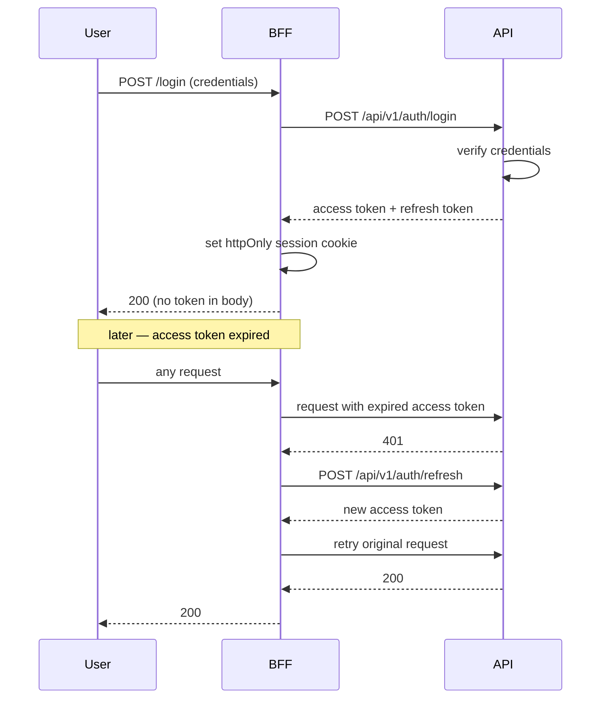

# 05 — API Contract

**Status:** Blueprint
**Owner:** Backend

## Purpose

The HTTP surface Atlas exposes to its frontends and mobile app: conventions, authentication, error shape, and the endpoint catalogue per module.

This document defines the **contract shape**. Per-endpoint request and response detail belongs in the module's router and schema files, and is published through the generated OpenAPI document.

---

## Base conventions

| Property | Value |
|---|---|
| Base path | `/api/v1` |
| Content type | `application/json` |
| Auth | Bearer JWT |
| Access token TTL | 1 hour |
| Refresh token TTL | 30 days |
| Signing | HMAC, secret from environment |
| Dates on the wire | ISO 8601, UTC |
| Timezone | A client display concern. The API never sends local time. |
| Money | Integer minor units plus an explicit currency code. Never a float. |
| IDs | Opaque public codes in public routes; string-form primary keys in staff routes |
| Tracing | `X-Request-ID` accepted from the client and always echoed |
| Versioning | Path-based. A breaking change means `/api/v2`. |

**Money rule.** `{"amount": 12550, "currency": "USD"}` means 125.50. Floats are forbidden in any monetary field — binary floating point cannot represent decimal money exactly, and the error compounds across a basket.

---

## Authentication



**Rules**

1. The access token **MUST NOT** be reachable from browser JavaScript. It lives in an httpOnly cookie set by the BFF.
2. Refresh is **transparent to the client**. The browser never handles a refresh token.
3. Refresh tokens rotate. A reused refresh token invalidates the whole family — that pattern indicates theft.
4. Logout revokes the refresh token server-side. Clearing a cookie is not logout.
5. The API never trusts a client-supplied identity. Identity comes from the verified token only.

### Authorisation model

Two layers, both server-side:

| Layer | Question | Enforcement |
|---|---|---|
| Role / permission | May this principal perform this operation at all? | Route dependency, checked before the handler runs |
| Scope | May this principal touch *this* record? | Service layer, using the principal's ownership facts |

Examples of scope:

| Principal | Scope fact |
|---|---|
| Buyer | Orders where `buyer_id` matches |
| Buyer staff | Same, further narrowed by the staff member's granted permissions |
| Supplier | Catalogue lines and orders where `supplier_id` matches |
| Staff | Governed by role, plus explicit permission for the specific operation |

**Rule:** hiding a control in the UI is not authorisation. Every restriction is enforced in the API.

---

## Error responses

One shape, everywhere.

```json
{
  "detail": "Insufficient stock for lot L-2291",
  "code": "insufficient_stock",
  "request_id": "01HQ8Z..."
}
```

| Field | Purpose |
|---|---|
| `detail` | Developer-facing message. English, technical, safe to log. |
| `code` | Stable machine-readable identifier. Clients branch on this, never on `detail`. |
| `request_id` | Correlates with server logs. Show it to the user for support. |
| `errors` | Optional. Field-level validation failures, keyed by field name. |

### Status code usage

| Code | When |
|---|---|
| 200 | Success with a body |
| 201 | Resource created; `Location` header set |
| 202 | Accepted for async processing; body contains a status URL |
| 204 | Success, no body |
| 400 | Malformed request |
| 401 | Missing or invalid credentials |
| 403 | Authenticated but not permitted |
| 404 | Not found, or not visible to this principal |
| 409 | State conflict: duplicate, already applied, stock contention |
| 422 | Semantically invalid payload |
| 429 | Rate limited; `Retry-After` set |
| 500 | Unhandled server error. Never exposes internals. |
| 503 | Dependency unavailable; `Retry-After` set |

**404 vs 403.** When a principal may not know a record exists, return 404. Returning 403 confirms existence, which is an information leak.

---

## Pagination, filtering, sorting

Offset pagination for admin surfaces; cursor pagination for anything a user scrolls.

```
GET /api/v1/admin/orders?page=1&page_size=50&status=awaiting_dispatch&sort=-placed_at
GET /api/v1/catalog/products?cursor=eyJpZCI6MTIzfQ&limit=24
```

| Parameter | Rule |
|---|---|
| `page` / `page_size` | 1-based page, default 20, maximum 200 |
| `cursor` / `limit` | Opaque cursor, default 24, maximum 100 |
| `sort` | Comma-separated; `-` prefix means descending |
| Filters | Explicitly named query parameters. No free-form filter expressions. |

Response envelope for offset pagination:

```json
{
  "items": [],
  "page": 1,
  "page_size": 50,
  "total": 1284,
  "has_next": true
}
```

**Rule:** a maximum page size exists so that no client can request an unbounded result and take down the database. Enforce it in the schema, not in the handler.

---

## Idempotency

Every mutation that affects **orders, payments, stock, or verification** accepts an idempotency key.

```
POST /api/v1/commerce/checkout
Idempotency-Key: 8f14e45f-ea0c-4f1e-9c0a-2b3d4e5f6a7b
```

| Behaviour | Result |
|---|---|
| First request with a key | Executed; response recorded against the key |
| Repeat with the same key, same payload | The recorded response is replayed. No side effect. |
| Repeat with the same key, different payload | `409` — the key was reused for a different intent |
| Key older than the retention window | Treated as new |

**AI proposal endpoints are also idempotent**, keyed on input hash plus prompt version. Re-submitting the same text returns the same `proposal_id` rather than a fresh, differently-worded proposal. Without this, a double-tap produces two proposals a buyer must reconcile.

**Confirming a proposal is the mutation.** `POST /ai/proposals/{id}/confirm` is where the money-affecting work happens, and it is idempotent on the proposal id. A confirmed proposal cannot be confirmed twice, and an expired proposal returns `409` rather than being silently re-priced.

**Why.** Gateways retry, networks drop responses after commit, and users double-tap. Without this, every one of those becomes a duplicated order or a double-charged account.

---

## Rate limiting

Per route, keyed by principal where authenticated and by client IP where not.

| Route class | Limit |
|---|---|
| Login, password reset | 5 / minute |
| Registration | 10 / minute |
| Token refresh | 20 / minute |
| Authenticated reads | 300 / minute |
| Authenticated writes | 60 / minute |
| Public catalogue reads | 600 / minute |
| Checkout submit | 10 / minute |
| Webhooks | 300 / minute, per source |
| AI proposals (buyer) | 20 / minute, per buyer |
| AI extraction (staff) | 60 / minute, per user |
| AI copilot queries | 30 / minute, per user |
| AI evaluation triggers | 5 / hour, per user |

Exceeding a limit returns `429` with `Retry-After`. Rate limit state lives in Redis so it is shared across API instances.

AI routes carry a second limit that is not per-route: a **cost budget** per tenant per period. A tenant at its ceiling gets `402` with the budget window in the body, not `429`. The two are different problems — one is too many requests, the other is too much spend — and the client should be able to tell them apart.

---

## Endpoint catalogue

Prefixes are shown relative to `/api/v1`. **A** = authenticated, **S** = staff permission required, **P** = public.

### `identity` — authentication, profile, verification

| Method | Path | Access | Purpose |
|---|---|---|---|
| POST | `/auth/register` | P | Begin buyer registration |
| POST | `/auth/register/verify` | P | Confirm registration with an OTP |
| POST | `/auth/login` | P | Obtain a token pair |
| POST | `/auth/refresh` | P | Exchange a refresh token |
| POST | `/auth/logout` | A | Revoke the refresh token family |
| POST | `/auth/password/forgot` | P | Begin password reset |
| POST | `/auth/password/reset` | P | Complete password reset |
| GET | `/buyer/me` | A | Current buyer profile |
| PATCH | `/buyer/me` | A | Update profile |
| GET | `/buyer/me/addresses` | A | List addresses |
| POST | `/buyer/me/addresses` | A | Add an address |
| PATCH | `/buyer/me/addresses/{code}` | A | Update an address |
| DELETE | `/buyer/me/addresses/{code}` | A | Remove an address |
| GET | `/buyer/me/verification` | A | Verification status and submitted evidence |
| POST | `/buyer/me/verification` | A | Submit or resubmit verification |
| GET | `/admin/users` | S | List platform users |
| PATCH | `/admin/users/{id}` | S | Update a user |
| POST | `/admin/users/{id}/suspend` | S | Suspend a user |
| GET | `/admin/verifications` | S | Verification review queue |
| POST | `/admin/verifications/{id}/decide` | S | Approve or reject, with reason |
| GET | `/admin/roles` | S | List roles and permissions |
| PUT | `/admin/roles/{role}/permissions` | S | Set a role's permissions |

### `catalog` — products and reference data

| Method | Path | Access | Purpose |
|---|---|---|---|
| GET | `/catalog/products` | P | Browse products |
| GET | `/catalog/products/{slug}` | P | Product detail |
| GET | `/catalog/categories` | P | Category tree |
| GET | `/catalog/brands` | P | Brand list |
| GET | `/catalog/suppliers` | P | Supplier list |
| GET | `/catalog/facets` | P | Facet values for the current filter set |
| GET | `/catalog/search` | P | Search with facets |
| GET | `/catalog/buyer-products` | A | Products visible to this buyer, with buyer pricing |
| GET | `/admin/catalog/products` | S | Staff product list |
| POST | `/admin/catalog/products` | S | Create a product |
| PATCH | `/admin/catalog/products/{id}` | S | Update a product |
| POST | `/admin/catalog/products/{id}/publish` | S | Publish a product |
| POST | `/admin/catalog/products/{id}/archive` | S | Archive a product |
| GET | `/admin/catalog/categories` | S | Staff category management |
| POST | `/admin/catalog/categories` | S | Create a category |
| GET | `/admin/catalog/suppliers` | S | Staff supplier list |
| POST | `/admin/catalog/reindex` | S | Trigger a search reindex |
| GET | `/admin/catalog/reindex/{job_id}` | S | Reindex progress |

### `pricing` — price lists and computation

| Method | Path | Access | Purpose |
|---|---|---|---|
| GET | `/admin/pricing/price-lists` | S | List price lists |
| POST | `/admin/pricing/price-lists` | S | Create a price list |
| GET | `/admin/pricing/price-lists/{id}` | S | Price list detail with entries |
| PUT | `/admin/pricing/price-lists/{id}/entries` | S | Replace entries |
| POST | `/admin/pricing/price-lists/{id}/assign` | S | Assign a price list to buyers |
| POST | `/pricing/quote` | A | Server-computed price for a set of lines |

**Note.** There is no endpoint for a client to submit a price. Price is computed from catalogue, price list, quantity, and promotions.

### `inventory` — stock, lots, allocation

| Method | Path | Access | Purpose |
|---|---|---|---|
| GET | `/inventory/availability` | A | Availability for a set of products |
| GET | `/admin/inventory/stock` | S | Stock list |
| GET | `/admin/inventory/lots` | S | Lot list with expiry and state |
| POST | `/admin/inventory/lots/{id}/quarantine` | S | Quarantine a lot |
| POST | `/admin/inventory/lots/{id}/release` | S | Release a lot from quarantine |
| GET | `/admin/inventory/low-stock` | S | Below-threshold items |
| GET | `/admin/inventory/expiring` | S | Lots nearing expiry |
| POST | `/admin/inventory/adjust` | S | Record a stock adjustment with a reason |

### `commerce` — cart, checkout, orders, fulfilment

| Method | Path | Access | Purpose |
|---|---|---|---|
| GET | `/commerce/cart` | A | Current cart, grouped by supplier |
| POST | `/commerce/cart/items` | A | Add a line |
| PATCH | `/commerce/cart/items/{code}` | A | Change quantity |
| DELETE | `/commerce/cart/items/{code}` | A | Remove a line |
| POST | `/commerce/cart/quote` | A | Totals, discounts, and availability for the cart |
| POST | `/commerce/checkout` | A | Submit the cart. Idempotent. Returns `202` when dispatch is deferred. |
| GET | `/commerce/orders/me` | A | Buyer order history |
| GET | `/commerce/orders/me/{code}` | A | Buyer order detail |
| POST | `/commerce/orders/me/{code}/cancel` | A | Request cancellation |
| GET | `/admin/orders` | S | Staff order list with SLA view |
| GET | `/admin/orders/{id}` | S | Staff order detail |
| POST | `/admin/orders/{id}/notes` | S | Add an internal note |
| POST | `/admin/orders/{id}/hold` | S | Put an order on hold |
| POST | `/admin/orders/{id}/release` | S | Release a hold |
| POST | `/admin/orders/{id}/split` | S | Split into supplier shipments |
| GET | `/admin/shipments` | S | Shipment list |
| PATCH | `/admin/shipments/{id}` | S | Update tracking or status |
| GET | `/admin/invoices` | S | Invoice list |
| POST | `/admin/invoices/{id}/issue` | S | Issue an invoice |

### `payments`

| Method | Path | Access | Purpose |
|---|---|---|---|
| GET | `/payments/methods` | A | Methods available to this buyer |
| POST | `/payments/intents` | A | Create a payment intent. Idempotent. |
| GET | `/payments/intents/{code}` | A | Intent status |
| GET | `/admin/payments` | S | Payment list |
| POST | `/admin/payments/{id}/refund` | S | Issue a refund, with reason |
| GET | `/admin/payments/reconciliation` | S | Reconciliation view |
| POST | `/webhooks/payments/{provider}` | P | Gateway callback. Signature-verified. |

### `promotions`

| Method | Path | Access | Purpose |
|---|---|---|---|
| GET | `/promotions/active` | A | Promotions applicable to this buyer |
| POST | `/commerce/cart/voucher` | A | Apply a voucher code |
| GET | `/admin/promotions` | S | Promotion list |
| POST | `/admin/promotions` | S | Create a promotion |
| PATCH | `/admin/promotions/{id}` | S | Update a promotion |
| POST | `/admin/promotions/{id}/publish` | S | Publish |
| GET | `/admin/promotions/reports` | S | Promotion performance |

### `crm` — leads, referrals, partners

| Method | Path | Access | Purpose |
|---|---|---|---|
| POST | `/leads` | P | Submit an enquiry |
| GET | `/admin/leads` | S | Lead queue |
| POST | `/admin/leads/{id}/assign` | S | Assign a lead |
| PATCH | `/admin/leads/{id}` | S | Update status or notes |
| GET | `/admin/referrals` | S | Referral codes and performance |
| POST | `/admin/referrals` | S | Create a referral code |
| GET | `/admin/partners` | S | Partner registry |
| POST | `/admin/partners` | S | Register a partner |
| GET | `/partners/track` | P | Resolve a partner reference from a campaign parameter |

### `cms`

| Method | Path | Access | Purpose |
|---|---|---|---|
| GET | `/cms/articles` | P | Published articles |
| GET | `/cms/articles/{slug}` | P | Article detail |
| GET | `/cms/pages/{slug}` | P | Static page |
| GET | `/cms/faqs` | P | FAQs |
| GET | `/cms/menus/{location}` | P | Navigation menu for a location |
| GET | `/cms/homepage` | P | Published homepage layout |
| POST | `/cms/newsletter/subscribe` | P | Subscribe to newsletter |
| POST | `/cms/newsletter/confirm` | P | Confirm subscription (double opt-in) |
| POST | `/cms/newsletter/unsubscribe` | P | Unsubscribe from newsletter |
| GET | `/sitemap.xml` | P | XML sitemap |
| GET | `/robots.txt` | P | Robots.txt |
| GET | `/feed/products.xml` | P | Atom product feed |
| GET | `/admin/cms/articles` | S | Article management |
| POST | `/admin/cms/articles` | S | Create an article |
| POST | `/admin/cms/articles/{id}/publish` | S | Publish |
| GET | `/admin/cms/pages` | S | Page management |
| POST | `/admin/cms/pages` | S | Create a page |
| GET | `/admin/cms/banners` | S | Banner management |
| POST | `/admin/cms/menus` | S | Create a menu entry |
| GET | `/admin/cms/settings` | S | Site settings |
| PUT | `/admin/cms/settings` | S | Update site settings |
| GET | `/admin/cms/homepage` | S | Draft homepage layout |
| PUT | `/admin/cms/homepage` | S | Replace draft layout |
| POST | `/admin/cms/homepage/publish` | S | Publish draft |
| GET | `/admin/cms/seo/templates` | S | List SEO templates |
| POST | `/admin/cms/seo/templates` | S | Create SEO template |
| PUT | `/admin/cms/seo/templates/{key}` | S | Update SEO template |
| GET | `/admin/cms/seo/settings` | S | List SEO settings |
| PUT | `/admin/cms/seo/settings` | S | Upsert SEO setting |
| GET | `/admin/cms/newsletter/subscribers` | S | List subscribers |
| GET | `/admin/cms/newsletter/subscribers/{code}` | S | Subscriber detail |
| DELETE | `/admin/cms/newsletter/subscribers/{code}` | S | Remove subscriber |
| GET | `/admin/cms/newsletter/subscribers/export` | S | Export subscribers (CSV) |
| GET | `/admin/cms/newsletter/stats` | S | Subscription statistics |
| GET | `/cms/legal/{doc_type}` | P | Current effective legal document |
| GET | `/cms/legal/{doc_type}/versions/{version}` | P | Specific published version |
| GET | `/admin/cms/legal/documents` | S | List legal documents |
| POST | `/admin/cms/legal/documents` | S | Create a legal document type |
| GET | `/admin/cms/legal/documents/{doc_type}` | S | Document detail with version history |
| PUT | `/admin/cms/legal/documents/{doc_type}/draft` | S | Update draft version |
| POST | `/admin/cms/legal/documents/{doc_type}/publish` | S | Publish draft as new version |
| GET | `/admin/cms/legal/documents/{doc_type}/versions` | S | List all versions |
| POST | `/cms/enquiries` | P | Submit a contact enquiry |
| GET | `/admin/cms/enquiries` | S | Enquiry list |
| GET | `/admin/cms/enquiries/{id}` | S | Enquiry detail |
| GET | `/admin/cms/faqs` | S | FAQ list (paginated, with active filter) |
| POST | `/admin/cms/faqs` | S | Create a FAQ |
| GET | `/admin/cms/faqs/{id}` | S | FAQ detail |
| PUT | `/admin/cms/faqs/{id}` | S | Update a FAQ |
| DELETE | `/admin/cms/faqs/{id}` | S | Delete a FAQ |

#### Homepage builder contract

The homepage is a **singleton composed document** — one layout with an ordered array of heterogeneous sections. It follows the article draft/publish pattern: edits go to the draft; the storefront reads only the published snapshot.

**Section object**

```json
{
  "code": "sec_abc123",
  "section_type": "hero_banner",
  "title": "Summer Collection",
  "is_active": true,
  "sort_order": 0,
  "config": { "banner_code": "ban_..." }
}
```

| Field | Type | Required | Rule |
|---|---|---|---|
| `code` | string | yes | Stable opaque identifier. Client-supplied on create; server-generated if omitted. |
| `section_type` | string | yes | Non-empty. Open — the backend does not enforce an enum; rendering is a frontend concern. |
| `title` | string | no | Display label for the admin UI. |
| `is_active` | bool | no | Default `true`. Inactive sections are excluded from the published output. |
| `sort_order` | int | no | Position in the layout. The PUT body's array order is authoritative; `sort_order` is stored for reference. |
| `config` | object | no | Arbitrary JSON. Type-specific settings (references to banners, products, categories, rich text, etc.). |

**Layout response envelope**

```json
{
  "sections": [],
  "published_sections": [],
  "published_at": "2026-09-19T10:00:00Z",
  "updated_at": "2026-09-19T10:05:00Z",
  "updated_by": "usr_..."
}
```

The public endpoint (`GET /cms/homepage`) returns only `sections` (the published snapshot), `published_at`, and omits `updated_by`. The admin endpoint (`GET /admin/cms/homepage`) returns the full envelope — the draft `sections` plus the last `published_sections` for diff/preview.

**Endpoint detail**

| Endpoint | Behaviour |
|---|---|
| `GET /cms/homepage` | Returns the published layout. If nothing has been published yet, returns `200` with an empty `sections` array and `published_at: null`. |
| `GET /admin/cms/homepage` | Returns the current draft layout. If no draft exists, returns `200` with empty arrays. Includes `published_sections` for side-by-side preview. |
| `PUT /admin/cms/homepage` | Full replacement of the draft. The request body is `{ "sections": [...] }`. The server validates each section (non-empty `code`, non-empty `section_type`), assigns `sort_order` from array position, and stamps `updated_at` and `updated_by`. Returns the full layout envelope. |
| `POST /admin/cms/homepage/publish` | Copies the current draft `sections` to `published_sections`, sets `published_at` to now, strips inactive sections from the published output. Returns the full layout envelope. Idempotent — calling publish twice with no intervening draft change is a no-op that returns `200`. |

**Validation**

| Condition | Status | Code |
|---|---|---|
| `sections` array missing or not an array | 400 | `invalid_body` |
| Section with empty `code` or empty `section_type` | 400 | `invalid_request` |
| Section `config` is not a JSON object | 400 | `invalid_request` |
| Publish with zero active sections in draft | 422 | `no_active_sections` |

**Ordering semantics.** The array order in the PUT body is authoritative. The server assigns `sort_order` sequentially (0, 1, 2, …) based on position. There is no separate reorder endpoint — reordering is done by changing the array order and sending a new PUT.

**Draft vs published state.** The draft and published layouts are independent snapshots. Editing the draft does not affect the published homepage. Publishing copies draft → published atomically. There is no approval workflow — any staff member with `cms.edit` can publish.

**Preview semantics.** The admin GET returns both `sections` (draft) and `published_sections` (last published). The frontend renders a side-by-side or overlay preview from these two arrays. The public GET returns only the published snapshot. Previewing never mutates state.

**Publish semantics.** Publish is a server-side copy: `draft_sections → published_sections`, `published_at = now()`, inactive sections excluded. The published snapshot is immutable until the next publish. A publish with no intervening draft change returns `200` (idempotent).

**Concurrency.** The PUT endpoint uses optimistic locking. The request body includes `expected_updated_at`; if it does not match the server's current `updated_at`, the server returns `409` with code `concurrent_modification`. The client re-fetches the draft, merges, and retries. The publish endpoint uses a row-level lock (`SELECT … FOR UPDATE`) to prevent two simultaneous publishes from interleaving.

**Idempotency.** Homepage mutations do not use idempotency keys (they are CMS content edits, not financial operations). Optimistic locking handles concurrent edits. Publish is naturally idempotent.

#### Newsletter subscription contract

Newsletter subscriptions follow a **double opt-in** lifecycle. A subscriber provides an email address, receives a confirmation token via email, and confirms the subscription before receiving any communications.

**Subscriber object**

```json
{
  "code": "sub_abc123",
  "email": "buyer@example.com",
  "status": "confirmed",
  "first_name": "Jane",
  "source": "footer",
  "subscribed_at": "2026-09-19T10:00:00Z",
  "confirmed_at": "2026-09-19T10:05:00Z",
  "unsubscribed_at": null,
  "created_at": "2026-09-19T10:00:00Z",
  "updated_at": "2026-09-19T10:05:00Z"
}
```

| Field | Type | Rule |
|---|---|---|
| `code` | string | Opaque subscriber identifier. Server-generated. |
| `email` | string | Normalized (trimmed, lowercased). Unique across all subscribers. |
| `status` | string | `pending`, `confirmed`, or `unsubscribed`. |
| `first_name` | string \| null | Optional. Provided at subscribe time. |
| `source` | string \| null | Origin of the subscription (e.g. `footer`, `checkout`, `admin`). |
| `subscribed_at` | timestamp \| null | When the subscription was initiated (set on first subscribe). |
| `confirmed_at` | timestamp \| null | When double opt-in was completed. Null until confirmed. |
| `unsubscribed_at` | timestamp \| null | When the subscriber unsubscribed. Null if still active. |
| `created_at` | timestamp | Record creation time. |
| `updated_at` | timestamp | Last mutation time. |

**Stats response envelope**

```json
{
  "total": 1284,
  "pending": 23,
  "confirmed": 1198,
  "unsubscribed": 63,
  "subscribed_today": 5,
  "subscribed_last_30_days": 142
}
```

**Endpoint detail**

| Endpoint | Behaviour |
|---|---|
| `POST /cms/newsletter/subscribe` | Accepts `{ "email": "...", "first_name": "..." }`. Creates a subscriber in `pending` status and sends a confirmation email with a token link. Returns `202` regardless of whether the email is new, already confirmed, or previously unsubscribed (re-subscribe resets to `pending`). Does not reveal whether the email exists. |
| `POST /cms/newsletter/confirm` | Accepts `{ "token": "..." }`. Transitions `pending` → `confirmed`. Returns `200` with the subscriber object. Tokens expire after 48 hours. |
| `POST /cms/newsletter/unsubscribe` | Accepts `{ "token": "..." }` or `{ "email": "..." }`. Token path: transitions to `unsubscribed` immediately. Email path: sends an unsubscribe notification email with a one-click token link (does not immediately unsubscribe — prevents abuse). Both paths return `200` with `{ "status": "processed" }`. Does not reveal whether the email exists. |
| `GET /admin/cms/newsletter/subscribers` | Paginated list (offset: `page`/`page_size`, max 200). Filter by `status` (`pending`, `confirmed`, `unsubscribed`). Search by `q` (matches email, first_name). Sorted by `created_at` descending by default. |
| `GET /admin/cms/newsletter/subscribers/{code}` | Subscriber detail. Returns the full subscriber object. |
| `DELETE /admin/cms/newsletter/subscribers/{code}` | Removes the subscriber record entirely (GDPR deletion). Returns `204`. Idempotent — deleting an already-deleted subscriber returns `204`. |
| `GET /admin/cms/newsletter/subscribers/export` | CSV export of confirmed subscribers. Query params: `format=csv` (default). Columns: email, first_name, status, subscribed_at, confirmed_at, source. Returns `text/csv` content type. |
| `GET /admin/cms/newsletter/stats` | Dashboard statistics. Returns total counts by status, subscribed_today, subscribed_last_30_days. |

**Validation**

| Condition | Status | Code |
|---|---|---|
| `email` missing or empty | 400 | `invalid_request` |
| `email` not a valid format | 400 | `invalid_email` |
| Request body not valid JSON | 400 | `invalid_body` |
| `token` missing, empty, or expired | 400 | `invalid_token` |
| `token` not found | 404 | `token_not_found` |
| Unsubscribe with neither `token` nor `email` | 400 | `invalid_request` |

**Subscription lifecycle.** A subscriber transitions through states: `pending` → `confirmed` → `unsubscribed`. Re-subscribing after unsubscribe resets to `pending` (requires re-confirmation). There is no direct `confirmed` → `pending` transition. A subscriber who was never confirmed and whose token has expired remains `pending` indefinitely until they re-subscribe or are deleted by an admin.

**Double opt-in.** No subscriber receives communications until their status is `confirmed`. The subscribe endpoint creates the record and triggers a confirmation email. The confirm endpoint validates the token and transitions the status. This is mandatory — there is no single-step subscribe-and-confirm endpoint.

**Token semantics.** Confirmation and unsubscribe tokens are cryptographically random, single-use, and expire after 48 hours. A used token returns `409` (`token_already_used`). An expired token returns `400` (`invalid_token`). A non-existent token returns `404` (`token_not_found`). Tokens are stored as SHA-256 hashes; the raw token is sent via email and never stored.

**Email normalization.** Emails are trimmed and lowercased before storage and lookup. `Jane@Example.com` and `jane@example.com` resolve to the same subscriber.

**Anti-enumeration.** Public endpoints never reveal whether an email address is already subscribed. Subscribe returns `202` for new, confirmed, and pending emails alike. Unsubscribe returns `200` regardless of whether the email exists.

**Re-subscription.** A `confirmed` subscriber who calls subscribe again receives `202` (no state change, no new email sent). An `unsubscribed` subscriber who calls subscribe again receives `202` and is reset to `pending` with a new confirmation email sent. A `pending` subscriber who calls subscribe again receives `202` and a new confirmation email is sent (previous token invalidated).

**Rate limiting.** Public newsletter endpoints are rate-limited to 10 requests per minute per IP (same class as registration). Admin endpoints follow standard staff write limits (60/minute).

**Privacy.** Subscribers can request complete data removal via `DELETE /admin/cms/newsletter/subscribers/{code}` (performed by staff on behalf of the subscriber). Deletion is permanent — the record is removed, not soft-deleted. Audit log retains the fact of deletion but not the subscriber data.

**Scope.** This contract covers the subscription lifecycle only. Campaign management (create, schedule, send) and delivery statistics (open rates, bounce tracking) are out of scope for this specification and will be defined separately (A9.8 future slice).

**Idempotency.** Newsletter mutations do not use idempotency keys (they are not financial operations). The token-based flows are naturally idempotent: a used token always returns `409`, and duplicate subscribe requests return `202` without side effects.

#### Legal documents contract

Legal documents are **versioned, immutable-once-published content** managed per document type (e.g. `terms_of_service`, `privacy_policy`, `cookie_policy`). Each document type maintains a draft (at most one) and a history of numbered published versions. Consent from buyers binds to a specific version number — when the version changes, re-consent may be required.

**Document object**

```json
{
  "doc_type": "terms_of_service",
  "title": "Terms of Service",
  "current_version": 3,
  "has_draft": true,
  "effective_at": "2026-09-01T00:00:00Z",
  "updated_at": "2026-09-19T10:00:00Z",
  "updated_by": "usr_..."
}
```

| Field | Type | Rule |
|---|---|---|
| `doc_type` | string | URL-safe slug. Immutable after creation. Unique. Examples: `terms_of_service`, `privacy_policy`, `cookie_policy`. |
| `title` | string | Human-readable display name. Editable via draft. |
| `current_version` | int \| null | Latest effective published version number. Null if no version has been published yet. |
| `has_draft` | bool | Whether an unpublished draft exists. |
| `effective_at` | timestamp \| null | Effective date of the current version. Null if no published version. |
| `updated_at` | timestamp | Last mutation time (draft edit, publish, or title change). |
| `updated_by` | string | Staff user ID of the last editor. |

**Version object**

```json
{
  "doc_type": "terms_of_service",
  "version": 3,
  "title": "Terms of Service",
  "body": "## 1. Acceptance of Terms\n\n...",
  "body_format": "markdown",
  "status": "published",
  "effective_at": "2026-09-01T00:00:00Z",
  "published_at": "2026-08-25T10:00:00Z",
  "created_at": "2026-08-20T14:30:00Z",
  "created_by": "usr_..."
}
```

| Field | Type | Rule |
|---|---|---|
| `doc_type` | string | Parent document type. |
| `version` | int | Sequential version number per document type (1, 2, 3, …). Assigned on publish. |
| `title` | string | Document title at the time of this version. |
| `body` | string | Full document content. |
| `body_format` | string | Content format: `markdown`, `html`, or `plaintext`. Default `markdown`. |
| `status` | string | `draft`, `published`, or `superseded`. |
| `effective_at` | timestamp \| null | When this version takes legal effect. May be in the future (scheduled effectiveness). Null for drafts. |
| `published_at` | timestamp \| null | When this version was published. Null for drafts. |
| `created_at` | timestamp | When this version record was created (draft started or publish time). |
| `created_by` | string | Staff user ID who created this version. |

**Draft object**

The draft is the in-progress next version. At most one draft exists per document type.

```json
{
  "doc_type": "terms_of_service",
  "title": "Terms of Service (v4 draft)",
  "body": "## 1. Updated Terms\n\n...",
  "body_format": "markdown",
  "updated_at": "2026-09-19T10:05:00Z",
  "updated_by": "usr_..."
}
```

**Endpoint detail**

| Endpoint | Behaviour |
|---|---|
| `GET /cms/legal/{doc_type}` | Returns the current effective published version. The "current effective" version is the latest published version whose `effective_at` is in the past (or null). If no published version exists, returns `404` with code `not_found`. Response includes the full version object. |
| `GET /cms/legal/{doc_type}/versions/{version}` | Returns a specific published version by version number. Used for consent verification — the frontend compares the user's consented version with this response. If the version does not exist or is still a draft, returns `404` with code `not_found`. Only `published` and `superseded` versions are accessible; `draft` versions return `404`. |
| `GET /admin/cms/legal/documents` | Paginated list of all document types (offset: `page`/`page_size`, max 100). Returns document objects with `current_version`, `has_draft`, and `effective_at`. Sorted by `doc_type` ascending. Filter by `has_draft=true` to show only documents with pending drafts. |
| `POST /admin/cms/legal/documents` | Creates a new document type. Accepts `{ "doc_type": "...", "title": "..." }`. The `doc_type` must be a URL-safe slug (lowercase, underscores, hyphens only, 3–64 chars). Returns `201` with the document object. Returns `409` with code `duplicate_doc_type` if the type already exists. |
| `GET /admin/cms/legal/documents/{doc_type}` | Returns the document object plus the draft (if any) and a summary of all versions (version number, status, effective_at, published_at, created_by). The draft body is included inline; version bodies are omitted (use the versions list endpoint for full content). |
| `PUT /admin/cms/legal/documents/{doc_type}/draft` | Creates or replaces the draft. Accepts `{ "title": "...", "body": "...", "body_format": "markdown", "effective_at": "..." }`. The `body` must be non-empty. The `effective_at` is optional — if provided, it is the proposed effective date for the next publish; if omitted, the version will be effective immediately upon publish. Uses optimistic locking: request includes `expected_updated_at`; mismatch returns `409` with code `concurrent_modification`. Returns the draft object. |
| `POST /admin/cms/legal/documents/{doc_type}/publish` | Publishes the current draft as a new version. The draft's status transitions to `published`, it receives the next sequential version number, and the previous published version (if any) transitions to `superseded`. The `effective_at` from the draft is used; if null, it defaults to `now()`. Returns the newly published version object. Returns `422` with code `no_draft` if no draft exists. Idempotent — if the draft is identical to the current published version (same body and title), returns `200` with the existing version (no new version created). Uses a row-level lock to prevent concurrent publishes. |
| `GET /admin/cms/legal/documents/{doc_type}/versions` | Paginated list of all versions for a document type (offset: `page`/`page_size`, max 100). Returns full version objects including body. Filter by `status` (`draft`, `published`, `superseded`). Sorted by `version` descending (newest first). |

**Validation**

| Condition | Status | Code |
|---|---|---|
| `doc_type` missing, empty, or not URL-safe slug | 400 | `invalid_request` |
| `doc_type` already exists on create | 409 | `duplicate_doc_type` |
| `title` missing or empty | 400 | `invalid_request` |
| `body` missing or empty on draft update | 400 | `invalid_request` |
| `body_format` not one of `markdown`, `html`, `plaintext` | 400 | `invalid_request` |
| `effective_at` not a valid RFC 3339 timestamp | 400 | `invalid_request` |
| `expected_updated_at` mismatch on draft update | 409 | `concurrent_modification` |
| Publish with no draft | 422 | `no_draft` |
| Document type not found | 404 | `not_found` |
| Version not found or is a draft | 404 | `not_found` |

**Version lifecycle.** A document type begins with no versions. A staff member creates a draft (via PUT), edits it, then publishes it. On publish: (1) the draft becomes `published` with the next version number, (2) the previous published version (if any) becomes `superseded`, (3) the document's `current_version` is updated. Published and superseded versions are immutable — their body, title, and metadata cannot be changed. A new draft can be started at any time to prepare the next version.

**Draft semantics.** At most one draft exists per document type. Creating a draft when one already exists replaces it (full replacement, same as the homepage builder PUT pattern). The draft is not visible on public endpoints. The draft's `effective_at` is a proposal — it becomes the version's `effective_at` on publish.

**Publish semantics.** Publish is a server-side transition: draft → published, previous published → superseded. The version number is assigned atomically (MAX(version) + 1 for the document type). If `effective_at` is null on the draft, it defaults to `now()` on publish. Publish uses a row-level lock (`SELECT … FOR UPDATE`) to prevent two simultaneous publishes from interleaving. Publish is idempotent when the draft body and title are identical to the current published version — no new version is created, and the existing version is returned.

**Consent binding.** A buyer's consent is bound to a specific `{doc_type, version}` pair. The public endpoint `GET /cms/legal/{doc_type}/versions/{version}` allows the frontend to retrieve the exact content the user consented to. The frontend compares the user's consented version number with `current_version` from `GET /cms/legal/{doc_type}` to determine if re-consent is needed. Consent recording and management are outside the scope of this contract (handled by the identity/buyer module).

**Concurrency.** The draft PUT uses optimistic locking via `expected_updated_at`. The publish POST uses a row-level lock. These follow the same patterns as the homepage builder.

**Immutability.** Once published, a version's `body`, `title`, `body_format`, and `effective_at` are immutable. The `status` field transitions from `published` to `superseded` when a new version is published, but no other fields change. There is no endpoint to edit a published version.

**Idempotency.** Draft PUT is not idempotent (it replaces the draft). Publish POST is conditionally idempotent — if the draft is identical to the current version, no new version is created. Document create POST returns `409` on duplicate `doc_type`.

**Scope.** This contract covers legal document versioning and public retrieval. Consent recording, consent history, re-consent prompting, and consent revocation are out of scope for this specification (A9.9 future slice or identity module). No approval workflow — any staff member with `cms.legal` can publish.

#### Contact enquiries contract

Contact enquiries are **public inbound messages** from the website contact form (S6.3) that feed into the CRM lead pipeline. Each enquiry is stored in the CMS schema and automatically routed to a CRM lead via asynchronous event. The admin view (A9.11) allows staff to review enquiries and their linked leads.

**Enquiry object**

```json
{
  "id": "enq_abc123",
  "name": "Jane Doe",
  "email": "jane@example.com",
  "phone": "+84 123 456 789",
  "company": "Acme Restaurant",
  "subject": "Product inquiry",
  "message": "I would like to know more about your chilled products...",
  "source": "contact_form",
  "status": "new",
  "lead_id": "lead_xyz789",
  "ip_address": "192.168.1.1",
  "user_agent": "Mozilla/5.0...",
  "created_at": "2026-09-20T10:00:00Z",
  "updated_at": "2026-09-20T10:00:00Z",
  "routed_at": "2026-09-20T10:00:01Z"
}
```

| Field | Type | Rule |
|---|---|---|
| `id` | string | Opaque enquiry identifier. Server-generated. |
| `name` | string | Contact name. Required. 1–200 characters. |
| `email` | string | Contact email. Required. Normalized (trimmed, lowercased). Valid email format. |
| `phone` | string \| null | Contact phone. Optional. Free-form (international format accepted). |
| `company` | string \| null | Company name. Optional. 1–200 characters. |
| `subject` | string | Enquiry subject. Required. 1–200 characters. |
| `message` | string | Enquiry message. Required. 1–5000 characters. |
| `source` | string | Origin of the enquiry. `contact_form` (S6.3), `lead_capture` (S6.6), `partner_landing` (S6.4), `admin` (staff-created). |
| `status` | string | `new`, `in_progress`, `resolved`, `closed`. Default `new`. |
| `lead_id` | string \| null | CRM lead ID once routed. Null until the CRM module creates the lead. |
| `ip_address` | string \| null | Client IP at submission time. Optional (may be omitted for privacy). |
| `user_agent` | string \| null | Client user agent. Optional. |
| `created_at` | timestamp | Enquiry creation time. |
| `updated_at` | timestamp | Last mutation time (status change, lead routing). |
| `routed_at` | timestamp \| null | When the lead was created. Null until routed. |

**Endpoint detail**

| Endpoint | Behaviour |
|---|---|
| `POST /cms/enquiries` | Accepts `{ "name": "...", "email": "...", "phone": "...", "company": "...", "subject": "...", "message": "..." }`. Creates an enquiry in `new` status and publishes a `cms.enquiry.submitted` event. The CRM module consumes the event and creates a lead (asynchronous). Returns `202` with the enquiry object (including `lead_id: null` initially). Does not reveal whether the email already exists in the system. Rate-limited to 10 requests per minute per IP. |
| `GET /admin/cms/enquiries` | Paginated list (offset: `page`/`page_size`, max 100). Filter by `status` (`new`, `in_progress`, `resolved`, `closed`), `source`, `date_from`, `date_to`. Search by `q` (matches name, email, company, subject). Sorted by `created_at` descending by default. Returns enquiry objects with `lead_id` populated once routed. |
| `GET /admin/cms/enquiries/{id}` | Enquiry detail. Returns the full enquiry object. If the lead has been created, `lead_id` is populated. Returns `404` if the enquiry does not exist. |

**Validation**

| Condition | Status | Code |
|---|---|---|
| `name` missing or empty | 400 | `invalid_request` |
| `email` missing or empty | 400 | `invalid_request` |
| `email` not a valid format | 400 | `invalid_email` |
| `subject` missing or empty | 400 | `invalid_request` |
| `message` missing or empty | 400 | `invalid_request` |
| `message` exceeds 5000 characters | 400 | `invalid_request` |
| Request body not valid JSON | 400 | `invalid_body` |
| Enquiry not found | 404 | `not_found` |

**CRM lead creation semantics.** When a contact enquiry is submitted, the CMS module publishes a `cms.enquiry.submitted` event with the enquiry ID and payload. The CRM module consumes the event and creates a lead with:
- `source` = `contact_form` (or the enquiry's `source` value)
- `contact_name` = enquiry `name`
- `contact_email` = enquiry `email`
- `contact_phone` = enquiry `phone`
- `company_name` = enquiry `company`
- `notes` = enquiry `subject` + `message` (concatenated)
- `status` = `new`

The CRM module updates the enquiry's `lead_id` and `routed_at` via an internal API call or event acknowledgement. If the CRM module fails to create the lead (e.g., temporary outage), the enquiry remains in `new` status with `lead_id: null`. A background job retries failed routings periodically.

**Duplicate submission behavior.** The public endpoint does not enforce uniqueness on email or phone. A buyer can submit multiple enquiries. Each submission creates a new enquiry and a new lead. There is no deduplication at the CMS level — the CRM module may apply lead deduplication logic (e.g., matching by email) when creating the lead.

**Status lifecycle.** An enquiry transitions through states: `new` → `in_progress` → `resolved` → `closed`. The initial status is `new`. Status transitions are performed by staff via `PATCH /admin/cms/enquiries/{id}` (future slice — not in this specification). The `lead_id` is populated asynchronously after submission.

**Source attribution.** The `source` field indicates where the enquiry originated:
- `contact_form`: The public contact page (S6.3 `/lien-he`)
- `lead_capture`: Inline lead capture form (S6.6)
- `partner_landing`: Partner campaign landing page (S6.4)
- `admin`: Staff-created enquiry (future slice)

The source is determined by the frontend and passed in the request body (optional field, defaults to `contact_form` if omitted).

**Rate limiting.** The public enquiry endpoint is rate-limited to 10 requests per minute per IP (same class as registration and newsletter subscription). Exceeding the limit returns `429` with `Retry-After`.

**Privacy.** The enquiry stores the submitter's IP address and user agent for abuse prevention. These fields are optional and may be omitted if privacy policy prohibits storage. Enquiries can be deleted by staff via a future endpoint (not in this specification — GDPR deletion follows the newsletter pattern).

**Idempotency.** Contact enquiry submission does not use idempotency keys (it is not a financial operation). Each POST creates a new enquiry. Duplicate submissions from the same IP within the rate limit window create multiple enquiries and leads.

**Scope.** This contract covers the public submission and admin retrieval of contact enquiries. Status management (PATCH), manual lead routing, enquiry deletion, and bulk operations are out of scope for this specification (future CMS slice). The CRM lead creation is asynchronous and handled by the CRM module — this contract defines the event contract, not the CRM lead schema.

#### FAQ Admin Contract

FAQs are **curated question-answer pairs** with categories and ordering. They are managed by staff and displayed on the storefront FAQ page (S2.6). The admin interface provides full CRUD with active filtering and sort ordering.

**FAQ object**

```json
{
  "code": "faq_abc123",
  "question": "What are your delivery hours?",
  "answer": "We deliver 8am–10pm daily.",
  "category": "Delivery",
  "sort_order": 1,
  "is_active": true,
  "created_at": "2026-09-20T10:00:00Z",
  "updated_at": "2026-09-20T10:00:00Z"
}
```

| Field | Type | Rule |
|---|---|---|
| `code` | string | Opaque FAQ identifier. Server-generated (`faq_` prefix). |
| `question` | string | Required. 1–500 characters. |
| `answer` | string | Required. 1–2000 characters. |
| `category` | string | Optional. Free-form category for grouping. 1–100 characters. |
| `sort_order` | int | Display order. Lower values appear first. Default `0`. |
| `is_active` | bool | Whether the FAQ is visible on the storefront. Default `true`. |
| `created_at` | timestamp | FAQ creation time. |
| `updated_at` | timestamp | Last mutation time. |

**Endpoint detail**

| Endpoint | Behaviour |
|---|---|
| `GET /admin/cms/faqs` | Paginated list (offset: `page`/`page_size`, max 100). Filter by `is_active` (`true`/`false`). Search by `q` (matches question, answer, category). Sorted by `sort_order` then `created_at`. |
| `POST /admin/cms/faqs` | Accepts `{ "question": "...", "answer": "...", "category": "...", "sort_order": 0, "is_active": true }`. Returns `201` with the FAQ object. Generates opaque `faq_` code. |
| `GET /admin/cms/faqs/{id}` | FAQ detail. Returns the full FAQ object. Returns `404` if not found. |
| `PUT /admin/cms/faqs/{id}` | Updates the FAQ. Accepts all fields (partial updates allowed). Returns the updated FAQ object. Returns `404` if not found. |
| `DELETE /admin/cms/faqs/{id}` | Deletes the FAQ. Returns `204`. Returns `404` if not found. |

**Validation**

| Condition | Status | Code |
|---|---|---|
| `question` missing or empty | 400 | `invalid_request` |
| `answer` missing or empty | 400 | `invalid_request` |
| `question` exceeds 500 characters | 400 | `invalid_request` |
| `answer` exceeds 2000 characters | 400 | `invalid_request` |
| `category` exceeds 100 characters | 400 | `invalid_request` |
| `sort_order` not an integer | 400 | `invalid_request` |
| Request body not valid JSON | 400 | `invalid_body` |
| FAQ not found | 404 | `not_found` |

**Category and ordering.** FAQs support a free-form `category` field for grouping on the storefront (e.g., "Delivery", "Returns", "Account"). The `sort_order` controls display order within and across categories. The public endpoint `GET /cms/faqs` returns only active FAQs (`is_active = true`) ordered by `sort_order`, `category`, `created_at`.

**Idempotency.** FAQ create is not idempotent — each POST creates a new FAQ. Update is idempotent for identical payloads (no-op). Delete is idempotent (deleting an already-deleted FAQ returns `404`).

**Scope.** This contract covers FAQ admin CRUD only. The public FAQ endpoint (`GET /cms/faqs`) is defined in the CMS public endpoints table. Category management (dedicated category CRUD) is out of scope for this slice.

### `suppliers`

| Method | Path | Access | Purpose |
|---|---|---|---|
| POST | `/suppliers/apply` | P | Supplier application |
| GET | `/supplier/me` | A | Supplier's own profile |
| PATCH | `/supplier/me` | A | Update own profile |
| GET | `/supplier/me/orders` | A | Orders directed to this supplier |
| PATCH | `/supplier/me/orders/{code}` | A | Acknowledge or update fulfilment |
| PATCH | `/supplier/me/stock` | A | Push a stock update |
| GET | `/admin/suppliers` | S | Supplier list |
| POST | `/admin/suppliers/{id}/approve` | S | Approve a supplier |
| GET | `/admin/suppliers/{id}/contracts` | S | Contract terms |
| PUT | `/admin/suppliers/{id}/contracts` | S | Set contract terms |

### `platform` — cross-cutting

| Method | Path | Access | Purpose |
|---|---|---|---|
| GET | `/health` | P | Liveness |
| GET | `/readyz` | P | Readiness: database and cache reachable |
| GET | `/platform/notifications` | A | Notification list |
| POST | `/platform/notifications/{id}/read` | A | Mark read |
| POST | `/platform/media` | A | Request an upload target |
| GET | `/platform/reference/regions` | P | Reference data |
| GET | `/platform/feature-flags` | P | Flags relevant to this client |
| GET | `/admin/feature-flags` | S | Flag management |
| PUT | `/admin/feature-flags/{key}` | S | Set a flag |
| GET | `/admin/audit-log` | S | Audit trail |
| GET | `/admin/integration-traffic` | S | Inbound webhook and outbound request log, redacted |

### `ai` — model-backed assistance

Every route below returns a **proposal**, never a committed side effect. `A` = authenticated buyer, `S` = staff.

| Method | Path | Access | Purpose |
|---|---|---|---|
| POST | `/ai/proposals/cart` | A | Propose cart lines from text, an image reference, or a voice transcript |
| GET | `/ai/proposals/{id}` | A | Fetch a proposal and its current validity |
| POST | `/ai/proposals/{id}/confirm` | A | Confirm a proposal; this is the mutation |
| POST | `/ai/proposals/{id}/reject` | A | Discard a proposal |
| POST | `/ai/assist/search` | A | Intent search over the deterministic catalogue filter |
| POST | `/ai/assist/substitutes` | A | Ranked substitutes, with differences from the original surfaced |
| POST | `/ai/ask/product` | A | Grounded product question; abstains when ungrounded |
| GET | `/ai/conversations/{code}` | A | A conversation's proposals |
| POST | `/ai/extract/document` | S | Extract structured fields from an uploaded document |
| POST | `/ai/extract/order-list` | S | Extract line items from an uploaded order document |
| POST | `/ai/draft/content` | S | Draft content for a target surface |
| POST | `/ai/rank/leads` | S | Rank and suggest an owner for inbound leads |
| POST | `/ai/flag/scan` | S | Run a flagging pass over a supplied record set |
| POST | `/ai/copilot/query` | S | Resolve a natural-language question against the semantic layer |
| GET | `/admin/ai/prompts` | S | Prompt registry |
| POST | `/admin/ai/prompts` | S | Create a prompt key |
| PUT | `/admin/ai/prompts/{key}` | S | Create a new prompt version |
| POST | `/admin/ai/prompts/{key}/promote` | S | Promote a version after evaluation |
| GET | `/admin/ai/models` | S | Model routing configuration |
| PUT | `/admin/ai/models/{feature}` | S | Set the model for a feature |
| GET | `/admin/ai/usage` | S | Token, latency, and cost accounting |
| GET | `/admin/ai/budgets` | S | Per-feature and per-tenant ceilings |
| PUT | `/admin/ai/budgets/{scope}` | S | Set a ceiling |
| GET | `/admin/ai/evals` | S | Evaluation runs and scores |
| POST | `/admin/ai/evals/run` | S | Trigger an evaluation suite |
| GET | `/admin/ai/review-queue` | S | Human review queue |
| POST | `/admin/ai/review-queue/{id}/decide` | S | Accept, edit, or reject an output |
| GET | `/admin/ai/incidents` | S | Guardrail and safety incidents |
| PUT | `/admin/ai/features/{key}` | S | Enable or disable an AI feature (the kill switch) |

#### The proposal envelope

Every AI route returns this shape. Detail in [12 AI Features](12-ai-features.md).

```json
{
  "proposal_id": "01HQ9...",
  "status": "proposed",
  "confidence": 0.82,
  "items": [],
  "unresolved": [],
  "provenance": {
    "prompt_key": "cart.from_text",
    "prompt_version": 4,
    "model": "provider/model-name",
    "input_hash": "sha256:..."
  },
  "expires_at": "2026-01-01T00:15:00Z"
}
```

#### Contract rules for AI routes

| Rule | Detail |
|---|---|
| **Proposal, never side effect** | No AI route writes an order, a price, a stock level, or a verification outcome |
| **Server-side resolution on confirm** | Price, availability, and eligibility are resolved by the normal path at confirm time — never taken from the proposal |
| **Expiry** | Proposals expire. Confirming an expired proposal returns `409` |
| **Explicit abstention** | When grounding is missing, the route returns a proposal with `unresolved` populated or `status: "abstained"` |
| **No free SQL** | `/ai/copilot/query` resolves against the semantic layer only; the resolved query is returned in the response |
| **Permission-scoped** | An AI route never exposes data the caller could not fetch directly |
| **Streaming** | Long generations stream. A non-streaming client gets `202` plus a status URL |
| **Non-AI path documented** | Every AI route documents what the client does when it returns `503` |

#### Status codes specific to AI

| Code | Meaning |
|---|---|
| `200` | Proposal returned |
| `202` | Accepted for asynchronous generation; poll the status URL |
| `402` | Tenant budget exhausted for the period |
| `409` | Proposal expired, already decided, or key reused |
| `422` | Input rejected by validation or guardrail |
| `503` | AI unavailable and no fallback; the client uses the non-AI path |

### `erp` — external system integration

| Method | Path | Access | Purpose |
|---|---|---|---|
| POST | `/webhooks/erp/{topic}` | P | Inbound ERP event. Signature-verified. |
| POST | `/admin/erp/sync/catalog` | S | Trigger a catalogue sync |
| POST | `/admin/erp/sync/stock` | S | Trigger a stock sync |
| GET | `/admin/erp/sync/{job_id}` | S | Sync job status and drift report |
| POST | `/admin/erp/orders/{id}/dispatch` | S | Force re-dispatch of an order |

### `reports` — operational reporting and export centre

| Method | Path | Access | Purpose |
|---|---|---|---|
| GET | `/admin/reports/sales` | S | Sales report by period, supplier, category |
| GET | `/admin/reports/buyers` | S | Buyer acquisition, retention, frequency |
| GET | `/admin/reports/products` | S | Product velocity, substitution rate, out-of-stock impact |
| GET | `/admin/reports/suppliers` | S | Supplier fill rate, lead time, cancellations |
| GET | `/admin/reports/promotions` | S | Promotion cost and uplift |
| GET | `/admin/reports/operations` | S | Operations SLA, exceptions, manual intervention rate |
| GET | `/admin/reports/finance` | S | Financial margin, outstanding, write-offs |
| GET | `/admin/reports/exports` | S | List export jobs |
| POST | `/admin/reports/exports` | S | Create an async export job |
| GET | `/admin/reports/exports/{code}/download` | S | Download completed export file |

---

## Webhook rules

Applies to every `/webhooks/*` route.

1. **Verify the signature** against the raw request body before parsing. Never verify a re-serialised body.
2. **Reject unsigned or stale requests** with `401`. Reject replays outside a timestamp window.
3. **Return `2xx` before doing work.** Acknowledge, then process asynchronously. A slow handler causes the sender to retry, and retries multiply.
4. **Treat every payload as untrusted input.** Validate shape and ranges; never trust the claimed identity inside it.
5. **Deduplicate by the provider's event ID.** Providers deliver the same event more than once.
6. **Log redacted.** Store headers and a payload hash; never store credentials or full cardholder data.

---

## Caching

| Content | Cache | Invalidation |
|---|---|---|
| Public catalogue list | BFF plus Redis | On product or category publish |
| Product detail | BFF plus Redis | On that product's write |
| Reference data | Redis, long TTL | Scheduled refresh |
| Buyer-scoped reads | Redis, keyed by buyer | On that buyer's write |
| Cart | Not cached | Always live |
| Order state | Not cached | Always live |
| Availability | Short TTL, seconds | On ERP stock update |

**Rule:** an authenticated, buyer-specific response **MUST NOT** share a cache key with a public response. A cache-key collision between two buyers is a data leak, not a performance bug.

---

## Related

- [04 Backend Architecture](04-backend-architecture.md) — how these routes are implemented inside modules
- [06 Data & Events](06-data-and-events.md) — what happens asynchronously after a write
- [07 Frontend Architecture](07-frontend-architecture.md) — how the BFF consumes this surface
