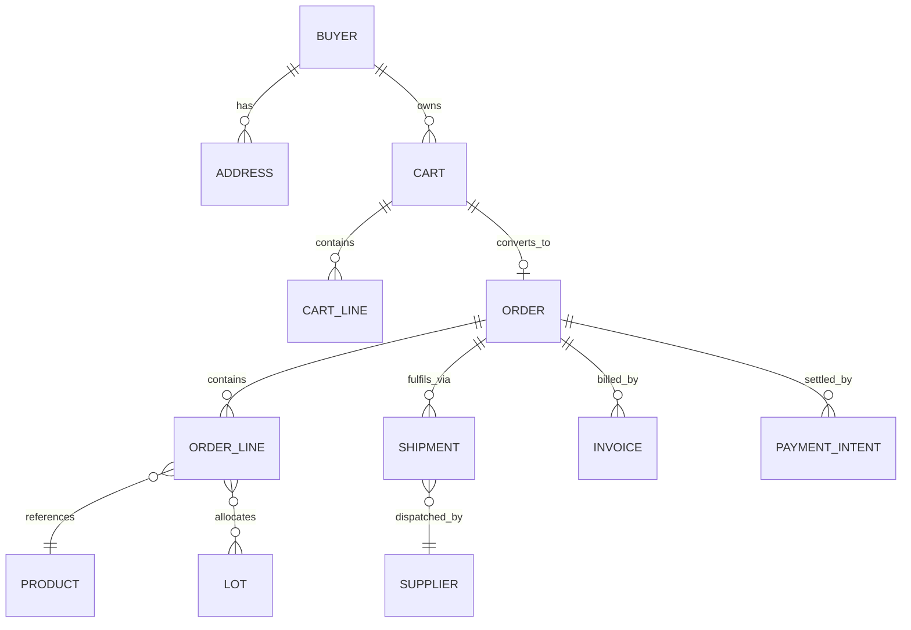
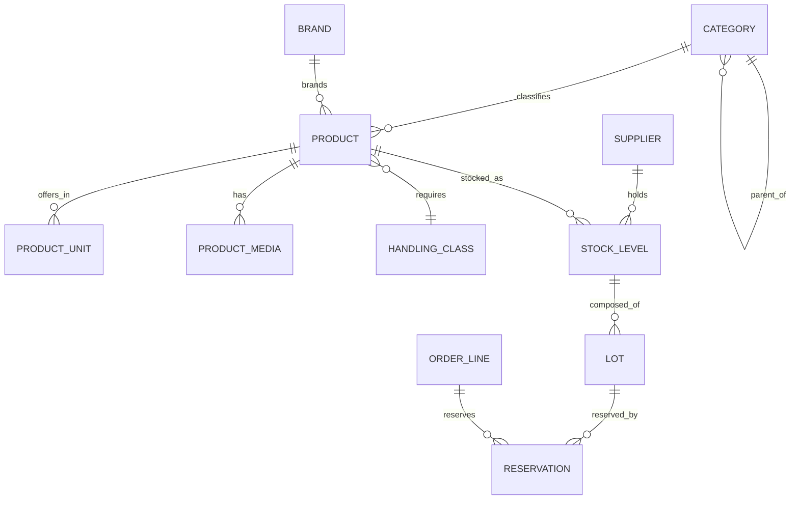
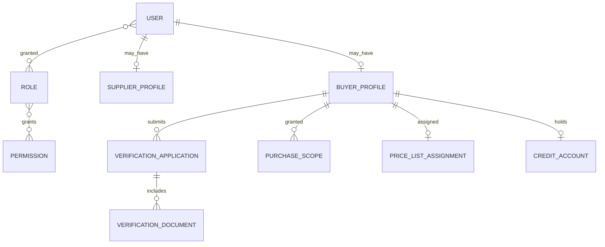
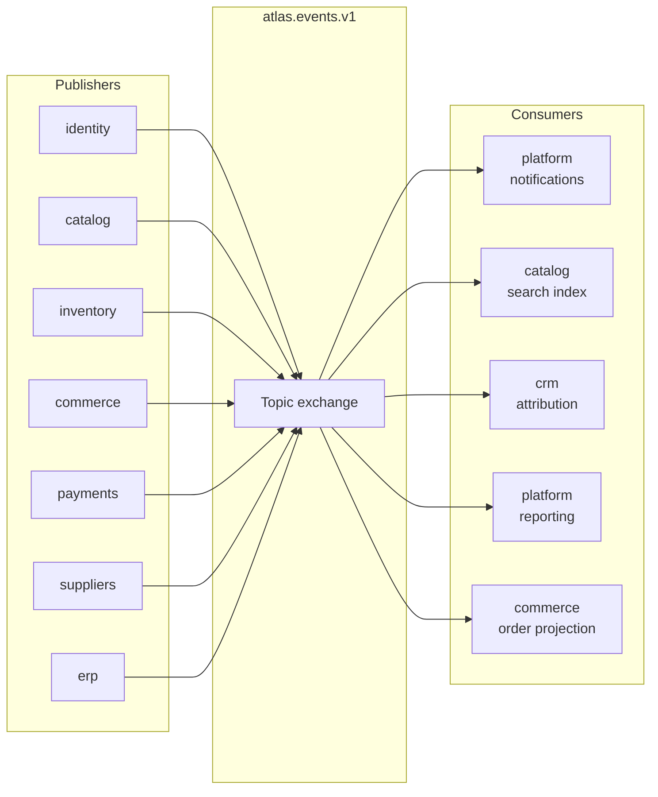

# 06 — Data & Events

**Status:** Blueprint
**Owner:** Backend

## Purpose

Where data lives, how entities relate, what happens asynchronously, and how the two connect through domain events.

---

## Schema-per-module

Each module owns exactly one PostgreSQL schema. A module never reads another module's tables.

| Schema | Module | Owns |
|---|---|---|
| `identity` | `identity` | Users, credentials, sessions, addresses, roles, permissions, business verification |
| `catalog` | `catalog` | Products, categories, brands, suppliers-as-listed, units, attributes, media |
| `pricing` | `pricing` | Price lists, price entries, quantity tiers, assignments |
| `inventory` | `inventory` | Stock levels, lots, reservations, adjustments, quarantine records |
| `commerce` | `commerce` | Carts, cart lines, orders, order lines, shipments, invoices |
| `payments` | `payments` | Payment methods, intents, transactions, refunds, reconciliation records |
| `promotions` | `promotions` | Promotions, vouchers, voucher redemptions, eligibility rules |
| `crm` | `crm` | Leads, referral codes, partners, assignments, attribution records |
| `cms` | `cms` | Articles, pages, menus, banners, site settings |
| `suppliers` | `suppliers` | Supplier profiles, contracts, service terms, onboarding applications |
| `platform` | `platform` | Notifications, media records, feature flags, audit log, integration traffic |
| `erp` | `erp` | Sync jobs, idempotency records, inbound event log, drift reports |
| `ai` | `ai` | Prompt registry and versions, model routing, proposals, review queue, usage and cost records, evaluation runs, guardrail incidents |

### Cross-schema access

**Forbidden.** No joins, no foreign keys spanning schemas, no direct reads.

Three sanctioned alternatives:

| Need | Approach |
|---|---|
| Read another module's data now | Call its public read function |
| React to another module's change | Subscribe to its domain event |
| Maintain a reference for performance | Keep a local projection table, updated from events, and treat it as derived |

A local projection is a cache with a schema. It **MUST** be rebuildable from the owning module, and rebuilding it **MUST** be an available procedure.

---

## Entity relationships

### Commerce core

### Catalogue and stock

### Identity and verification

**Key point.** `PURCHASE_SCOPE` is what makes a buyer eligible for restricted goods. It is granted by a verification decision, and it is checked server-side on every catalogue and checkout path. Removing eligibility must immediately remove visibility — not on the next cache cycle.

---

## Naming and column conventions

| Convention | Rule |
|---|---|
| Table name | Singular `snake_case`, matching the aggregate |
| Primary key | `id`, big integer, never reused |
| Public identifier | `code`, opaque, unique, indexed — the only identifier in public routes |
| Foreign key | `<referent>_id` |
| Timestamps | `created_at`, `updated_at`, and a semantic one where meaningful (`placed_at`, `verified_at`) |
| Soft delete | `deleted_at` nullable; every query filters it |
| Money | `amount_minor` (integer) plus `currency` (char 3) |
| Quantity | Integer in the product's base unit. No floats. |
| Status | Enum type in the schema, not a free string |
| Audit | `created_by`, `updated_by` on anything a human changes |
| Version | `version` integer for optimistic concurrency on contended aggregates |

### Indexing rules

1. Every foreign key is indexed.
2. Every column used in a public route filter is indexed.
3. `code` is uniquely indexed.
4. Partial indexes for hot subsets (for example, orders not yet dispatched).
5. Time-ordered indexes are descending where the access pattern is "most recent first".
6. **Justify every index in the migration.** An unexplained index is future confusion.

### Constraints belong in the database

| Rule | Constraint |
|---|---|
| Money is never negative where it cannot be | `CHECK` |
| A lot expiry is after its production date | `CHECK` |
| An order line's quantity is positive | `CHECK` |
| One cart per buyer | `UNIQUE` |
| A voucher is redeemed once per buyer | `UNIQUE` |
| A reservation cannot exceed its lot quantity | Service plus `CHECK` |

Application logic can be bypassed by a script, a migration, or a future service. A database constraint cannot.

---

## Domain events

Events are past-tense facts. A publisher does not know or care who consumes them.

| Property | Rule |
|---|---|
| Exchange | `atlas.events.v1` |
| Exchange type | Topic |
| Routing key | `<module>.<entity>.<past_tense_verb>` |
| Envelope | `event_id`, `event_type`, `occurred_at`, `version`, `payload`, `correlation_id` |
| Delivery | At-least-once. **Every consumer must be idempotent.** |
| Payload | Only what the event means. Never an ORM dump. |
| Evolution | Additive only within a version. Breaking change means a new version. |

### Event catalogue

| Event | Publisher | Consumed by | Meaning |
|---|---|---|---|
| `identity.buyer.registered` | `identity` | `crm`, `platform` | A buyer account was created |
| `identity.verification.submitted` | `identity` | `platform` | Verification evidence was submitted |
| `identity.verification.decided` | `identity` | `catalog`, `platform` | Scope granted or refused |
| `catalog.product.published` | `catalog` | `platform` | A product became visible |
| `catalog.product.updated` | `catalog` | `platform` | Product data changed |
| `inventory.stock.updated` | `inventory` | `catalog` | Stock changed at a supplier |
| `inventory.lot.quarantined` | `inventory` | `commerce`, `platform` | A lot became unavailable |
| `inventory.stock.reserved` | `inventory` | `commerce` | Stock was held for an order |
| `inventory.stock.shortfall` | `inventory` | `commerce`, `platform` | A reservation could not be fully met |
| `commerce.order.placed` | `commerce` | `erp`, `payments`, `crm`, `platform` | An order was created |
| `commerce.order.dispatched` | `commerce` | `erp`, `platform` | An order was sent to the ERP |
| `commerce.order.cancelled` | `commerce` | `inventory`, `payments`, `platform` | An order was cancelled |
| `commerce.shipment.updated` | `commerce` | `platform` | Tracking or status changed |
| `payments.intent.succeeded` | `payments` | `commerce`, `platform` | Money was captured |
| `payments.intent.failed` | `payments` | `commerce`, `platform` | Payment attempt failed |
| `payments.refund.issued` | `payments` | `commerce`, `platform` | Money was returned |
| `promotions.voucher.redeemed` | `promotions` | `commerce`, `platform` | A voucher was consumed |
| `erp.sync.completed` | `erp` | `platform`, `catalog` | A sync finished, with a drift summary |
| `erp.sync.failed` | `erp` | `platform` | A sync failed and needs attention |
| `suppliers.supplier.approved` | `suppliers` | `catalog` | A supplier went live |
| `ai.proposal.generated` | `ai` | `platform` | An AI proposal was produced, with prompt version and model |
| `ai.proposal.confirmed` | `ai` | `platform` | A human accepted a proposal; the resulting action is recorded with provenance |
| `ai.proposal.rejected` | `ai` | `platform` | A human rejected a proposal |
| `ai.review.decided` | `ai` | `platform` | A review-queue item was decided, with the edit distance where one was applied |
| `ai.guardrail.triggered` | `ai` | `platform` | An input or output was blocked by a guardrail |
| `ai.budget.threshold` | `ai` | `platform` | A feature or tenant crossed a cost threshold |

**AI events carry provenance, always.** Every `ai.*` payload includes `prompt_key`, `prompt_version`, `model`, and `input_hash`. An AI-mediated decision that cannot be reproduced from its event is not auditable, and an unauditable AI decision has no place in the platform.

### Consumer rules

1. **Idempotent.** Record the `event_id` and skip if already processed.
2. **Order-independent.** Never assume events arrive in publication order. Use the payload's own timestamps.
3. **Fast.** A consumer does work and returns. Long work is dispatched to a task.
4. **Non-blocking on failure.** A failing consumer retries with backoff and, after the limit, parks in a dead-letter queue with an alert. It never blocks the publisher.
5. **Observable.** Every consumer emits a processed count, a failure count, and a lag metric.

---

## Async job topology

### Queues

| Queue | Purpose | Characteristics |
|---|---|---|
| `high` | Latency-sensitive: OTP delivery, payment callbacks, order confirmation | Short tasks, aggressive concurrency |
| `default` | Standard: indexing, notifications, CRM sync, media processing | Balanced |
| `low` | Bulk: reports, exports, reconciliation batches, reindexing | Long-running, tolerant of delay |
| `ai` | Model calls: proposals, enrichment, evaluation runs | Long, externally bounded, low concurrency per provider limit |
| `dead_letter` | Tasks that exhausted retries | Monitored, never auto-drained |

Routing rule: a task declares its queue explicitly. There is no default queue — a task without an explicit queue is a review defect.

**Why `ai` has its own queue.** A model call is slow and externally rate-limited, and a provider slowdown can stretch a task from one second to sixty. Sharing a queue with order dispatch means a bad afternoon at a model provider becomes a fulfilment incident. Isolation is the point.

**Scheduler.** A beat process publishes periodic tasks onto the same queues. The scheduler never does work itself; it only enqueues.

### Priority guidance

| Concern | Queue | Why |
|---|---|---|
| Buyer-facing notification | `high` | Visible latency |
| Order dispatch to ERP | `high` | Blocks fulfilment |
| Payment reconciliation | `high` | Money correctness |
| Search indexing | `default` | Tolerates seconds of delay |
| Email campaigns | `low` | Bulk, no deadline |
| Analytics export | `low` | Bulk |
| Full reindex | `low` | Long, disruptive |
| Buyer-facing AI proposal (async path) | `high` | Visible latency, but must not block commerce |
| Batch catalogue enrichment | `ai` | Bulk, externally rate-limited |
| Evaluation run after a prompt change | `ai` | Can take minutes; blocks promotion, not users |
| AI usage and cost rollup | `low` | Reporting only |

### Reliability rules

1. **Acknowledge late.** A task acknowledges only after success. A crash mid-task requeues it.
2. **Always idempotent.** At-least-once delivery means a task may run twice.
3. **Bounded retries with backoff.** Exponential, with jitter, capped. After the cap, dead-letter and alert.
4. **Timeouts on everything.** Every task declares a soft and a hard limit. A task with no timeout is a task that will one day hang a worker.
5. **A failed task is never silently dropped.** It is retried, then parked, then alerted on.
6. **Poison messages are quarantined.** A payload that fails to deserialise goes straight to dead-letter rather than looping.

### Scheduled jobs

| Job | Cadence | Purpose |
|---|---|---|
| ERP stock sync | Every 5 minutes | Keep stock fresh |
| ERP catalogue delta sync | Every 30 minutes | Pick up product changes |
| ERP full reconciliation | Daily | Detect drift between ERP and Atlas |
| Lot expiry scan | Daily | Flag lots nearing expiry; quarantine the expired |
| Low-stock evaluation | Hourly | Generate alerts |
| Cart abandonment sweep | Daily | Identify and notify |
| Order SLA sweep | Every 15 minutes | Flag orders breaching their service window |
| Stale reservation release | Every 10 minutes | Release reservations from abandoned checkouts |
| Payment reconciliation | Every 30 minutes | Match settled payments to orders |
| Invoice generation | Daily | Produce invoices for shipped orders |
| Search index health check | Hourly | Compare index count against database count |
| Analytics rollup | Daily | Aggregate into reporting tables, read by the analytics tool over a replica |
| Session and token cleanup | Daily | Remove expired records |
| Audit log archival | Weekly | Move cold audit records to archive storage |
| Prompt regression suite | On every prompt or model change | Block promotion if a score falls below its recorded baseline |
| Scheduled evaluation sweep | Weekly | Re-score production prompts against the golden set to catch provider drift |
| AI usage and cost rollup | Daily | Attribute tokens and cost per feature and tenant |
| Semantic cache pruning | Daily | Evict stale entries and enforce retention |
| AI review sampling | Weekly | Draw production outputs for human review; record the sample and the outcome |

**Rule:** every scheduled job is idempotent and safe to run twice concurrently. A scheduler restart must not double-apply anything.

---

## Data lifecycle

| Data | Retention | On expiry |
|---|---|---|
| Cart | 90 days after last activity | Deleted |
| Order and order lines | Indefinite | Archived, never deleted |
| Payment records | Indefinite | Archived |
| Reservation | Until order completes or is released | Deleted |
| Lot | Indefinite | Archived |
| Verification documents | Per policy, defined before launch | Deleted from storage, reference retained |
| Audit log | Long, then archived | Moved to cold storage |
| Session and refresh token | On expiry | Deleted |
| Integration traffic log | 90 days, redacted | Deleted |
| Notification | 180 days | Deleted |
| AI proposal | 90 days | Deleted; the resulting action retains its provenance record |
| AI conversation | 90 days after last turn | Deleted |
| AI raw prompt and response payload | 30 days, redacted | Deleted; metrics and hashes retained |
| AI usage and cost record | 24 months | Archived |
| AI evaluation run and scores | Indefinite | Archived — a prompt version's score is its promotion history |
| Guardrail incident | 24 months | Archived |
| Reporting table | Derived; rebuildable from source | Rebuilt, never restored from backup |

**Rules**
- Financial and order records are **never hard-deleted**. History must survive disputes.
- AI prompt and response payloads carry the shortest retention of anything in the system. Their value is debugging, and it expires quickly. Hashes, metrics, and provenance records outlive the payload that produced them.
- Personal data is **redacted before the payload is stored**, not redacted on read. A store that holds raw text and filters later is a store that will one day be read unfiltered.
- Provenance records are retained with the business action they produced. If a price or a verification outcome was proposed by a model, that link must survive as long as the action does.
- Verification documents are the most sensitive data in the system. Encrypt at rest, restrict access to the reviewer role, log every retrieval.
- Soft delete means `deleted_at` is set and every query filters it. A soft delete that leaks into a normal query is worse than no soft delete.
- **Reporting tables are derived, not authoritative.** They can be dropped and rebuilt from source at any time. Nothing writes to them except the rollup jobs.
- **Business analytics reads a replica, never the primary.** One exploratory query must not be able to slow down checkout. See [14 Observability and Analytics](14-observability-and-analytics.md).

---

## Backup and recovery

| Aspect | Requirement |
|---|---|
| Database backup | Automated, at least daily, tested restore |
| Point-in-time recovery | Enabled; window documented |
| Object storage | Versioned, with a life cycle policy |
| Cache | Not backed up. Rebuilt. |
| Search index | Not backed up. Rebuilt from the database. |
| Restore test | Performed on a schedule. An untested backup is not a backup. |
| Recovery objectives | RPO and RTO defined per data class before launch |

**Rule:** if it is derived, rebuild it rather than restore it. Restoring a stale search index alongside a fresh database is how inconsistency is introduced.

---

## Related

- [02 System Architecture](02-system-architecture.md) — decisions behind this structure
- [04 Backend Architecture](04-backend-architecture.md) — the module rules that make schema isolation real
- [05 API Contract](05-api-contract.md) — the HTTP surface over this data
- [10 Delivery Plan](10-delivery-plan.md) — the order to build schemas and events in
