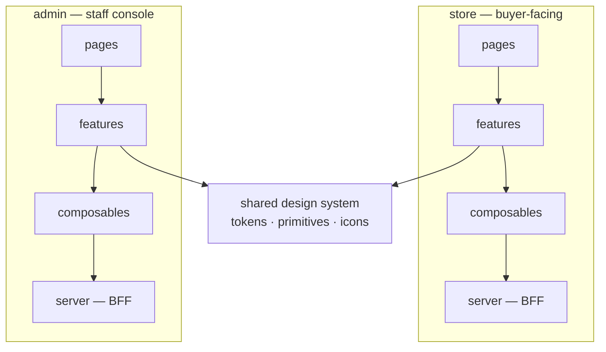
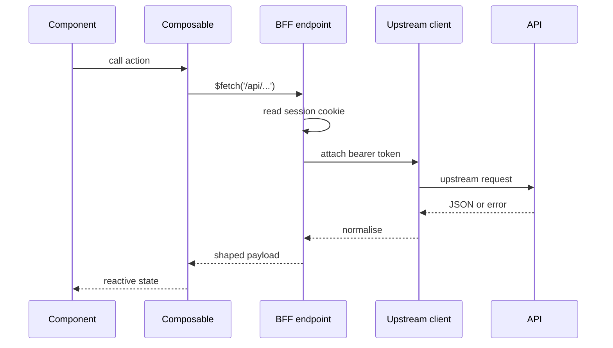

# 07 — Frontend Architecture

**Status:** Blueprint
**Owner:** Frontend

## Purpose

How the two web applications are structured: the Nuxt/Vue stack, feature-slice organisation, the BFF boundary, state management, and the conventions that keep a large frontend navigable.

---

## Two applications, one design system



**Why two apps.** Different audiences with different optimisation targets. The storefront optimises for discovery, speed, and mobile web. The admin console optimises for density, bulk operations, and data tables. One codebase forces compromises on both.

**Why one design system.** Visual consistency and a single place to change a token. It contains primitives and tokens only — never page composition, never API access.

---

## Stack

| Concern | Choice | Notes |
|---|---|---|
| Framework | Nuxt (Vue 3) | SSR plus a server tier in one project |
| Language | TypeScript, strict | `strict: true`, no implicit `any`, `exactOptionalPropertyTypes` |
| Styling | Utility-first CSS plus design tokens | Tokens in one file; no hardcoded colour values |
| State | Composables plus a small store for genuinely global state | See "State management" below |
| Data fetching | One composable convention wrapping the BFF | Never `fetch` directly in a component |
| Forms | Schema-driven validation shared with the API shape | One source of truth for field rules |
| Icons | A single icon set, imported by name | No inline SVG scattered through components |
| Testing | Unit for composables and pure logic; component tests for critical flows; end-to-end for the money paths | See "Testing" below |

---

## Directory layout

Both apps follow the same shape. Uniformity means an engineer moving between them is productive immediately.

```
<app>/
├── app/
│   ├── pages/                  # file-based routes
│   ├── features/               # vertical slices — the bulk of the code
│   ├── composables/            # cross-feature reactive logic
│   ├── components/             # shared presentational components
│   ├── layouts/                # page shells
│   ├── middleware/             # route guards
│   ├── config/                 # route registry, role mappings, constants
│   └── assets/
├── server/                     # the BFF — Nitro
│   ├── api/                    # same-origin endpoints the browser calls
│   ├── middleware/             # session, CSRF, request ID
│   └── utils/                  # upstream client, auth, cache
├── shared/                     # types shared between app and server
└── tests/
```

### Feature slice anatomy

A feature is self-contained. It owns its components, its composable, its types, and its tests.

```
app/features/<feature>/
├── index.ts                    # public surface — the only cross-feature entry
├── components/                 # components used only here
├── composables/
│   └── use<Feature>.ts         # state, data fetching, actions
├── types.ts
└── __tests__/
```

**Rules**

1. A feature **MUST** expose a public surface through `index.ts`.
2. A cross-feature import **MUST** go through `index.ts`. Importing `features/x/components/Inner.vue` from `features/y` is forbidden.
3. A feature **MUST NOT** import from another app.
4. A feature **MUST NOT** call the API directly. It goes through a composable, which goes through the BFF.

**Why.** Without these rules, a frontend becomes a web where changing one component breaks three unrelated screens, and nobody can delete anything.

---

## Route registry and access control

The admin console has many routes across many roles. Maintain a single registry rather than scattering guards.

```ts
// app/config/route-registry.ts
export const ROUTE_DEFINITIONS = {
  '/admin/orders': {
    title: 'Orders',
    group: 'Operations',
    requiredPermission: 'orders.view',
  },
  '/admin/verifications': {
    title: 'Verification queue',
    group: 'Customers',
    requiredPermission: 'verification.review',
  },
  // ...
} as const
```

Two rules that prevent the most common admin bug:

1. **Every route in the router must have a registry entry.** A route with no entry has no permission requirement defined, which means it is either unreachable or — worse — reachable by everyone.
2. **A test asserts this.** Iterate the router's routes, assert each has an entry, and fail the build otherwise. Manual discipline does not survive a busy week.

Navigation is generated from the registry, filtered by the current principal's permissions. Adding a screen means adding one registry entry, not editing a menu component.

### Access resolution

```ts
export function canAccess(permission: string, principal: Principal): boolean
export function landingPathFor(principal: Principal): string
```

`landingPathFor` resolves where a principal lands after login, based on their highest-value permission. Without it, every role lands on a dashboard they may not be allowed to see.

**Server-side enforcement is authoritative.** Route guards improve the experience; the API decides. A guard that is the only control is not access control.

---

## The BFF layer

The `server/` directory is the boundary between the browser and the API.



### BFF responsibilities

| Responsibility | Detail |
|---|---|
| Session | Read the httpOnly cookie; never expose the token |
| Refresh | Refresh transparently on `401` and retry once |
| Upstream client | One configured client with base URL, timeout, and request ID |
| Error normalisation | Convert upstream errors into one client-side shape |
| Cache | Per-route caching for public reads with explicit invalidation |
| Shaping | Adapt the API response to what the view needs |
| CSRF | Double-submit token on mutating same-origin calls |

### What the BFF must not do

- Contain business rules. Those live in the API.
- Decide permissions. It may *read* a permission claim to shape a response, but it never grants access.
- Hold long-lived state. It is stateless; sessions live in the token and the cookie.
- Aggregate slowly. If a BFF route needs three slow upstream calls, the API should expose one endpoint instead.

### Error shape

One shape for the client, whatever the upstream returned:

```ts
type AppError = {
  code: string          // stable, branch on this
  message: string       // developer-facing
  requestId: string     // for support
  fields?: Record<string, string>
}
```

**Rule:** components branch on `code`, never on `message`. A message is copy and will change.

---

## State management

Four kinds of state. Each has one home.

| Kind | Home | Example |
|---|---|---|
| Server state | Data-fetching composable, keyed | Product list, order detail |
| URL state | Route params and query | Filters, page, sort, selected tab |
| Session state | BFF plus a small read-only store | Current principal, permissions |
| Local UI state | Component `ref` | Dropdown open, form draft |

**Rules**
1. **URL is the source of truth for anything shareable.** Filters, pagination, and sorting belong in the query string. A filtered list that cannot be linked is a bug.
2. **Do not copy server state into a global store.** It duplicates, and the copy goes stale.
3. **No global store for local concerns.** A dropdown's open state is not global.
4. **Mutating actions return the updated resource** so the composable can reconcile without a refetch.

---

## Performance

### Rendering

| Concern | Approach |
|---|---|
| Public catalogue | Server-rendered with a cache, hydrated |
| Buyer-specific views | Rendered after auth resolves; no SSR of private data |
| Admin console | Client-rendered; it is authenticated and not indexed |
| Long lists | Virtualised above a threshold (roughly 100 rows) |

**Rule:** never server-render buyer-specific data into a shared cache. A cached page containing one buyer's prices is a leak.

### Assets and payloads

| Rule | Detail |
|---|---|
| Route-level code splitting | Default; do not defeat it with a barrel import of everything |
| Images | Serve responsive variants; lazy-load below the fold; reserve space to avoid layout shift |
| Requests | Batch and deduplicate; a composable must not fire the same request twice on one view |
| Bundle budget | Define a per-route JavaScript budget and fail CI when exceeded |
| Third parties | Load after interaction or on idle. Never block first paint. |

### Perceived speed

| Technique | Where |
|---|---|
| Skeleton screens | Lists and detail views |
| Optimistic updates | Cart quantity, notification read |
| Stale-while-revalidate | Catalogue lists |
| Prefetch on intent | Product links on hover or viewport entry |

**Never optimistic:** checkout submission, payment, verification submission, stock allocation. These must show the server's answer before claiming success.

---

## UI conventions

### Every list must handle four states

| State | Requirement |
|---|---|
| Loading | Visible progress, not a blank screen |
| Empty | Explain why empty and offer a next action |
| Error | Actionable message and a retry |
| Populated | The data |

A list that shows nothing when the query fails is indistinguishable from an empty result. That is the most common frontend bug in any admin console.

### AI-assisted surfaces

Background in [12 AI Features](12-ai-features.md). The rules below are UI rules, and they are not optional.

| Rule | Detail |
|---|---|
| **No AI side effect on arrival** | A proposal renders as a proposal. Nothing is added to a cart, applied to a record, or saved because a model suggested it. Confirm is an explicit user action. |
| **Always show what is unresolved** | The `unresolved` array is rendered, not dropped. Silently discarding what the model could not map loses the user's intent. |
| **Show confidence proportionally** | Low-confidence lines are visually distinguishable. Do not hide them, and do not weight the whole list to the weakest item. |
| **Never present a proposal as a fact** | Wording matters: "Suggested lines" and "Review before adding", never "Your order". |
| **Never surface provenance to end users** | Prompt versions and model identifiers belong in the console, not in a buyer's cart. |
| **Handle expiry visibly** | An expired proposal says so and offers to regenerate. It never silently re-prices. |
| **Design the unavailable state** | `503` from an AI route is normal. The non-AI path must be reachable in one click. |
| **Label generated content** | AI-drafted text carries a marker until a human accepts it. After acceptance the provenance stays in the record. |
| **Never block the manual path** | A loading assistant may not prevent typing a quantity. |

**Required states for any AI surface.** Loading, empty, proposal ready, partially resolved, abstained, expired, unavailable, error, rate limited, budget exhausted. Ten states — a feature that handles three of them is not finished.

**Abstention is a UI state, not a failure.** "I could not answer that from the product documents" is a correct and useful result. Render it as a normal outcome with a route to the manual path.

### Forms

1. Validate on the client for responsiveness, and on the server for correctness.
2. Server validation errors map back to fields via `fields`.
3. Disable submit while in flight; prevent double submission.
4. Preserve user input on error. Never clear a form because a request failed.
5. Confirm destructive actions with the specific object named.

### Accessibility baseline

| Requirement | Detail |
|---|---|
| Keyboard reachable | Every interactive element |
| Visible focus | Never removed without a replacement |
| Labelled controls | Real labels, not placeholder-only |
| Semantic structure | Headings in order; landmarks used |
| Live regions | Async results and errors announced |
| Contrast | Meets the WCAG AA threshold on both themes |

### Internationalisation

- No user-facing string is hardcoded in a component.
- Format numbers, dates, and currency through the locale layer.
- Support plural forms properly; do not concatenate.
- Design layouts that tolerate text expansion — some languages run 40% longer.

---

## Testing

| Level | What | When required |
|---|---|---|
| Unit | Composables, formatters, guards, pure logic | Every function with a branch |
| Component | Critical interactive components | Cart, checkout, filter panel, data table |
| Integration | Feature slice against a mocked BFF | Per feature |
| End-to-end | Login, search, add to cart, checkout, view order | Every money path |
| Visual | Critical screens | When a design token or layout changes |
| Access | Automated scanning on key pages | Continuously |

**Rules**
- An end-to-end test for a money path is mandatory. Nothing else proves the path actually works.
- Do not assert on styling classes. Assert on behaviour and accessible roles.
- A flaky test is fixed or deleted. A quarantined test that stays quarantined is a deleted test with extra steps.

---

## Anti-patterns

| Anti-pattern | Why rejected |
|---|---|
| API call directly in a component | Untestable, uncacheable, and leaks the API shape into the view |
| Cross-feature deep import | Couples slices invisibly; blocks deletion |
| Server state duplicated in a store | Guaranteed to go stale |
| Filter state not in the URL | Breaks sharing, back button, and refresh |
| Route guard as the only access control | Client-side checks are advisory |
| A list with no error state | Failures look like empty results |
| Hardcoded colour or spacing | Design drift within weeks |
| Barrel import of the whole design system | Defeats code splitting; grows the bundle |
| Calling a model provider from the browser | Leaks credentials and bypasses guardrails and cost accounting |
| Auto-applying an AI proposal | Commits a change the user never approved |
| Hiding the `unresolved` items from a proposal | Silently discards what the user actually asked for |
| Presenting a suggestion with the same visual weight as a confirmed value | The user cannot tell a guess from a fact |
| No path back when AI is unavailable | Turns an optional enhancement into a blocker |

---

## Related

- [05 API Contract](05-api-contract.md) — what the BFF talks to
- [08 Feature Inventory](08-feature-inventory.md) — the screens these features produce
- [09 Mobile Applications](09-mobile-application.md) — the three buyer applications and what they share with the web clients
- [11 Conventions & Glossary](11-conventions-and-glossary.md) — naming rules
- [12 AI Features](12-ai-features.md) — what AI may do, and the UI contract for proposals
