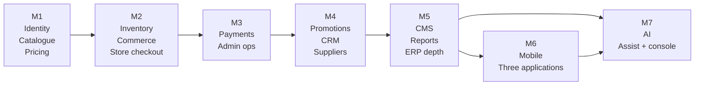

# 08 — Feature Inventory

**Status:** Blueprint
**Owner:** Product

## Purpose

The complete feature list, organised **by surface**. This is the document to read when you want to know what exists where, and the checklist to build against.

Four surfaces:

| Surface | Who uses it | Client |
|---|---|---|
| **Store** | Buyers and their staff | Nuxt web app, buyer-facing |
| **Admin** | Atlas staff | Nuxt web app, staff-facing |
| **API** | All clients | FastAPI, versioned |
| **Mobile** | Buyers, on the move | Native Android and iOS |

Route paths use `{param}` for path parameters. Paths are relative to the app root.

> **Nothing here is built.** This is a specification, not a status report. Every item is a design intent to be implemented and verified.

---

## 1. Store — buyer storefront

### 1.1 Entry and discovery

| # | Feature | Route | Notes |
|---|---|---|---|
| S1.1 | Home page | `/` | Server-rendered, cached. Curated sections, categories, featured items. |
| S1.2 | Category browsing | `/danh-muc/{slug}` | Category landing with sub-categories and filtered listing |
| S1.3 | Product listing | `/san-pham` | Faceted filters, sort, pagination |
| S1.4 | Search | `/tim-kiem` | Query plus facets; falls back to database search if the index is down |
| S1.5 | Product detail | `/san-pham/{slug}` | Unit options, tier pricing, availability, related items |
| S1.6 | Brand listing | `/thuong-hieu` | Brand index and per-brand listing |
| S1.7 | Supplier listing | `/nha-cung-cap` | Supplier index and per-supplier listing |
| S1.8 | Flash deals | `/khuyen-mai` | Time-boxed promotions |
| S1.9 | Quick order | `/dat-nhanh` | Paste or import a line list; the highest-value storefront feature |
| S1.10 | Scan to order | `/quet-ma` | Camera-based item lookup for repeat ordering |
| S1.11 | Saved lists | `/danh-sach-cua-toi` | Reusable baskets for recurring orders |
| S1.12 | Recently ordered | `/da-mua` | One-tap reorder from order history |

### 1.2 Catalogue and product information

| # | Feature | Route | Notes |
|---|---|---|---|
| S2.1 | Unit and pack conversion | product detail | Order by case, pack, or unit — conversion shown before adding |
| S2.2 | Tier pricing display | product detail | Quantity breaks rendered as a table |
| S2.3 | Availability display | product detail and listing | Per-supplier, with a staleness indicator |
| S2.4 | Handling requirement badges | listing and detail | Ambient / chilled / frozen, allergen and storage notes |
| S2.5 | Product documents | product detail | Spec sheets, certificates of analysis where applicable |
| S2.6 | Product questions | product detail | Buyer questions with staff-answered responses |
| S2.7 | Related and substitute items | product detail | Substitutions are critical in a supply-constrained catalogue |
| S2.8 | Comparison | product detail | Compare specifications across similar items |

### 1.3 Eligibility and compliance

| # | Feature | Route | Notes |
|---|---|---|---|
| S3.1 | Registration | `/dang-ky` | Business details, contact, password |
| S3.2 | Registration OTP | `/dang-ky/xac-thuc` | Verify the contact channel |
| S3.3 | Login | `/dang-nhap` | |
| S3.4 | Forgot password | `/quen-mat-khau` | |
| S3.5 | Reset password | `/dat-lai-mat-khau` | Token from email |
| S3.6 | Business verification submission | `/xac-thuc-doanh-nghiep` | Licence number and document upload |
| S3.7 | Verification status | `/xac-thuc-doanh-nghiep/trang-thai` | Pending, approved, rejected with reason, resubmit |
| S3.8 | Trading terms acceptance | `/dieu-khoan-giao-dich` | Credit terms and returns policy acknowledgement |
| S3.9 | Restricted-line gate | inline | A blocked product explains *why* it is blocked and what unlocks it |
| S3.10 | Legal pages | `/chinh-sach/{slug}` | Terms, privacy, returns, delivery |

### 1.4 Cart and checkout

| # | Feature | Route | Notes |
|---|---|---|---|
| S4.1 | Cart | `/gio-hang` | Grouped by supplier; per-supplier subtotal and delivery window |
| S4.2 | Cart line editing | cart | Quantity, unit change, removal, move to saved list |
| S4.3 | Cart quote | cart | Server-computed totals, discounts, and availability |
| S4.4 | Voucher application | cart | Code entry with a clear reason on rejection |
| S4.5 | Checkout | `/thanh-toan` | Address, delivery window, payment method, PO reference, notes |
| S4.6 | Checkout review | checkout | Final confirmation with all suppliers and totals itemised |
| S4.7 | Order confirmation | `/thanh-toan/ket-qua/{code}` | Per-supplier outcome — a partial success is possible and must be shown honestly |
| S4.8 | Payment | `/thanh-toan/thanh-toan/{code}` | Method-dependent flow; never claims success before the gateway confirms |
| S4.9 | Credit balance | checkout | Show credit limit and remaining exposure where the buyer is on account |

### 1.5 Orders and account

| # | Feature | Route | Notes |
|---|---|---|---|
| S5.1 | Order history | `/tai-khoan/don-hang` | Filter by date range, status, supplier |
| S5.2 | Order detail | `/tai-khoan/don-hang/{code}` | Lines, shipments, tracking, invoice, status timeline |
| S5.3 | Reorder | order detail | Entire order or selected lines back into the cart |
| S5.4 | Cancellation request | order detail | Only where the order state permits |
| S5.5 | Shipment tracking | order detail | Per-supplier tracking |
| S5.6 | Invoices | `/tai-khoan/hoa-don` | List and download |
| S5.7 | Statements | `/tai-khoan/cong-no` | Outstanding balance and ageing |
| S5.8 | Account overview | `/tai-khoan` | Profile, verification, price list, credit |
| S5.9 | Profile editing | `/tai-khoan/thong-tin` | Business and contact details |
| S5.10 | Address book | `/tai-khoan/dia-chi` | Multiple delivery addresses with a default |
| S5.11 | Staff users | `/tai-khoan/nguoi-dung` | Buyer-managed sub-accounts with permissions |
| S5.12 | Notification centre | `/tai-khoan/thong-bao` | Order and account notifications |
| S5.13 | Support requests | `/tai-khoan/ho-tro` | Raise an issue against an order |
| S5.14 | Switch account | header | Where a buyer has multiple entities |

### 1.6 Content and conversion

| # | Feature | Route | Notes |
|---|---|---|---|
| S6.1 | Articles and news | `/tin-tuc`, `/tin-tuc/{slug}` | |
| S6.2 | FAQ | `/cau-hoi-thuong-gap` | |
| S6.3 | Contact | `/lien-he` | Enquiry form, feeding the CRM lead pipeline |
| S6.4 | Partner landing pages | `/doi-tac/{slug}` | Campaign-specific entry with attribution |
| S6.5 | Referral landing | `/gioi-thieu/{code}` | Referral code capture |
| S6.6 | Lead capture form | inline | Request a quote or a callback |
| S6.7 | Newsletter signup | footer and inline | |
| S6.8 | Cookie consent | overlay | Consent captured before setting non-essential cookies |
| S6.9 | SEO surfaces | generated | `robots.txt`, `sitemap.xml`, structured data |
| S6.10 | Product feed | generated | Merchant feed for external channels |

### 1.7 AI-assisted buying

Full specification and the rules governing these in [12 AI Features](12-ai-features.md). Every item here returns a **proposal** the buyer confirms; price, availability, and eligibility are always resolved by the normal server-side path at confirm time.

| # | Feature | Route | Notes |
|---|---|---|---|
| AI1.1 | Conversational ordering | `/dat-hang-tro-chuyen` | Describe an order in prose; returns proposed lines for confirmation |
| AI1.2 | Photo-to-cart | `/dat-hang/quet-danh-sach` | Photograph a handwritten list or a previous invoice; unmatched items flagged, never guessed |
| AI1.3 | Intent search | `/tim-kiem` | Natural-language query resolved over the deterministic catalogue filter |
| AI1.4 | Reorder prediction | home, `/da-mua` | Items due by the buyer's own cadence, labelled as suggestions |
| AI1.5 | Substitution ranking | product detail, cart | Ranked substitutes with differences from the original surfaced |
| AI1.6 | Menu-to-basket | `/dat-hang/thuc-don` | Paste a menu or recipe; returns scaled ingredient lines |
| AI1.7 | Product Q&A | product detail | Grounded in spec sheets and certificates only; cites the source; abstains when ungrounded |
| AI1.8 | Voice ordering | `/dat-hang/giong-noi` | Hands-free line entry |
| AI1.9 | Suggestion explanations | inline | Every suggestion states why it was made |
| AI1.10 | Notification summaries | notification centre | Collapses several order updates into one readable message |

---

## 2. Admin — staff console

The console is organised into navigation groups. Every route belongs to a group and declares a required permission (see [07 Frontend Architecture](07-frontend-architecture.md)).

### 2.1 Overview

| # | Feature | Route | Notes |
|---|---|---|---|
| A1.1 | Operations dashboard | `/admin` | Order volume, SLA breaches, queue depth, sync staleness |
| A1.2 | My queue | `/admin/my-queue` | Items assigned to the current user |
| A1.3 | Alerts | `/admin/alerts` | Low stock, expiring lots, failed syncs, payment anomalies |

### 2.2 Customers and leads

| # | Feature | Route | Permission | Notes |
|---|---|---|---|---|
| A2.1 | Buyer list | `/admin/buyers` | `buyers.view` | Search, filter by verification and credit state |
| A2.2 | Buyer detail | `/admin/buyers/{id}` | `buyers.view` | Orders, credit, price list, contacts, notes |
| A2.3 | Verification queue | `/admin/verifications` | `verification.review` | Oldest first |
| A2.4 | Verification review | `/admin/verifications/{id}` | `verification.review` | Document viewer, decision with reason |
| A2.5 | Purchase scope management | `/admin/buyers/{id}/scopes` | `buyers.scope.manage` | Grant or revoke restricted-line eligibility |
| A2.6 | Credit accounts | `/admin/buyers/{id}/credit` | `credit.manage` | Limit, terms, exposure, hold |
| A2.7 | Buyer staff accounts | `/admin/buyers/{id}/users` | `buyers.manage` | Sub-users and their permissions |
| A2.8 | Leads | `/admin/leads` | `leads.view` | Queue with assignment and status |
| A2.9 | Lead detail | `/admin/leads/{id}` | `leads.view` | Activity timeline, conversion to a buyer |
| A2.10 | Lead assignment rules | `/admin/leads/rules` | `leads.configure` | Routing by region or channel |
| A2.11 | Partners | `/admin/partners` | `partners.manage` | Registry and performance |
| A2.12 | Referrals | `/admin/referrals` | `partners.manage` | Codes, clicks, attributed orders |

### 2.3 Operations

| # | Feature | Route | Permission | Notes |
|---|---|---|---|---|
| A3.1 | Order list | `/admin/orders` | `orders.view` | SLA columns, sticky filters, saved views |
| A3.2 | Order detail | `/admin/orders/{id}` | `orders.view` | Full timeline, lines, allocations, shipments |
| A3.3 | Order hold and release | order detail | `orders.hold` | With a reason, always recorded |
| A3.4 | Order editing | order detail | `orders.edit` | Line changes before dispatch, fully audited |
| A3.5 | Order split | order detail | `orders.edit` | Split by supplier or delivery window |
| A3.6 | Manual dispatch | order detail | `orders.dispatch` | Force re-dispatch to the ERP |
| A3.7 | Shipments | `/admin/shipments` | `shipments.manage` | Tracking, carrier, status |
| A3.8 | Returns and credit notes | `/admin/returns` | `returns.manage` | Buyer-initiated and staff-initiated |
| A3.9 | Short-ship resolution | `/admin/short-ships` | `operations.resolve` | Substitution, release, or credit |
| A3.10 | Intervention log | `/admin/interventions` | `operations.resolve` | Every manual fix, searchable |
| A3.11 | Order exceptions | `/admin/exceptions` | `operations.resolve` | Failed dispatch, allocation shortfall, stuck states |

### 2.4 Inventory

| # | Feature | Route | Permission | Notes |
|---|---|---|---|---|
| A4.1 | Stock overview | `/admin/inventory` | `inventory.view` | Per product, per supplier |
| A4.2 | Lot list | `/admin/inventory/lots` | `inventory.view` | Expiry, state, remaining quantity |
| A4.3 | Lot detail | `/admin/inventory/lots/{id}` | `inventory.view` | Movement history, reservations |
| A4.4 | Quarantine | `/admin/inventory/quarantine` | `inventory.quarantine` | Quarantine and release, with a reason |
| A4.5 | Expiring stock | `/admin/inventory/expiring` | `inventory.view` | Horizon-selectable |
| A4.6 | Low stock | `/admin/inventory/low-stock` | `inventory.view` | Threshold breaches |
| A4.7 | Stock adjustments | `/admin/inventory/adjustments` | `inventory.adjust` | Reason code mandatory |
| A4.8 | Reservations | `/admin/inventory/reservations` | `inventory.view` | Held stock, and what holds it |
| A4.9 | Recall management | `/admin/inventory/recalls` | `inventory.quarantine` | Recall a batch across lots; impact analysis |
| A4.10 | Stock history | per product | `inventory.view` | Audit trail of level changes |

### 2.5 Catalogue

| # | Feature | Route | Permission | Notes |
|---|---|---|---|---|
| A5.1 | Product list | `/admin/catalog/products` | `catalog.view` | Bulk-select, bulk-publish |
| A5.2 | Product editor | `/admin/catalog/products/{id}` | `catalog.edit` | Units, pricing rules, media, attributes, SEO |
| A5.3 | Product creation | `/admin/catalog/products/new` | `catalog.edit` | With duplicate detection |
| A5.4 | Bulk import | `/admin/catalog/import` | `catalog.import` | Dry-run first, always |
| A5.5 | Media library | `/admin/catalog/media` | `catalog.edit` | Upload, crop, alt text |
| A5.6 | Categories | `/admin/catalog/categories` | `catalog.edit` | Tree, ordering, SEO |
| A5.7 | Brands | `/admin/catalog/brands` | `catalog.edit` | |
| A5.8 | Units of measure | `/admin/catalog/units` | `catalog.configure` | Conversion factors |
| A5.9 | Attributes and facets | `/admin/catalog/attributes` | `catalog.configure` | Defines what is filterable |
| A5.10 | Handling classes | `/admin/catalog/handling-classes` | `catalog.configure` | Ambient / chilled / frozen and their rules |
| A5.11 | Search reindex | `/admin/catalog/reindex` | `catalog.reindex` | With progress and drift report |
| A5.12 | Catalogue change log | `/admin/catalog/changelog` | `catalog.view` | Who changed what, when |

### 2.6 Pricing and promotions

| # | Feature | Route | Permission | Notes |
|---|---|---|---|---|
| A6.1 | Price lists | `/admin/pricing/price-lists` | `pricing.view` | |
| A6.2 | Price list editor | `/admin/pricing/price-lists/{id}` | `pricing.edit` | Entries, tiers, effective dates |
| A6.3 | Bulk price update | price list | `pricing.edit` | Percentage or absolute, with preview |
| A6.4 | Buyer assignment | price list | `pricing.assign` | Assign buyers to a list |
| A6.5 | Price history | per product | `pricing.view` | What changed and when |
| A6.6 | Contract pricing | `/admin/pricing/contracts` | `pricing.edit` | Negotiated rates per buyer, with validity |
| A6.7 | Promotions | `/admin/promotions` | `promotions.view` | |
| A6.8 | Promotion editor | `/admin/promotions/{id}` | `promotions.edit` | Rules, eligibility, budget, schedule |
| A6.9 | Vouchers | `/admin/promotions/vouchers` | `promotions.edit` | Generation, limits, usage |
| A6.10 | Volume deals | `/admin/promotions/volume-deals` | `promotions.edit` | Quantity-break discounts |
| A6.11 | Campaign calendar | `/admin/promotions/calendar` | `promotions.view` | Overlap detection |
| A6.12 | Promotion performance | `/admin/promotions/reports` | `promotions.view` | Uplift, cost, margin impact |
| A6.13 | Margin rule alerts | `/admin/pricing/margin-alerts` | `pricing.view` | Promotions below a margin floor |

### 2.7 Payments and finance

| # | Feature | Route | Permission | Notes |
|---|---|---|---|---|
| A7.1 | Payment list | `/admin/payments` | `payments.view` | |
| A7.2 | Payment detail | `/admin/payments/{id}` | `payments.view` | Gateway references, attempts, timeline |
| A7.3 | Refunds | `/admin/payments/{id}/refund` | `payments.refund` | Reason mandatory, approval above a threshold |
| A7.4 | Reconciliation | `/admin/payments/reconciliation` | `payments.reconcile` | Matched, unmatched, discrepancies |
| A7.5 | Invoices | `/admin/invoices` | `invoices.view` | Issue, void, reissue |
| A7.6 | Statements | `/admin/statements` | `invoices.view` | Buyer statements by period |
| A7.7 | Aged debt | `/admin/finance/aged-debt` | `finance.view` | Ageing buckets |
| A7.8 | Credit holds | `/admin/finance/credit-holds` | `credit.manage` | Accounts on hold and why |
| A7.9 | Settlement view | `/admin/finance/settlement` | `finance.view` | Per-supplier settlement inputs |

### 2.8 Suppliers

| # | Feature | Route | Permission | Notes |
|---|---|---|---|---|
| A8.1 | Supplier list | `/admin/suppliers` | `suppliers.view` | |
| A8.2 | Supplier detail | `/admin/suppliers/{id}` | `suppliers.view` | Catalogue, orders, performance |
| A8.3 | Supplier onboarding | `/admin/suppliers/applications` | `suppliers.approve` | Review queue |
| A8.4 | Contracts and terms | `/admin/suppliers/{id}/contracts` | `suppliers.manage` | Commercial terms, service windows |
| A8.5 | Delivery windows | `/admin/suppliers/{id}/delivery` | `suppliers.manage` | Cut-off times and zones |
| A8.6 | Supplier catalogue mapping | `/admin/suppliers/{id}/mapping` | `suppliers.manage` | Map supplier SKUs to Atlas products |
| A8.7 | Supplier performance | `/admin/suppliers/reports` | `suppliers.view` | Fill rate, on-time, quality |
| A8.8 | Suspension | supplier detail | `suppliers.manage` | Suspend with impact preview |

### 2.9 Content

| # | Feature | Route | Permission | Notes |
|---|---|---|---|---|
| A9.1 | Articles | `/admin/cms/articles` | `cms.edit` | Draft, review, publish, schedule |
| A9.2 | Article editor | `/admin/cms/articles/{id}` | `cms.edit` | Rich text, media, SEO |
| A9.3 | Pages | `/admin/cms/pages` | `cms.edit` | Static pages |
| A9.4 | Menus | `/admin/cms/menus` | `cms.edit` | Per location, drag-ordered |
| A9.5 | Banners | `/admin/cms/banners` | `cms.edit` | Placement, schedule, targeting |
| A9.6 | Homepage builder | `/admin/cms/homepage` | `cms.edit` | Section ordering and preview |
| A9.7 | FAQ | `/admin/cms/faqs` | `cms.edit` | Categories and ordering |
| A9.8 | Newsletter | `/admin/cms/newsletter` | `cms.edit` | Subscribers, campaigns, delivery stats |
| A9.9 | Legal documents | `/admin/cms/legal` | `cms.legal` | Versioned; consent binds to a version |
| A9.10 | SEO defaults | `/admin/cms/seo` | `cms.edit` | Templates for titles, descriptions, structured data |
| A9.11 | Contact enquiries | `/admin/cms/enquiries` | `cms.view` | routed into leads |

### 2.10 Platform and system

| # | Feature | Route | Permission | Notes |
|---|---|---|---|---|
| A10.1 | User management | `/admin/system/users` | `system.users` | Staff users |
| A10.2 | Roles and permissions | `/admin/system/roles` | `system.roles` | Matrix editor |
| A10.3 | Audit log | `/admin/system/audit` | `system.audit` | Filter by actor, entity, time range |
| A10.4 | Feature flags | `/admin/system/flags` | `system.flags` | Rollout controls |
| A10.5 | Site settings | `/admin/system/settings` | `system.settings` | Non-secret configuration |
| A10.6 | Reference data | `/admin/system/reference` | `system.settings` | Regions, units, reason codes, tax rates |
| A10.7 | Integration traffic | `/admin/system/integration` | `system.integration` | Inbound webhooks and outbound calls, redacted |
| A10.8 | ERP sync console | `/admin/system/erp` | `system.integration` | Trigger syncs, view drift, retry failures |
| A10.9 | Job queue monitor | `/admin/system/jobs` | `system.jobs` | Queue depth, failures, dead letter |
| A10.10 | Scheduled tasks | `/admin/system/schedules` | `system.jobs` | Last run, next run, outcome |
| A10.11 | Email and SMS templates | `/admin/system/templates` | `system.settings` | With preview |
| A10.12 | Health dashboard | `/admin/system/health` | `system.view` | Probes, dependency status, latency |

### 2.11 Reports

| # | Feature | Route | Permission | Notes |
|---|---|---|---|---|
| A11.1 | Sales report | `/admin/reports/sales` | `reports.view` | By period, supplier, category |
| A11.2 | Buyer report | `/admin/reports/buyers` | `reports.view` | Acquisition, retention, frequency |
| A11.3 | Product report | `/admin/reports/products` | `reports.view` | Velocity, substitution rate, out-of-stock impact |
| A11.4 | Supplier report | `/admin/reports/suppliers` | `reports.view` | Fill rate, lead time, cancellations |
| A11.5 | Promotion report | `/admin/reports/promotions` | `reports.view` | Cost and uplift |
| A11.6 | Operations report | `/admin/reports/operations` | `reports.view` | SLA, exceptions, manual intervention rate |
| A11.7 | Financial report | `/admin/reports/finance` | `reports.view` | Margin, outstanding, write-offs |
| A11.8 | Export centre | `/admin/reports/exports` | `reports.export` | Async export with a download link |
| A11.9 | Saved views | `/admin/reports/saved` | `reports.view` | Shared filter sets |

**Where the boundary sits.** These are the **operational** reports: the ones staff need while doing their job, on data the platform owns. Deep or ad-hoc analysis — a question nobody anticipated, a cohort nobody defined — belongs in the analytics tool, not in a report builder built from scratch. See [14 Observability and Analytics](14-observability-and-analytics.md).

**The promotion rule.** A question asked often enough to become daily operational work is a candidate for a real feature with a route and a permission. Leave it in the analytics tool and it becomes an undocumented dependency nobody owns.

### 2.12 AI assistance and the AI console

Rules in [12 AI Features](12-ai-features.md). Each item is an **extract**, **rank**, **draft**, or **flag** — never a decision.

| # | Feature | Route | Permission | Class | Notes |
|---|---|---|---|---|---|
| AI2.1 | Order exception triage | `/admin/exceptions` | `operations.resolve` | Draft | Summarises and ranks exceptions with a proposed resolution |
| AI2.2 | Verification document extraction | `/admin/verifications/{id}` | `verification.review` | Extract | Reads licence and certificate fields; flags mismatch. Reviewer decides. |
| AI2.3 | Catalogue enrichment | `/admin/catalog/products/{id}` | `catalog.edit` | Draft | Description, attributes, handling class from supplier spec sheets → staged draft |
| AI2.4 | Duplicate detection | `/admin/catalog/dedup` | `catalog.edit` | Rank | Clusters near-duplicate SKUs, proposes a merge; the merge is a human action |
| AI2.5 | Image compliance check | `/admin/catalog/media` | `catalog.edit` | Flag | Text overlays, watermarks, wrong pack, missing allergen marks |
| AI2.6 | Demand and stock-out forecast | `/admin/inventory/forecast` | `inventory.view` | Rank | Per SKU per supplier horizon. Informs thresholds; does not set them. |
| AI2.7 | Pricing anomaly detection | `/admin/pricing/anomalies` | `pricing.view` | Flag | Margin outliers, contracts below cost, abrupt changes |
| AI2.8 | Supplier review narrative | `/admin/suppliers/{id}` | `suppliers.view` | Draft | Drafts the periodic review from deterministic performance metrics |
| AI2.9 | Lead scoring and routing | `/admin/leads` | `leads.view` | Rank | Ranks leads and suggests an owner |
| AI2.10 | Content drafting | `/admin/cms/articles` | `cms.edit` | Draft | Article and copy drafts honouring a brand-tone guide. Never auto-published. |
| AI2.11 | Support reply drafting | `/admin/case/{id}` | `operations.resolve` | Draft | Drafts a reply from order context; an agent edits and sends it |
| AI2.12 | Analytics copilot | `/admin/copilot` | `reports.view` | Extract | Natural language against a **predefined semantic layer only**; the resolved query is always shown |
| AI2.13 | Recall impact assist | `/admin/inventory/recalls` | `inventory.quarantine` | Draft | Enumerates affected buyers and orders, drafts the notification |
| AI2.14 | Fraud and abuse signals | `/admin/risk` | `risk.view` | Flag | Unusual ordering patterns, address mismatches, card-testing signatures |
| AI2.15 | Internal knowledge assistant | `/admin/help` | `system.view` | Draft | Policy and how-to answers grounded in internal documents, with citations |
| AI2.16 | Prompt registry | `/admin/ai/prompts` | `system.ai` | — | Versions, ownership, promotion gate |
| AI2.17 | Model routing | `/admin/ai/models` | `system.ai` | — | Which model serves which feature |
| AI2.18 | Usage and cost | `/admin/ai/usage` | `system.ai` | — | Tokens, latency, and cost per feature and tenant; budget ceilings |
| AI2.19 | Evaluation results | `/admin/ai/evals` | `system.ai` | — | Scores per prompt version; regression runs |
| AI2.20 | Review queue | `/admin/ai/review-queue` | `system.ai` | — | Human review of sampled AI output; decisions feed evaluation sets |
| AI2.21 | Guardrail incidents | `/admin/ai/incidents` | `system.ai` | — | Injection attempts, rejected outputs, safety events |
| AI2.22 | Feature kill switches | `/admin/ai/features` | `system.ai` | — | Disable any AI feature immediately without a deploy |

---

## 3. API — service surface

Fully specified in [05 API Contract](05-api-contract.md). Summary of what each module exposes:

| Module | Public | Buyer | Supplier | Staff | Webhooks |
|---|---|---|---|---|---|
| `identity` | 5 | 8 | — | 6 | — |
| `catalog` | 8 | 1 | — | 11 | — |
| `pricing` | — | 1 | — | 6 | — |
| `inventory` | — | 1 | — | 7 | — |
| `commerce` | — | 8 | 2 | 12 | — |
| `payments` | — | 3 | — | 4 | 1 |
| `promotions` | — | 2 | — | 6 | — |
| `crm` | 2 | — | — | 8 | — |
| `cms` | 5 | — | — | 9 | — |
| `suppliers` | 1 | — | 5 | 4 | — |
| `platform` | 4 | 3 | — | 6 | — |
| `erp` | — | — | — | 4 | 1 |
| `ai` | — | 8 | — | 21 | — |

**Two endpoints every service must have:** `/health` (liveness) and `/readyz` (readiness — database and cache reachable). Neither performs business logic.

---

## 4. Mobile — buyer applications

Detail in [09 Mobile Applications](09-mobile-application.md). Feature parity target with the storefront, prioritised for the ordering journey.

**Three applications, one list.** Atlas ships three independent buyer applications — Flutter, native Android, native iOS — described in [09 Mobile Applications](09-mobile-application.md). The features below, their priorities, and their required states apply to all three. The list is the product surface, not an implementation plan.

| # | Feature | Priority | Notes |
|---|---|---|---|
| M1 | Authentication | P0 | Login, biometric unlock, refresh handled silently |
| M2 | Home | P0 | Cached for offline viewing |
| M3 | Category browsing | P0 | |
| M4 | Search | P0 | With recent searches stored locally |
| M5 | Product detail | P0 | Unit conversion, tier pricing, availability |
| M6 | Quick order | P0 | The primary reason a buyer opens the app |
| M7 | Saved lists | P1 | Reusable baskets |
| M8 | Cart | P0 | Grouped by supplier, offline-tolerant |
| M9 | Checkout | P0 | Never fabricates success |
| M10 | Order history | P0 | |
| M11 | Order detail and tracking | P0 | |
| M12 | Reorder | P1 | One tap from history |
| M13 | Verification status | P1 | Read-only on mobile; submission on web |
| M14 | Notifications | P0 | Push plus in-app centre |
| M15 | Account and addresses | P1 | Address editing |
| M16 | Invoices and statements | P2 | View and download |
| M17 | Promotions | P2 | Browse active promotions |
| M18 | Contact and support | P2 | |
| M19 | Photo-to-cart | P2 | Camera list capture with a review step |
| M20 | Substitution suggestions | P2 | Ranked, with differences from the original surfaced |
| M21 | Voice ordering | P2 | Hands-free line entry; proposals only |
| M22 | Order assistant | P3 | Grounded Q&A over the buyer's own orders and products |

### Mobile-specific requirements

| Requirement | Detail |
|---|---|
| Offline tolerance | Catalogue and cart readable without a connection; mutations queue visibly, never silently |
| State coverage | Loading, empty, validation, offline, timeout, unauthorized, forbidden, rate-limited, server error, partial success, stale, uncertain mutation |
| Uncertainty handling | Where a mutation's outcome is unknown, tell the user it is unconfirmed. Never assume success. |
| No fake success | Never simulate a payment result or an order confirmation |
| Screen specifications | Every screen documented with states and edge cases before implementation |
| Parity across all three apps | A feature is complete when it works in every application that is intended to ship it. The three applications are independent, so nothing enforces agreement — it has to be checked. |
| Hosted store build | iOS artifacts require a macOS runner; plan the CI capability before the milestone starts, not during it |
| Remote disablement | Every feature can be switched off from the server without a store release |

---

## 5. Surface traceability

Which backend module serves which surface feature.

| Capability | Store | Admin | API module | Mobile |
|---|---|---|---|---|
| Authentication | S3.1–S3.5 | A10.1–A10.2 | `identity` | M1 |
| Verification | S3.6–S3.9 | A2.3–A2.5 | `identity` | M13 |
| Catalogue | S1.1–S1.11, S2.1–S2.8 | A5.1–A5.12 | `catalog` | M3–M6 |
| Pricing | product detail, cart | A6.1–A6.6 | `pricing` | M5 |
| Inventory | availability display | A4.1–A4.10 | `inventory` | M5 |
| Cart and orders | S4.1–S4.9, S5.1–S5.7 | A3.1–A3.11 | `commerce` | M7–M12 |
| Payments | S4.8, S5.6–S5.7 | A7.1–A7.9 | `payments` | M16 |
| Promotions | S1.8, S4.4 | A6.7–A6.13 | `promotions` | M17 |
| CRM and partners | S6.3–S6.7 | A2.8–A2.12 | `crm` | M18 |
| Content | S6.1–S6.2, S6.9–S6.10 | A9.1–A9.11 | `cms` | M18 |
| Suppliers | S1.7 | A8.1–A8.8 | `suppliers` | — |
| Platform | S5.12, S6.8 | A10.1–A10.12 | `platform` | M14 |
| ERP | availability, dispatch | A10.8 | `erp` | — |
| AI-assisted buying | AI1.1–AI1.10 | — | `ai` + owning module | M19–M22 |
| AI assistance | — | AI2.1–AI2.15 | `ai` + owning module | — |
| AI console | — | AI2.16–AI2.22 | `ai` | — |

---

## 6. Build order

Do not build this breadth-first. Each milestone is usable.

| Milestone | Delivers | Exit criterion |
|---|---|---|
| **M1** | Registration, verification, catalogue, pricing | A verified buyer can browse with their own prices |
| **M2** | Inventory, cart, checkout, order creation | A buyer can place a real order through the web storefront |
| **M3** | Payments, admin order operations | Staff can run an order end to end |
| **M4** | Promotions, CRM, supplier management | Commercial terms and campaigns are manageable |
| **M5** | CMS, reports, ERP depth | Content, reporting, and integration are operational |
| **M6** | Three buyer applications: Flutter, native Android, native iOS | A buyer places a real order in each application, including under a simulated connection loss |
| **M7** | AI assistance: proposal gateway, admin assist, store assist, console | Every AI feature has a working non-AI path, a recorded cost per action, and an evaluation score |

### Why AI is last, not first

AI is an enhancement to a working platform, so it is sequenced after one exists. Three concrete reasons:

1. **There is nothing to propose into.** Substitution ranking needs a real substitute set; reorder prediction needs real order history; enrichment needs real spec sheets. The deterministic path has to exist and carry traffic first.
2. **Evaluation needs data.** A golden set built from nothing measures nothing. Real inputs are what make an evaluation meaningful.
3. **The console is shared.** Prompt registry, cost accounting, evaluation, and the review queue are built once. Building them before there are features to serve is speculative.

**One exception, and it is deliberate.** The `ai` module's *skeleton* — the proposal envelope, provenance columns, prompt registry, and cost accounting — is created in **M1**. Retrofitting provenance and audit into features that already ship is materially harder than having the seam from the start, and the proposal envelope is the contract every AI feature will speak. No feature-level AI ships before M7.

---

## Related

- [01 Product Brief](01-product-brief.md) — the capabilities these features serve
- [05 API Contract](05-api-contract.md) — the endpoint detail behind section 3
- [07 Frontend Architecture](07-frontend-architecture.md) — the route registry and access model
- [09 Mobile Application](09-mobile-application.md) — the mobile surface in depth
- [10 Delivery Plan](10-delivery-plan.md) — milestones, sequencing, and effort
- [12 AI Features](12-ai-features.md) — the rules governing every AI item above
