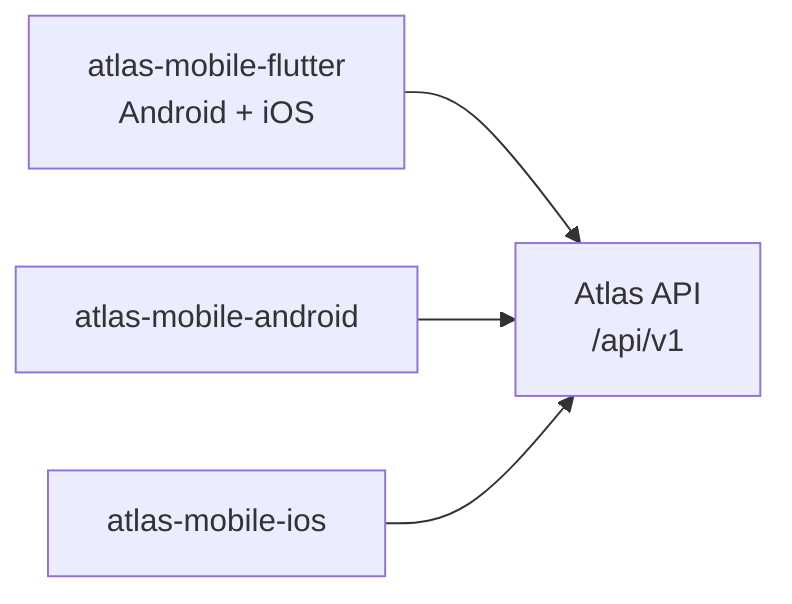

# 09 — Mobile Applications

**Status:** Blueprint
**Owner:** Mobile

## Purpose

Three separate buyer applications, one shared API contract. What each app is, and the few things all three have in common.

This document describes the shape, not the implementation. Navigation, project layout, state management, design system, and offline storage are **open decisions for whoever builds each app** — see [What is left open](#what-is-left-open).

---

## The three apps

| App | Repository | Stack | Character |
|---|---|---|---|
| Flutter | `atlas-mobile-flutter` | Dart, Flutter | One codebase, both stores, fastest route to parity |
| Android | `atlas-mobile-android` | Kotlin, Jetpack Compose | Platform-native, full access to Android capability |
| iOS | `atlas-mobile-ios` | Swift, SwiftUI | Platform-native, full access to iOS capability |

**They are independent.** Separate repositories, separate release cycles, separate ownership if wanted. They share no code.

**What they do share** is the contract in [05 API Contract](05-api-contract.md). That is the coordination point, and it is deliberately the only one.

**Why sharing no code is workable here.** The server is authoritative for price, stock, eligibility, and order state, so the clients stay thin. The rule surface that would otherwise have to be duplicated — pricing arithmetic, allocation, availability — lives on the server, in one place, for all three apps and both web surfaces. Duplicating the remaining presentation logic three times is a cost, but a bounded and visible one.

**Why three apps.** Each platform gets an application that behaves the way people on that platform expect, and each is free to move at its own pace. The cost is that every client-side feature is written three times and three release cycles must be kept in view.

---

## What every app must do

Short list. Everything else is a design choice.

| | Requirement |
|---|---|
| **Contract** | Consume the same API as the web clients, from a generated client, with a drift check in the build |
| **Scope** | Cover the mobile feature list in [08 Feature Inventory](08-feature-inventory.md) → section 4 |
| **Authority** | Never compute a price, a discount, a stock decision, or an eligibility outcome. Display what the server returned. |
| **States** | Every screen defines loading, empty, error, offline, unauthorized, and **uncertain outcome** |
| **Uncertainty** | Where a mutation's outcome is unknown, say so. Never report success you cannot confirm. |
| **Money** | Checkout and payment require a live connection. Never simulate a payment result or an order confirmation. |
| **Offline** | Catalogue and cart readable from cache; queued changes shown as pending, never silently |
| **Platform** | Ask for permissions at the point of use, not at launch |
| **Data** | Tokens in secure storage. Verification documents never written to the device. |
| **AI** | Proposals only, confirmed by a person. Never applied on the model's behalf. See [12 AI Features](12-ai-features.md). |
| **Release** | Ship behind remote flags so a feature can be disabled without a store release |
| **Old versions** | Assume a buyer may not update for months; the server must stay compatible with a client it cannot change |

---

## Flutter app

**Stack.** Dart, Flutter. One codebase producing both store artifacts.

**Shape.** Screens, state, and data access live in one project. Platform capabilities are reached through plugins.

**Watch for:**

- **Plugin maintenance.** A plugin that stops being maintained becomes your code. Prefer a small, well-understood dependency, and be willing to write a platform channel instead.
- **App size.** The runtime is included in every build. Set a budget and measure a release build, not a debug one.
- **Platform feel.** Deliberately consistent across platforms, which is the point — but it will not be indistinguishable from a native app.
- **Background work.** iOS background execution is opportunistic. Do not build a design that depends on a scheduled background task running.

---

## Android app

**Stack.** Kotlin, Jetpack Compose. Distributed through Google Play.

**Shape.** Platform-native UI over Android's own APIs. No cross-platform layer, so any Android capability is directly available.

**Watch for:**

- **Device fragmentation.** A wholesale buyer base includes older, low-end hardware. Decide the minimum supported version and device class early, and measure on a real mid-range device.
- **Background work.** `WorkManager` is the supported path, but battery optimisation on vendor builds can still suppress it. Design so a delayed background task degrades rather than breaks.
- **Play review latency.** Updates are not instant. Remote flags carry the rollback.

---

## iOS app

**Stack.** Swift, SwiftUI. Distributed through the App Store.

**Shape.** Platform-native UI over Apple's frameworks.

**Watch for:**

- **Background execution.** `BGTaskScheduler` is opportunistic and Apple decides when it runs. Never design a flow that requires it to have run.
- **Store review latency.** Longer and less predictable than Play. Remote flags matter more here, not less.
- **Build capability.** An iOS artifact requires macOS and Xcode. This is a prerequisite to stand up before feature work, not a detail to discover later.
- **Privacy declarations.** Permissions and data use are declared at submission and must match what the app actually does.

---

## Shared concerns

| Concern | Where it is settled |
|---|---|
| The HTTP surface | [05 API Contract](05-api-contract.md) |
| The features to cover | [08 Feature Inventory](08-feature-inventory.md) → section 4 |
| Authentication model | [05 API Contract](05-api-contract.md) → auth |
| Failure behaviour to respect | [02 System Architecture](02-system-architecture.md) |
| AI capability boundaries | [12 AI Features](12-ai-features.md) |
| When mobile is built | [10 Delivery Plan](10-delivery-plan.md) → M6 |
| AI module skeleton (proposals, provenance) | Derived from [12 AI Features](12-ai-features.md) |

**Testing.** Test on real devices. An emulator does not reproduce network behaviour, battery constraints, or background termination. Exercise failure paths — dropped connections, timeouts, denied permissions, interrupted uploads — because those are the paths buyers actually hit.

**What "built" does not mean.** Source files existing means the code exists. It does not mean the feature is reachable, completes against the real backend, is reviewed, or is safe for real buyers. Readiness is a separate decision backed by evidence.

---

## What is left open

Deliberately not specified. Each app's builder decides, and is free to decide differently from the others.

| Open | Notes |
|---|---|
| Project and module layout | Whatever suits the team and the stack |
| State management | Choose per platform; no requirement to match across apps |
| Navigation model | Follow the platform's conventions |
| Design system | May follow the shared web design language, or diverge where a platform expects something else |
| Offline storage engine | Any suitable local database |
| Screen specifications | To be written by the builder, per app |
| Naming inside the app | Follow [11 Conventions](11-conventions-and-glossary.md), then local taste |
| Whether to share any code between the native apps | Permitted if it helps; not required |

The only non-negotiable items are the twelve in [What every app must do](#what-every-app-must-do), and they are not stylistic — they exist because getting them wrong costs money, trust, or a compliance position.

---

## Related

- [05 API Contract](05-api-contract.md) — the surface all three apps consume
- [08 Feature Inventory](08-feature-inventory.md) — the mobile feature list (section 4)
- [02 System Architecture](02-system-architecture.md) — the failure behaviour the apps must respect
- [03 Infrastructure](03-infrastructure.md) — the mobile repositories and their pipelines
- [10 Delivery Plan](10-delivery-plan.md) — when mobile is built
- [11 Conventions and Glossary](11-conventions-and-glossary.md) — terms used above
- [12 AI Features](12-ai-features.md) — the assistant capabilities and their boundaries
