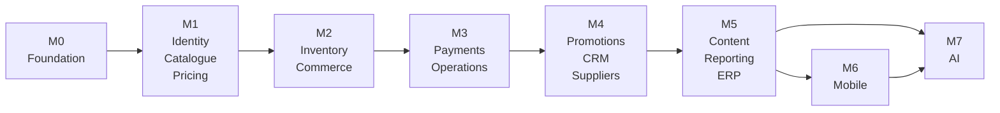
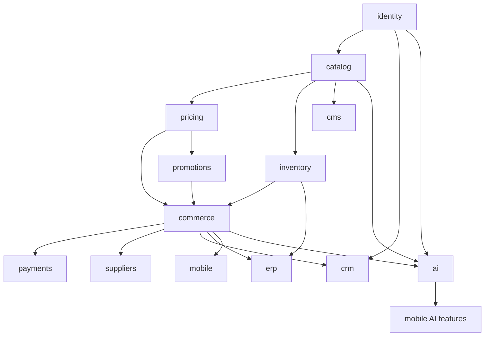

# 10 — Delivery Plan

**Status:** Blueprint
**Owner:** Engineering Lead

## Purpose

The order to build Atlas in. Written for an engineer starting from nothing: what to do first, what depends on what, and how to know a milestone is genuinely done.

---

## Guiding principles

1. **Build vertically, not horizontally.** Each milestone must produce something a real user can complete end to end. A perfect catalogue module with no checkout is not progress.
2. **Prove the hard parts early.** Pricing, allocation, and order splitting are the risky areas. Do not leave them for month four.
3. **Defer breadth.** Category pages, article management, and report exports matter, but they do not de-risk anything.
4. **One environment from day one.** Local, staging, and production topology exist before the first feature ships, not after.
5. **No unvalidated milestone.** A milestone is done when the exit criterion is demonstrated, not when the code is merged.
6. **Earn AI by building the deterministic path first.** AI proposes into a system that already decides correctly. See [12 AI Features](12-ai-features.md).

---

## Milestones

`M7` runs after `M5` and alongside `M6`. The `ai` module *skeleton* lands in `M1` — see the note in that milestone for why.

---

### M0 — Foundation

**Goal.** A developer can clone, run, and test the system. Nothing user-facing.

> Toolchain note (2026-09-19, [ADR-0001](../../docs/adr/0001-go-backend-stack.md)): M0 was executed with the Go toolchain — Chi router, pgx/SQLC, golang-migrate with up/down pairs. Milestone flow and exit criteria are unchanged.

| Deliverable | Detail |
|---|---|
| Repository structure | Six repositories, branch protection, merge gates |
| Backend skeleton | Go app with Chi router, configuration from environment, health and readiness |
| Module scaffold | One empty module with the full directory shape, as the template |
| Database connectivity | pgx pool, schema-per-module, numbered golang-migrate migrations |
| Sample migration | One table, migration applied, rollback tested |
| Event bus | Exchange declared, publisher and consumer helpers, one event round-trip |
| Task queue | One queue per priority, one task, one scheduled task, dead-letter handling |
| Web skeletons | Store and admin apps that start and render a page, BFF proxy with one route |
| Design system | Tokens, a handful of primitives, both apps consuming it |
| Local stack | One manifest starts everything; documented ports |
| CI | Lint, typecheck, test on every pull request |
| Observability | OpenTelemetry in the application, the collector, one metric, one trace, one dashboard, one alert, and a local overlay that can be left off |

**Exit criterion.** A new engineer clones the repositories and reaches a working local stack, a passing test suite, and a rendered page, following only the README.

---

### M1 — Identity, catalogue, pricing

**Goal.** A verified buyer browses a catalogue with their own prices.

| Area | Deliverable |
|---|---|
| Identity | Registration, OTP, login, refresh, logout, password reset |
| Identity | Business profiles, addresses, staff sub-accounts |
| Identity | Verification submission, review queue, decision, purchase scope |
| Identity | Roles, permissions, permission checks on every route |
| Catalogue | Products, categories, brands, units, attributes, media |
| Catalogue | Public listing, detail, facets, search with a database fallback |
| Catalogue | Eligibility filtering by purchase scope and handling class |
| Pricing | Price lists, entries, quantity tiers, effective dates, buyer assignment |
| Pricing | Server-side quote endpoint |
| Store | Home, category, listing, search, product detail, auth screens |
| Store | Eligibility gates with an explanation |
| Admin | Product and category management, price list management, verification queue |
| Platform | Reference data, feature flags, audit log |
| AI (skeleton only) | `ai` module boundary, proposal envelope, provenance columns, prompt registry, cost accounting. **No AI feature ships.** |

**Exit criterion.** A verified buyer logs in, browses only what they are eligible for, sees prices from their assigned price list, and cannot see another buyer's prices or scopes. A staff reviewer approves a verification and the buyer's visible catalogue changes accordingly.

**Risks.** Eligibility filtering must be server-side and cache-key separated. Verify with two buyers against one cache.

**Why the AI skeleton is here and not in M7.** Provenance and audit cannot be retrofitted cheaply. A proposal created in M7 without columns to record its prompt version, model, and reviewer is a proposal nobody can explain later. Creating the envelope now costs a module scaffold; creating it later costs a migration across every feature that already ships — and a period where those features are unauditable.

---

### M2 — Inventory, commerce

**Goal.** A buyer places a real order through the web storefront.

| Area | Deliverable |
|---|---|
| Inventory | Stock levels, lots, expiry, quarantine, reservations |
| Inventory | FEFO allocation with row locking and a defined timeout behaviour |
| Inventory | Availability endpoint with staleness indication |
| Inventory | Low-stock and expiring-lot detection |
| Commerce | Cart with per-supplier grouping, quote, voucher hook |
| Commerce | Checkout with idempotency, order creation, per-supplier split |
| Commerce | Order state machine, history, detail, cancellation request |
| Commerce | Shipment records and tracking |
| Store | Cart, checkout, confirmation with honest partial results, order history and detail |
| Admin | Order list with SLA view, order detail, hold and release, split |
| Platform | Order lifecycle notifications |

**Exit criterion.** A buyer adds lines from three suppliers, checks out, and receives three correctly split orders with correct totals, correct FEFO allocations against non-quarantined lots, and an accurate per-supplier confirmation. Submitting the same checkout twice with one idempotency key creates one order set.

**Risks.** Allocation contention under concurrency; idempotency correctness; partial success in the confirmation screen. All three need explicit tests.

---

### M3 — Payments, operations

**Goal.** Staff run an order from placement to settlement.

| Area | Deliverable |
|---|---|
| Payments | Methods, intents, gateway integration, webhook verification, deduplication |
| Payments | Refunds with a reason and an approval threshold |
| Payments | Reconciliation view |
| Commerce | Invoices, credit notes, returns |
| Finance | Credit accounts, limits, exposure, holds |
| Finance | Aged debt, statements |
| Admin | Payment list and detail, refund flow, reconciliation, invoice management |
| Admin | Exceptions queue, short-ship resolution, intervention log |
| Admin | Operations dashboard with real signals |

**Exit criterion.** An order is placed, paid, dispatched, shipped, invoiced, and settled. A refund is issued and reconciles. A duplicated webhook does not double-apply. A credit hold blocks checkout with an explanation.

**Risks.** Webhook reliability and idempotency. Test with deliberate duplicates, out-of-order delivery, and delayed callbacks.

---

### M4 — Promotions, CRM, suppliers

**Goal.** Commercial terms and campaigns are manageable.

| Area | Deliverable |
|---|---|
| Promotions | Promotions, vouchers, volume deals, eligibility, budgets, scheduling |
| Promotions | Redemption tracking, reporting, margin-floor alerts |
| CRM | Leads, assignment, activity, conversion to a buyer |
| CRM | Partners, referral codes, attribution |
| Suppliers | Supplier profiles, applications, approval, contracts, delivery windows |
| Suppliers | SKU mapping, supplier portal views, performance reporting |
| Store | Promotion display, voucher entry, partner and referral landings, contact and lead forms |
| Admin | Promotion and voucher management, lead queue, partner registry, supplier management |

**Exit criterion.** A promotion is created, published, applied at checkout, redeemed, and reported with correct cost. A lead arrives from a partner link, is attributed, is assigned, and converts to a buyer.

**Risks.** Promotion stacking and overlap. Define the precedence rules in writing before implementing, and test combinations explicitly.

---

### M5 — Content, reporting, ERP depth

**Goal.** Content, reporting, and integration are operational.

| Area | Deliverable |
|---|---|
| CMS | Articles, pages, menus, banners, homepage builder, FAQ, legal versioning |
| CMS | SEO templates, sitemap, structured data, product feed |
| Reporting | Sales, buyer, product, supplier, promotion, operations, finance reports |
| Reporting | Async export centre with a download link |
| Analytics | Nightly rollup jobs, a read replica, and the analytics tool connected read-only to it |
| ERP | Scheduled stock and catalogue sync, drift detection, full reconciliation |
| ERP | Order dispatch with retry and dead-letter handling |
| ERP | Sync console with manual triggers and drift reports |
| Platform | Notification templates, email and SMS delivery, delivery tracking |
| Admin | Content screens, report screens, export centre, ERP console, job monitor |

**Exit criterion.** Staff publish an article and it appears on the storefront. A report exports asynchronously and downloads. An ERP sync runs on schedule, reports drift, and recovers from a simulated failure without data loss.

---

### M6 — Mobile

**Goal.** Three independent buyer applications — Flutter, native Android, native iOS — each able to place a real order.

They share no code and coordinate only through the API contract. See [09 Mobile Applications](09-mobile-application.md).

| Area | Deliverable |
|---|---|
| Each app | Generated API client with a drift check in the build |
| Each app | The ordering journey: auth, catalogue, search, product detail, quick order, cart, checkout, orders |
| Each app | Offline behaviour, full state coverage, biometrics, push, deep links |
| Each app | Remote feature flags, so any screen can be disabled without a store release |
| Each app | Its own pipeline, including a macOS runner for the iOS artifact |
| Cross-app | A parity check: the three apps are compared before release, because nothing enforces agreement |

**Note.** The three applications can be built in parallel or in sequence, and they do not have to ship on the same day. Building one is a complete, shippable unit of work.

**Exit criterion.** A buyer completes a full order in each application, including under a simulated connection loss, and no app claims success it cannot confirm.

| Risk | Why it bites | Mitigation |
|---|---|---|
| Offline state handling | Routinely underestimated; the failure is invisible in a demo | Budget for it explicitly; failure injection is a required test, not optional |
| Three apps drift apart | Buyers on one platform can do what another cannot | Treat cross-platform agreement as an assertion that needs evidence; compare before each release |
| iOS build capability discovered late | A macOS runner is a prerequisite, not a detail | Stand up the pipeline before feature work starts |
| Store review treated as a rollback mechanism | A review cycle is measured in days | Remote feature flags are a release requirement |
| Three release cycles to track | Two apps move while the third is forgotten | Give each app an owner, or accept a deliberate order of delivery |

---

### M7 — AI capabilities

**Goal.** AI assists buyers and staff without ever becoming a correctness path. See [12 AI Features](12-ai-features.md).

| Area | Deliverable |
|---|---|
| Gateway | Model routing, retries, timeouts, token caps, exact and semantic caching |
| Gateway | Guardrails: PII redaction, injection detection, output schema validation |
| Governance | Prompt registry with versions, ownership, and a promotion gate |
| Governance | Cost accounting per feature and tenant, with ceilings and alerts |
| Governance | Evaluation harness: golden sets, regression gate, adversarial set, failure taxonomy |
| Governance | Review queue, sampling, and a feedback path into evaluation sets |
| Console | Prompt registry, model routing, usage, evaluations, review queue, incidents, kill switches |
| Admin assist | Order triage, document extraction, catalogue enrichment, duplicate detection |
| Admin assist | Forecast, pricing anomalies, supplier narrative, lead scoring, content and reply drafting |
| Admin assist | Analytics copilot over the semantic layer; internal knowledge assistant |
| Store assist | Conversational ordering, photo-to-cart, intent search, substitution ranking |
| Store assist | Reorder prediction, menu-to-basket, grounded product Q&A, suggestion explanations |
| Mobile | Photo-to-cart, voice ordering, substitution suggestions |

**Exit criterion.** Every AI feature has four things on record: a working non-AI path, a measured cost per action, an evaluation score with a recorded baseline, and a human review sample. The platform remains fully usable with the `ai` module disabled.

**Risks.**

| Risk | Impact | Mitigation |
|---|---|---|
| An AI feature quietly becomes a dependency | Correctness path with a probabilistic failure mode | Disable `ai` in staging and run the full regression suite |
| Cost per action exceeds the value it protects | Unbudgeted spend | A per-feature ceiling from day one; measure before scaling |
| Prompt injection through supplier or buyer content | Data exposure, unauthorised action | Retrieved content is data, never instruction; no model-driven tool calls |
| A prompt change ships unmeasured | Silent behaviour change in production | Promotion gate: no version without a score |
| Buyer-specific pricing sent to a third-party model | Commercial confidentiality breach | Classification gate on any field entering a prompt |
| AI output treated as an answer rather than a proposal | Confident wrongness reaching a customer | Schema validation, `unresolved` on low confidence, abstention over guessing |

---

## Dependency graph

`ai` depends on nothing. It is a leaf: the modules that want assistance supply their own data. This is what makes it safe to disable.

**Reading it.** An arrow means the target depends on the source. Build left to right. Do not begin a module before its dependencies exist, even as stubs — stubs that lie about shape cost more than they save.

---

## Working agreement

### Definition of done

A change is done when **all** of these hold:

1. The behaviour is implemented and matches the specification.
2. Tests cover the happy path, at least one failure path, and each business rule touched.
3. Type checking and linting pass.
4. The migration is reviewable and has a rollback path.
5. Logging and metrics exist for the new behaviour.
6. Documentation that the change invalidates has been updated.
7. The change was reviewed by someone other than the author.
8. It runs in staging.

Anything less is work in progress, regardless of what the board says.

### Review expectations

| Author provides | Reviewer checks |
|---|---|
| What changed and why | The change matches the stated intent |
| How it was verified | The verification is real and sufficient |
| Known limitations | The limitations are documented, not hidden |
| Migration and rollback plan | Both are safe |
| Boundary impact | No deep imports, no cross-schema joins, no rule violations |

### Pull request rules

1. **One concern per pull request.** A bug fix does not include a refactor.
2. **Under roughly 400 changed lines** excluding generated code, fixtures, and documentation.
3. **The description states how to verify.** "Tests pass" is not verification.
4. **No `TODO` without an issue reference.**
5. **No commented-out code.** Version control remembers.
6. **No secrets, ever** — not in tests, not in fixtures, not in examples.

---

## Risks

| Risk | Impact | Mitigation |
|---|---|---|
| Eligibility enforced only in the UI | Compliance breach | Server-side filtering, tested with two buyers |
| Price computed client-side | Revenue loss | Server-computed only; a lint rule against price arithmetic in the client |
| Duplicate orders from retries | Financial and operational damage | Idempotency keys, tested with deliberate replays |
| Allocation race conditions | Overselling | Row locking, defined timeout, concurrency tests |
| ERP drift mistaken for truth | Wrong promises to buyers | Staleness indicators, scheduled reconciliation, drift alerts |
| Mobile offline handling underestimated | Confusing, unsafe behaviour | Explicit state coverage plus failure injection from day one |
| Three mobile apps drift apart | Buyers on one platform can do what another cannot | Nothing enforces agreement, so treat parity as an assertion requiring evidence — see [09 Mobile Applications](09-mobile-application.md) |
| Cache key collision between buyers | Data leak between tenants | Tenant-scoped cache keys, a test asserting isolation |
| Database migration without rollback | Extended outage | Every migration reviewed for a rollback path |
| Scope creep from non-goals | Schedule loss | The non-goals list in the product brief is binding |
| AI treated as a shortcut around the deterministic path | Audit, compliance, and correctness failures | The four capability classes in [12 AI Features](12-ai-features.md) are the allowed surface; "decide" is not one of them |
| AI cost discovered after launch | Unbudgeted spend with no owner | Per-feature and per-tenant ceilings in M7; measure cost per action before scaling |

---

## First two weeks

Two starting points, two plans. Pick one, not both.

| Situation | Plan |
|---|---|
| **Starting from nothing** — the intended path for this project, since none of it is built | [13 Kickoff Plan](13-kickoff-plan.md). Ten days, intern tasks against owner tasks, with a checkpoint on day 5 and acceptance criteria on day 10. |
| **Joining a project that already runs** — useful if you are working inside a codebase that has these conventions already | The table below. The point is to make one small change end to end before taking on a feature. |

The table below assumes the platform already exists.

| Day | Task |
|---|---|
| 1 | Read [01](01-product-brief.md), [02](02-system-architecture.md), [04](04-backend-architecture.md). Get the local stack running. |
| 2 | Read [05](05-api-contract.md) and [06](06-data-and-events.md). Trace one endpoint from router to repository. |
| 3 | Add a field to an existing model: model, migration, schema, service, router, test. Ship it. |
| 4–5 | Add a new endpoint end to end with a test. Include the auth dependency and an error case. |
| 6–7 | Read [07](07-frontend-architecture.md). Add a page that calls the new endpoint through the BFF. |
| 8–9 | Write a failing test for a business rule, then make it pass. |
| 10 | Add an event: publish from one module, consume in another, verify idempotency. |
| 11–14 | Take a small feature from the M1 list and complete it against the definition of done, with review. |

**What is being tested here.** Reading the documentation, tracing a request through the layers, shipping a change within the conventions, and asking for help before being stuck for a day.

---

## Related

- [08 Feature Inventory](08-feature-inventory.md) — the features each milestone delivers
- [02 System Architecture](02-system-architecture.md) — the constraints the plan respects
- [03 Infrastructure](03-infrastructure.md) — the environments each milestone needs
- [11 Conventions & Glossary](11-conventions-and-glossary.md) — the rules to follow while building
- [12 AI Features](12-ai-features.md) — the AI milestone in depth
