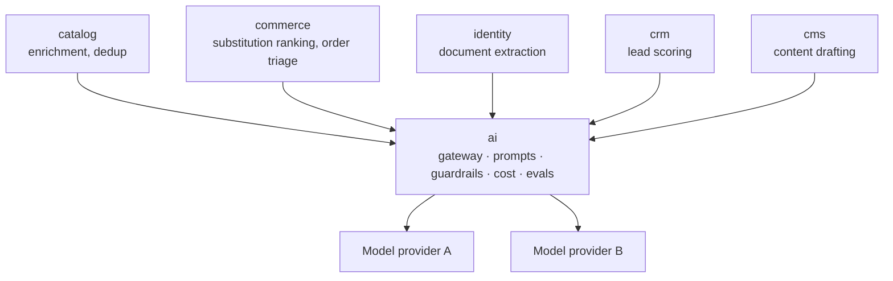
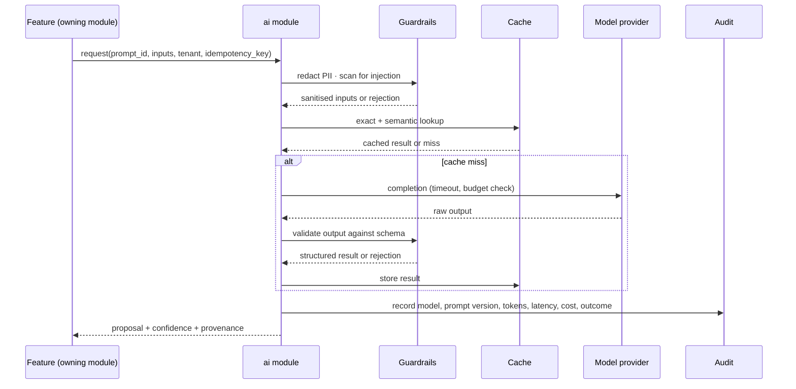

# 12 — AI Features

**Status:** Blueprint
**Owner:** Architecture / AI

## Purpose

Where AI belongs in Atlas, what it is allowed to decide, and what it must never touch. Read this before adding a model call to any module.

---

## The governing rule

> **AI proposes. Deterministic code decides. A human confirms anything that touches money, stock, eligibility, or compliance.**

This is not caution for its own sake. Every one of those four areas has a correctness requirement that a probabilistic system cannot meet:

| Area | Why a model cannot own it |
|---|---|
| Price | A hallucinated price is a revenue loss or a billing dispute. The number must be reproducible from a price list. |
| Stock | The ERP is authoritative. A model's guess about availability is a promise the platform cannot keep. |
| Eligibility | Verification status is a legal fact, not a judgement call. |
| Compliance | A decision must cite a rule and survive an audit. "The model said so" is not a defence. |

AI is **excellent** at the layer above these: reading unstructured input, ranking, summarising, drafting, extracting, and flagging. That is where it goes.

---

## Where AI is allowed

Four capability classes. Every AI feature in Atlas belongs to exactly one.

| Class | What it does | Who confirms | Example |
|---|---|---|---|
| **Extract** | Turns unstructured input into structured data | Always — output is a draft | Reading a licence number from an uploaded document |
| **Rank** | Orders or scores a set the deterministic system has already filtered | Usually not — ordering is a presentation choice | Ranking substitutes for an out-of-stock line |
| **Draft** | Produces text a human reviews before it goes anywhere | Always | A product description, a support reply |
| **Flag** | Points at something worth a human's attention | A human decides what to do | An unusual ordering pattern, a margin outlier |

**Not a class:** "Decide". There is no AI feature in Atlas that determines an outcome on its own.

---

## Module placement

AI adds a **thirteenth module**, `ai`. It owns the plumbing, not the features.

| Concern | Owner |
|---|---|
| Model providers, routing, retries, timeouts | `ai` |
| Prompt registry and versioning | `ai` |
| Guardrails: injection detection, PII redaction, output filtering | `ai` |
| Usage and cost accounting per tenant and feature | `ai` |
| Evaluation registry: suites, scores, regression gates | `ai` |
| Human review queue for AI-assisted decisions | `ai` |
| Exact-match and semantic response caching | `ai` |

Feature-level AI lives in the **owning module**:



**Why this split.** A module that knows *what* it wants from a model should not also manage API keys, retries, and token accounting. Centralising that in `ai` means one place to audit cost, one place to change a provider, and one place to enforce redaction.

**Rule:** no module calls a model provider directly. Every call goes through the `ai` module's public surface.

---

## Request path



Four properties this path guarantees:

1. **Every call is attributable.** Prompt version, model, input hash, and outcome are recorded.
2. **Every call is bounded.** Timeout, token cap, and per-tenant budget are enforced before the provider is reached.
3. **Every output is validated.** A response that does not match the expected schema is a failure, not a best-effort parse.
4. **Every call is degradable.** If the provider is unavailable, the feature falls back — see "Degradation" below.

---

## Capability inventory

### 1. Store — buyer-facing

| # | Feature | Class | Route / trigger | Notes |
|---|---|---|---|---|
| AI1.1 | Conversational ordering | Extract | `/dat-hang-tro-chuyen` | Describe the order in prose; returns a **proposed** cart for line-by-line confirmation |
| AI1.2 | Photo-to-cart | Extract | `/dat-hang/quet-danh-sach` | Photograph a handwritten list or a previous invoice; unmatched items are flagged, never guessed silently |
| AI1.3 | Intent search | Rank | `/tim-kiem` | "vegetarian starter, freezable, under $3 per portion" — runs over the deterministic catalogue filter, never bypasses it |
| AI1.4 | Reorder prediction | Rank | home, `/da-mua` | Items due based on the buyer's own cadence. Always labelled as a suggestion. |
| AI1.5 | Substitution ranking | Rank | product detail, cart | Ranked substitutes with the **specification differences surfaced** — allergens, storage, pack size |
| AI1.6 | Menu-to-basket | Extract | `/dat-hang/thuc-don` | Paste a menu or recipe; returns scaled ingredient lines for confirmation |
| AI1.7 | Product Q&A | Draft | product detail | Answers grounded strictly in spec sheets and certificates. Cites the source. **Abstains** when not grounded. |
| AI1.8 | Voice ordering | Extract | mobile, `/dat-hang/giong-noi` | Hands-free line entry for a kitchen |
| AI1.9 | Suggestion explanations | Draft | inline | "You usually order this every three weeks" — every suggestion states why |
| AI1.10 | Notification summaries | Draft | notification centre | Collapses several order updates into one readable message |

**Rules for every store-facing AI feature**

1. The output is a **proposal**. Nothing is added to the cart, and nothing is ordered, without an explicit confirmation.
2. **Price, availability, and eligibility are resolved by the normal server-side path** after the proposal is confirmed — never taken from the model's output.
3. Every proposed line carries a confidence indicator. Low-confidence lines are visually distinguished, not hidden.
4. The buyer can always reach the same result manually. An AI feature that is the only path to an outcome is a single point of failure.

### 2. Admin — staff-facing

| # | Feature | Class | Route | Permission | Notes |
|---|---|---|---|---|---|
| AI2.1 | Order exception triage | Draft | `/admin/exceptions` | `operations.resolve` | Summarises and ranks exceptions with a proposed resolution. Staff apply it. |
| AI2.2 | Verification document extraction | Extract | `/admin/verifications/{id}` | `verification.review` | Reads licence and certificate fields; flags mismatch against typed data. Reviewer decides. |
| AI2.3 | Catalogue enrichment | Draft | `/admin/catalog/products/{id}` | `catalog.edit` | Description, attributes, storage and allergen class from supplier spec sheets → staged draft |
| AI2.4 | Duplicate detection | Rank | `/admin/catalog/dedup` | `catalog.edit` | Clusters near-duplicate SKUs and proposes a merge. Merge is a human action. |
| AI2.5 | Image compliance check | Flag | `/admin/catalog/media` | `catalog.edit` | Flags text overlays, watermarks, wrong pack, missing allergen marks |
| AI2.6 | Demand and stock-out forecast | Rank | `/admin/inventory/forecast` | `inventory.view` | Per SKU per supplier horizon. Informs thresholds; does not set them. |
| AI2.7 | Pricing anomaly detection | Flag | `/admin/pricing/anomalies` | `pricing.view` | Margin outliers, contracts below cost, abrupt changes |
| AI2.8 | Supplier review narrative | Draft | `/admin/suppliers/{id}` | `suppliers.view` | Drafts the periodic review from deterministic performance metrics |
| AI2.9 | Lead scoring and routing | Rank | `/admin/leads` | `leads.view` | Ranks inbound leads and suggests an owner. Assignment stays manual or rule-based. |
| AI2.10 | Content drafting | Draft | `/admin/cms/articles` | `cms.edit` | Article and copy drafts honouring a brand-tone guide. Never auto-published. |
| AI2.11 | Support reply drafting | Draft | `/admin/case/{id}` | `operations.resolve` | Drafts a reply from order context. An agent edits and sends it. |
| AI2.12 | Analytics copilot | Extract | `/admin/copilot` | `reports.view` | Natural language against a **predefined semantic layer only**. No free SQL. The resolved query is always shown. |
| AI2.13 | Recall impact assist | Draft | `/admin/inventory/recalls` | `inventory.quarantine` | Enumerates affected buyers and orders, drafts the notification. Quarantine itself is a deterministic action. |
| AI2.14 | Fraud and abuse signals | Flag | `/admin/risk` | `risk.view` | Unusual ordering patterns, address mismatches, card-testing signatures |
| AI2.15 | Internal knowledge assistant | Draft | `/admin/help` | `system.view` | Answers policy and how-to questions grounded in internal documents, with citations |
| AI2.16 | AI console | — | `/admin/ai` | `system.ai` | Prompt registry, model configuration, usage and cost, evaluation results, review queue, guardrail incidents |

### 3. API — AI surface

All under `/api/v1`. Detail in [05 API Contract](05-api-contract.md).

| Method | Path | Access | Purpose |
|---|---|---|---|
| POST | `/ai/proposals/cart` | A | Propose cart lines from text, image reference, or voice transcript |
| POST | `/ai/assist/search` | A | Intent search over the deterministic catalogue filter |
| POST | `/ai/assist/substitutes` | A | Ranked substitutes for a product |
| POST | `/ai/ask/product` | A | Grounded product question; abstains when ungrounded |
| GET | `/ai/conversations/{code}` | A | Retrieve a conversation's proposals |
| POST | `/ai/extract/document` | S | Extract structured fields from an uploaded document |
| POST | `/ai/draft/content` | S | Draft content for a target surface |
| POST | `/ai/copilot/query` | S | Resolve a natural-language question against the semantic layer |
| GET | `/admin/ai/prompts` | S | Prompt registry |
| PUT | `/admin/ai/prompts/{key}` | S | Create a prompt version |
| GET | `/admin/ai/models` | S | Model routing configuration |
| PUT | `/admin/ai/models/{feature}` | S | Set the model for a feature |
| GET | `/admin/ai/usage` | S | Token, latency, and cost accounting |
| GET | `/admin/ai/evals` | S | Evaluation runs and scores |
| POST | `/admin/ai/evals/run` | S | Trigger an evaluation suite |
| GET | `/admin/ai/review-queue` | S | Human review queue |
| POST | `/admin/ai/review-queue/{id}/decide` | S | Accept, edit, or reject an AI output |
| GET | `/admin/ai/incidents` | S | Guardrail and safety incidents |

**Contract rule.** Every AI endpoint returns a **proposal envelope**, never a committed side effect:

```json
{
  "proposal_id": "01HQ9...",
  "status": "proposed",
  "confidence": 0.82,
  "items": [],
  "unresolved": [],
  "provenance": {
    "prompt_key": "cart.from_text",
    "prompt_version": 4,
    "model": "provider/model-name",
    "input_hash": "sha256:..."
  },
  "expires_at": "2026-01-01T00:15:00Z"
}
```

Four required fields and why:

| Field | Why it must be there |
|---|---|
| `proposal_id` | Confirmation and audit refer to it |
| `confidence` | The UI must be able to distinguish a guess from a near-certainty |
| `unresolved` | What the model could not map. Silently dropping it loses the buyer's intent. |
| `provenance` | Reproducing a bad output a week later requires knowing what produced it |

**Expiry.** A proposal expires. Confirming a stale proposal against changed prices or stock is exactly the failure this prevents.

### 4. Mobile — buyer applications

| # | Feature | Priority | Notes |
|---|---|---|---|
| AI3.1 | Voice ordering | P2 | Hands-free line entry; proposals only |
| AI3.2 | Photo-to-cart | P2 | Camera list capture with review |
| AI3.3 | Order assistant | P3 | Grounded Q&A over the buyer's own orders and products |
| AI3.4 | Substitution suggestions | P2 | Surfaced differences, not just a ranked list |

**Mobile-specific rules**
- On-device processing is preferred where the input is sensitive (photos of a buyer's premises). Send derived text, not the raw image, where the task permits.
- Voice and photo capture must work without a connection for capture, queueing the request — the proposal simply arrives later, visibly pending.
- No AI feature may block the manual ordering path.

---

## Guardrails

Non-negotiable controls. Each is a rule with an owner, not a good intention.

| # | Control | Detail |
|---|---|---|
| G1 | **Treat all model output as untrusted input** | Validate against a schema before use. Never `eval`, never execute, never interpolate into SQL. |
| G2 | **Treat all retrieved content as untrusted** | A supplier's spec sheet, a buyer's note, and a product description can all contain injected instructions. Retrieved content is data, never instruction. |
| G3 | **Never let retrieved content call a tool** | Tool invocation requires a deterministic decision in code, not a model's choice. |
| G4 | **Redact before sending** | Strip personal data, credentials, and internal identifiers that the task does not need. |
| G5 | **Keep buyer-specific commercial data inside the boundary** | Contract prices and price lists are never sent to a third-party model without explicit classification and approval. |
| G6 | **Enforce per-tenant budget and rate limits** | A single tenant must not be able to exhaust capacity or cost. |
| G7 | **Cap tokens and time on every call** | No unbounded generation. A timeout is a failure, not a partial answer. |
| G8 | **Require abstention over guessing** | Where grounding is missing, the correct answer is "I don't know", not a plausible invention. |
| G9 | **Label AI-generated content** | In the UI, in the database, and in exports. |
| G10 | **Log every AI-mediated decision** | Prompt version, model, inputs hash, output, reviewer, and outcome. |
| G11 | **Never train on tenant data without explicit, revocable consent** | Written into the provider agreement and enforced by configuration. |
| G12 | **Provide a non-AI path for every AI feature** | The platform must be fully usable with the `ai` module disabled. |

**G12 is the load-bearing one.** If Atlas cannot operate with AI switched off, then AI is not an enhancement — it is a hidden dependency with a probabilistic failure mode.

---

## Degradation

AI is always optional. Design the failure path first.

| Condition | Behaviour |
|---|---|
| Provider unavailable | Fall back to the non-AI path. Log and alert. Do not queue indefinitely. |
| Provider slow beyond timeout | Return the non-AI result. Never hold a request open on a model. |
| Budget exhausted for a tenant | Disable that tenant's AI features. Surface it in the console. |
| Guardrail rejection | Reject the request with an explanation. Do not retry the same input. |
| Low confidence below threshold | Return the proposal with `unresolved` populated, or abstain. Never pad. |
| Output fails schema validation | Treat as a failure. One bounded retry with a corrected prompt, then the fallback. |
| Rate limited by the provider | Back off with jitter and honour `Retry-After`. Degrade the feature, not the platform. |

**Rule:** no AI feature may block a core commerce path. A buyer must be able to place an order with every model provider in the world unreachable.

---

## Cost control

Model calls cost money per request. Treat them like any other unbounded resource.

| Control | Detail |
|---|---|
| Per-feature budget | A monthly ceiling per feature, alerted at 80% |
| Per-tenant cap | Prevents one large buyer consuming the pool |
| Token accounting | Tokens and cost recorded per call, attributed to feature and tenant |
| Caching | Exact-hash cache for identical inputs; semantic cache where the tolerance is safe |
| Model tiering | A small, cheap model for extraction and classification; a larger one only where reasoning genuinely matters |
| Output caps | A hard maximum on generated tokens per call |
| Batch where possible | Nightly enrichment runs in bulk, not one call per record |
| Kill switch | A feature flag disables any AI feature immediately, without a deploy |

**Anti-target.** An AI feature whose unit cost exceeds the margin it protects. Compute the cost per action before building it, and write the number down.

---

## Evaluation

A model change is a behaviour change. It needs tests like any other.

| Level | Requirement |
|---|---|
| Golden set | A curated input/output set per feature, versioned alongside the prompt |
| Regression gate | A prompt or model change must not reduce the score below the recorded baseline |
| Human review sample | A sample of production outputs reviewed periodically, with results recorded |
| Adversarial set | Injection attempts, malformed input, hostile documents, boundary cases |
| Failure taxonomy | Each failure classified: extraction error, hallucination, refusal, format, safety |
| Shadow mode | A new prompt or model runs alongside the current one before promotion |

**Rules**
- No prompt change reaches production without an evaluation run.
- Scores are recorded per prompt version. A prompt version without a score is not promoted.
- The evaluation set is never used as few-shot examples. That is how a score becomes meaningless.
- Safety failures are treated as defects, not as quality scores to improve.

### What an evaluation does not prove

A passing evaluation proves the model did well on that set. It does **not** prove the feature is correct end to end, that the UI handles its failures, that the cost is acceptable, or that a human will use it as intended. Those are separate, and each needs its own evidence.

---

## Anti-patterns

| Anti-pattern | Why it is rejected |
|---|---|
| AI computing a price, a total, or a discount | Not reproducible, not auditable, not safe |
| AI deciding eligibility or a verification outcome | A legal fact is not a prediction |
| Auto-applying an AI-proposed order change | Commits money on a probabilistic basis |
| Auto-publishing AI-written content | Puts unreviewed claims in front of customers |
| Free-form SQL from a model against the database | Unbounded access, unbounded cost, unauditable |
| Sending contract prices to a third-party model by default | Commercial confidentiality breach |
| Letting retrieved content influence the system prompt or tools | The prompt-injection path |
| Silently falling back to a guess when grounded data is missing | Manufactures confident wrongness |
| Shipping an AI feature with no non-AI path | Hides a probabilistic dependency inside a correctness path |
| No cost ceiling per feature | An unbounded bill with no owner |
| Changing a prompt without an evaluation | An unmeasured behaviour change in production |
| Storing raw prompts containing personal data indefinitely | An unnecessary data-residency and privacy exposure |

---

## Related

- [02 System Architecture](02-system-architecture.md) — where the `ai` module sits, and decision D10
- [04 Backend Architecture](04-backend-architecture.md) — module rules the `ai` module obeys
- [05 API Contract](05-api-contract.md) — the AI endpoint surface
- [06 Data & Events](06-data-and-events.md) — the `ai` schema and its events
- [08 Feature Inventory](08-feature-inventory.md) — AI features in the full per-surface list
- [11 Conventions & Glossary](11-conventions-and-glossary.md) — AI vocabulary
