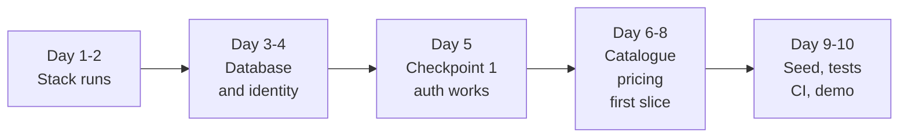

# 13 — Ten-Day Kickoff Plan

**Status:** Blueprint
**Owner:** Project Owner + Intern

## Purpose

Who does what for the first ten working days. This is the opening of [M0 and M1](10-delivery-plan.md) at day granularity, cut down to what one intern can actually finish.

The plan assumes **one intern, full time, with an owner available for decisions**. Adjust the day count, not the order.

---

## Goal

By the end of day ten: **a running local platform with real authentication, a catalogue, buyer-specific pricing, generated seed data, tests, and a CI pipeline.**

That is a foundation, not a product. It is the part every later milestone stands on, and the part that is expensive to retrofit.

## What ten days does not produce

Say this out loud at the start, or day ten will be a disappointment.

| Not in ten days | Why |
|---|---|
| Storefront and Admin user interfaces | The web surfaces are their own milestone; ten days is API only |
| Cart, checkout, orders | M2. They depend on pricing and inventory being real first |
| Payments, ERP, CMS, reports | M3 to M5 |
| Mobile applications | M6 |
| AI capabilities | M7 |
| All thirteen modules | Ten days builds roughly three. The rest follow the same pattern. |
| Production deployment | Local and CI only. Nothing is deployed anywhere real. |

---

## The two roles

| | Intern | Owner |
|---|---|---|
| **Owns** | Writing the code, running the local stack, tests, keeping the repository clean | Decisions, access, review, acceptance |
| **Decides** | How the code inside a module is organised | What gets built, in what order, and what "done" means |
| **Must not** | Invent an architecture decision, widen the scope, build a UI, or open a database schema change without review | Write feature code, review nothing, or leave a question unanswered past the next morning |
| **Available** | Full time | A daily slot for questions, plus a review window |

**The single biggest risk is decision latency.** An intern who waits a day for an answer loses a fifth of the milestone. Every question in the day table below has a same-day answer as its expectation.

---

## Day by day

> Toolchain note (2026-09-19, [ADR-0001](../../docs/adr/0001-go-backend-stack.md)): this plan was executed with the Go toolchain — Chi, pgx/SQLC, golang-migrate, `go test -race` — wherever superseded tool nouns appear below. Day flow and acceptance criteria are unchanged.

| Day | Intern — build | Owner — decide, provide, review | Output at end of day |
|---|---|---|---|
| **1** | Read docs [01](01-product-brief.md), [02](02-system-architecture.md), [03](03-infrastructure.md), [11](11-conventions-and-glossary.md). Install the toolchain. Bring up the local stack. | Create the repositories. Grant access. Set branch protection. Name the reviewer. Confirm the stack versions. | Local stack starts with one command |
| **2** | Go application with Chi: settings, `/health`, `/readyz`, logging, request IDs. Module folder convention. Linter, formatter, commit hooks. | Confirm the module list and which three come first. Confirm the error response shape. | API starts; health endpoints answer |
| **3** | PostgreSQL and golang-migrate. Schema-per-module. First migration. pgx pooling. Test database. | Confirm naming conventions. Confirm that seed data is generated, never copied from anywhere real. | Migration applies and rolls back cleanly |
| **4** | `identity`: user entity, password hashing, registration endpoint, input validation. | Review the first pull request. Confirm token lifetimes and rate limits. Confirm the public-identifier scheme. | A buyer can register |
| **5** | `identity`: login, access token, refresh, current-user dependency, authorisation guard. **Then stop and demo.** | **Checkpoint 1.** Review the week. Answer everything still open. Agree the scope of the second week. | Register, log in, and reach an authenticated endpoint |
| **6** | `catalogue`: product and category entities, public list endpoint with pagination, search over names. | Provide or approve seed product content. Confirm the public-identifier scheme and pagination style. | A catalogue list and a detail endpoint |
| **7** | `pricing`: price model, buyer-specific price resolution, the service other modules call. | Confirm that price is computed on the server only, in every path. Review the pricing pull request. | A price that differs correctly by buyer |
| **8** | The first vertical slice: catalogue list, product detail, showing the authenticated buyer's own price. | Review the slice against the feature list. Confirm it behaves for a second buyer with different terms. | One complete flow, end to end |
| **9** | Seed script generating buyers, suppliers, products, prices, and stock. Tests for the slice, including a failure path and a second-buyer isolation test. | Confirm the generated data contains nothing derived from a real business. Review the test list. | Repeatable seed plus a passing test suite |
| **10** | CI pipeline: lint, typecheck, tests, migration check. Repository README. **Then demo and write a one-page status.** | **Checkpoint 2.** Accept or reject against the exit criteria below. Decide what the next ten days are. | A green pipeline and an accepted demo |

---

## Checkpoints

**Checkpoint 1 — end of day 5.** Not a progress report. It answers: is the foundation sound enough to build on, and is the intern unblocked? If the answer is no, the second week changes shape now rather than on day 9.

**Checkpoint 2 — end of day 10.** Acceptance against the exit criteria. The owner either accepts, accepts with listed gaps, or rejects with reasons. "Looks good" is not an acceptance decision.

---

## Exit criteria for day 10

All of these, verified by the owner by running them, not by reading the code.

| # | Criterion | How it is checked |
|---|---|---|
| 1 | The local stack starts from a clean checkout with one documented command | Run it on a machine that has never had it |
| 2 | Migrations apply and roll back without error | Run up, run down, run up again |
| 3 | A buyer can register, log in, and refresh a token | By hand, through the API |
| 4 | The catalogue lists products with pagination | By hand |
| 5 | Two different buyers receive different prices for the same product | With two accounts, side by side |
| 6 | A buyer cannot see another buyer's price or data | Attempt it deliberately |
| 7 | The seed script reproduces the same dataset from scratch | Delete the data, re-seed |
| 8 | Tests pass locally and in CI | Make the pipeline run on a pull request |
| 9 | No secret, credential, or real business data is in the repository | Search the history, not just the working tree |
| 10 | The intern can explain the module boundary rules without notes | Ask three questions from [04](04-backend-architecture.md) |

Criterion 10 is not padding. It is the difference between a foundation and code that happens to run.

---

## Daily rhythm

| When | What | Who |
|---|---|---|
| Start of day | Fifteen minutes: yesterday, today, blockers | Both |
| During the day | Questions asked in writing, answered the same day | Owner |
| End of day | A short written note: what was finished, what is in review, what is next | Intern |
| Pull requests | Reviewed within one working day | Owner |

**Rule:** no question waits until tomorrow. If the owner is unavailable, the intern picks the reversible option, writes down the assumption, and moves on.

---

## Risks

| Risk | Why it bites | Mitigation |
|---|---|---|
| Decision latency | An intern waiting is an intern not building | Same-day answers; a documented fallback when the owner is away |
| Scope creep on day 6 or 7 | Every "while we are here" costs a day | The out-of-scope table at the top is binding |
| A foundation that only runs on one machine | Discovered at the worst moment | Criterion 1 is tested on a clean checkout, by the owner |
| Tests written to pass, not to check | The suite proves nothing | Failure paths and cross-buyer isolation are required, not optional |
| The intern invents architecture | Silent divergence from the blueprint | Any decision not in the blueprint becomes a written question, not a commit |
| Real business data used as seed | A compliance problem that never goes away | Generated only; searched for in the acceptance check |

---

## What follows day ten

| Next | Content |
|---|---|
| Days 11–20 | Inventory, cart, checkout, order creation — [M2](10-delivery-plan.md) |
| A second intern | The storefront and admin surfaces, in parallel, against the same API |
| The next decision | Whether to widen the module count or deepen the ordering journey |

---

## Related

- [10 Delivery Plan](10-delivery-plan.md) — the milestones this plan opens
- [02 System Architecture](02-system-architecture.md) — the boundaries the intern must respect
- [03 Infrastructure](03-infrastructure.md) — the stack and repositories being set up
- [04 Backend Architecture](04-backend-architecture.md) — the module rules behind exit criterion 10
- [08 Feature Inventory](08-feature-inventory.md) — the features later milestones draw from
- [11 Conventions and Glossary](11-conventions-and-glossary.md) — the vocabulary this plan assumes
