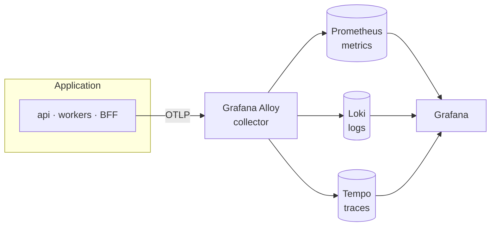
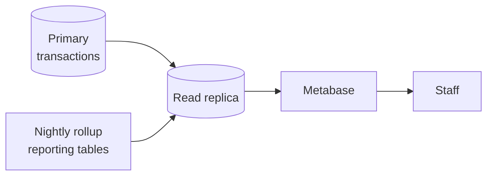

# 14 — Observability and Analytics

**Status:** Blueprint

## Purpose

Two questions that look similar and must not share an answer.

| Question | Who asks it | System that answers it |
|---|---|---|
| Is the platform healthy, and why is this request slow? | Engineers, on call | **Grafana**, over telemetry |
| How much did we sell, and to whom? | Business, operations | **Metabase**, over reporting data |

Conflating the two produces a dashboard that answers neither question well, and a business tool that gets load-tested by an outage.

---

# Part 1 — Telemetry

## Shape

**OpenTelemetry** instruments the application. **Grafana Alloy** collects. **Grafana** reads.

## OpenTelemetry is the only thing the application knows

Application code depends on the **OpenTelemetry API**. It never imports a backend client, and it never knows whether Alloy, a hosted vendor, or nothing at all is on the other end.

**What that buys:** changing a backend becomes a collector configuration change, not an application release. This is the whole reason to instrument against a standard rather than against whichever product happens to be chosen first.

**Rule:** no module imports a telemetry backend client. Metrics, logs, and spans are emitted through the standard interfaces and go no further.

## Alloy is the collector, and the only place a backend is named

Alloy receives **OTLP** on `4317` (gRPC) and `4318` (HTTP), applies a processing chain, and fans out to the metric, log, and trace stores. Its configuration lives in `atlas-observability`, not in the application repositories.

What the processing chain typically does, in order:

| Stage | Purpose |
|---|---|
| Receive | Accept OTLP from every service and from the container runtime |
| Batch | Group signals so the network cost is per batch, not per span |
| Limit | Bound memory so a telemetry spike cannot take the collector down |
| Scrub | Strip attributes that must never leave the process |
| Route | Send each signal to its store, and to a different place per environment |

## What travels where

| Signal | Produced by | Stored in | The question it answers |
|---|---|---|---|
| **Metric** | Counters, histograms, exporter scrapes | Prometheus | Is it saturated, failing, or slow — at a glance |
| **Log** | Structured JSON from every service | Loki | What exactly happened, in this one case |
| **Trace** | Spans from request and task instrumentation | Tempo | Where the 900 ms actually went, across tiers |
| **Alert** | Rules evaluated over the above | Grafana | Wake someone, with a link to the trace |

## Correlation is the point

Three stores are only useful if you can cross them. Every log line carries `trace_id` and `span_id`. Every span carries the request ID the client was given. That single thread — from an alert, to a trace, to the exact log line — is the difference between a five-minute diagnosis and an hour of guessing.

**Async work must keep the thread.** A background task is enqueued by a request, and it inherits that request's trace context through the message header. Without that, the asynchronous half of every flow is invisible, which is precisely the half that fails quietly.

## Cardinality decides whether metrics stay useful

**Rule: metric labels are low-cardinality only.** Route, method, status class, queue name, module, environment. Never a buyer identifier, order identifier, product identifier, session identifier, or any user-supplied string.

This is stated as a rule rather than a preference because one label with a million distinct values takes the metrics store down — and it does so weeks after the commit that introduced it, when nobody remembers why.

Identifiers belong in traces and logs, which are indexed for exactly that.

## Sampling

Keeping every trace in production is usually unaffordable and rarely necessary. The shape: sample at the collector, and keep errors and slow requests disproportionately, because those are the ones anyone will ever look at. Exact rates and the choice of head or tail sampling are left to the builder — see below.

## Local development must not require the collector

By default a developer machine starts **without** the observability stack. The application exports nothing, or exports to the console. A side channel can be absent, and local development is where that gets proven.

An optional overlay brings the full stack up locally for the rare occasion it is genuinely needed — investigating a performance problem, or changing collector configuration.

---

# Part 2 — Business analytics

## Metabase reads a replica

**Rule: Metabase never connects to the primary database.** One unindexed exploratory query by a business user is a production incident in a transactional system, and it will happen on the busiest day of the quarter.

A read replica also makes the acceptable staleness explicit: analytics is allowed to be behind by minutes. Transactions are not.

## Curated, not raw

Business users query **curated models**, not base tables. A curated model is owned, named, documented, and reviewed — the same standard as an API.

When a column is added to a base table, nothing appears in the analytics surface until someone decides it should. That is deliberate. A database schema is an internal detail, and exposing one to a wide audience creates a contract nobody agreed to maintain.

## Which system answers which question

| Question | System |
|---|---|
| Is checkout failing right now? | Grafana alert |
| Why did this particular order fail? | Tempo trace, then Loki logs |
| How many orders per day this quarter? | Metabase |
| Which buyers have stopped ordering? | Metabase |
| Is the ERP sync stale? | Grafana alert |
| What is the margin by supplier this month? | Metabase |
| What is the p95 of the catalogue endpoint? | Grafana |

Rule of thumb: **Grafana answers "is the system healthy". Metabase answers "is the business doing well".**

## Rollups feed the analytics surface

Nightly jobs aggregate into reporting tables — see the job table in [06 Data and Events](06-data-and-events.md). Those tables, plus curated views on top of them, are what Metabase reads. They exist so that a question about last quarter does not scan the order table.

## Access and data protection

| Concern | Rule |
|---|---|
| Database credentials | A read-only account with a replica-only grant. No write credential exists inside the BI tool at all. |
| Staff access | Identity comes from the platform; group membership decides which models are visible |
| Buyer-identifying data | Restricted to roles that need it. Aggregated by default, identified only on purpose. |
| Exports | An export is a copy of data leaving the system. Treat it as a data-handling decision, not a button. |
| Local environments | Real data never reaches a developer machine. Seed data only. |

---

# Rules

1. **Telemetry is a side channel.** If the collector is unreachable, the application keeps serving. Losing observability must never become an outage.
2. **No telemetry payload carries a secret, token, or full request body.** Scrub in the application, and scrub again in the collector.
3. **Metric labels stay low-cardinality.** Identifiers go in traces and logs.
4. **The application depends on the OpenTelemetry API**, never on a specific backend product.
5. **Telemetry and dashboard configuration live in `atlas-observability`**, never in an application repository.
6. **Metabase connects to a read replica with a read-only account.** Never to the primary.
7. **Business users query curated models**, never base tables.
8. **A question that becomes a daily operational need is a candidate for a product feature**, not a permanent dashboard.

---

# What is left open

| Open question | Why it is not decided here |
|---|---|
| Grafana distribution and hosting | Self-hosted and managed are both reasonable; the choice follows operating capacity |
| Retention per signal | Follows volume, budget, and how far back investigations actually reach |
| Sampling rate and head-versus-tail | Follows traffic shape and cost; guessing now produces a number nobody trusts later |
| Collector processing chain details | Follows what the chosen backends turn out to need |
| Which dashboards exist | Emerges from incidents and real questions, not from a template |
| Which curated Metabase models exist | Emerges from what staff actually ask for |
| Replica mode: streaming or periodic snapshot | Follows how much staleness the business will tolerate |
| Whether analytics runs on a separate host | Follows data volume and isolation requirements |

---

## Related

- [02 System Architecture](02-system-architecture.md) — where telemetry sits in the topology
- [03 Infrastructure](03-infrastructure.md) — the local stack, ports, and configuration rules
- [06 Data and Events](06-data-and-events.md) — the rollup jobs that feed the reporting tables
- [08 Feature Inventory](08-feature-inventory.md) — the in-application reports, and where Metabase takes over
- [11 Conventions and Glossary](11-conventions-and-glossary.md) — terminology used here
